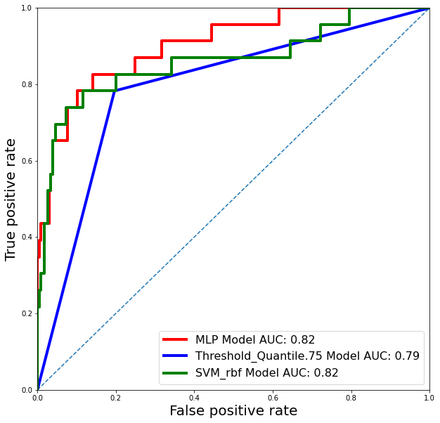

# Multi-Layer Perceptron (MLP)


```python
##all coding is runing on env theano_3
# set plots inline for ipython
# %matplotlib inline

# import system & ipython utils
import os
import subprocess
from IPython.display import Image
import time

# numpy and visualization libs
import pandas as pd
import numpy as np
import seaborn as sns
import matplotlib.pyplot as plt

# import data preprocessing, cross validaiton

from sklearn.preprocessing import StandardScaler


from sklearn.tree import export_graphviz

# classifiers
from sklearn.neighbors import KNeighborsClassifier
from sklearn.tree import DecisionTreeClassifier
from sklearn.svm import SVC
from sklearn.ensemble import AdaBoostClassifier
from sklearn.ensemble import RandomForestClassifier, GradientBoostingClassifier
from sklearn.linear_model import LinearRegression, LogisticRegression
from sklearn.model_selection import train_test_split
from sklearn.model_selection import GridSearchCV
# performance measures
from sklearn.metrics import classification_report
from sklearn.metrics import log_loss, hamming_loss, mean_squared_error
from sklearn.metrics import roc_curve, auc
from sklearn.metrics import matthews_corrcoef, f1_score, precision_score, recall_score
from sklearn.metrics import accuracy_score

from sklearn.metrics import confusion_matrix
from sklearn.utils import shuffle

# # personal libs
# from mwutil.ml import run_training_range
# from mwutil.ml import compare_classifiers

# set random seed
rand_state = np.random.RandomState(32)
# set the scoring function
# set the scoring function
scoring_function_label = 'f1_weighted'
scoring_function = f1_score

# set number of folds for cross validation
n_folds = 3

# init an empty dict to hold all models for final analysis & comparison
classifiers = {}

# define the number of 'stages' aka bins to map the UPDRS scores
n_stages = 55

# set updrs metric (total or motor)
#updrs_measure = 'total_UPDRS'

# subsampling (-1 for no subsampling)
subsample_n = -1
```


```python
import numpy as np
import pandas as pd
import warnings

## Plotting libraries
# import seaborn as sns
import matplotlib.pyplot as plt
import matplotlib as mpl
import seaborn as sns

## Sklearn Libraries
from sklearn.pipeline import make_pipeline, Pipeline
from sklearn.decomposition import PCA
from sklearn.feature_selection import RFECV
from sklearn.model_selection import cross_val_predict
from sklearn.utils import shuffle
from sklearn.utils import resample
from sklearn.preprocessing import PowerTransformer
from sklearn.model_selection import train_test_split
from sklearn.model_selection import StratifiedKFold
from sklearn.neural_network import MLPClassifier
from sklearn.neighbors import KNeighborsClassifier
from sklearn.svm import SVC
from sklearn.gaussian_process.kernels import RBF
from sklearn.tree import DecisionTreeClassifier
from sklearn.ensemble import RandomForestClassifier, AdaBoostClassifier
from sklearn.naive_bayes import GaussianNB
from sklearn.discriminant_analysis import QuadraticDiscriminantAnalysis
from sklearn.linear_model import LogisticRegression

from sklearn.model_selection import RandomizedSearchCV
from sklearn.metrics import f1_score, confusion_matrix, roc_curve, auc, \
            classification_report, recall_score, precision_recall_curve, roc_auc_score, precision_score, accuracy_score
from sklearn.metrics import log_loss
from sklearn.metrics import get_scorer

## XGBoost Librarires
from xgboost import XGBClassifier

# pickle library
import pickle

## Scipy Libraries
from scipy.stats.mstats import winsorize
from scipy.stats import f
from scipy.stats import norm
from scipy.stats import chi2
from scipy.stats import ttest_ind
from scipy.stats import randint
from scipy.stats import yeojohnson

#statistics
from statistics import stdev 

#itertools
from itertools import combinations, permutations

#mlxtend
from mlxtend.evaluate import paired_ttest_5x2cv
from mlxtend.feature_selection import SequentialFeatureSelector as SFS

#math
import math

# Define random state
random_state = 2020
np.random.seed(random_state)
warnings.filterwarnings('ignore')
```


```python
import torch
import torch.nn as nn

device = torch.device('cuda' if torch.cuda.is_available() else 'cpu')

class MLP(nn.Module):
    def __init__(self):
        super(MLP, self).__init__()
        self.linear = nn.Linear(3, 2)
        self.soft = nn.Softmax(dim=1)
    def forward(self, x):
        out = self.soft(self.linear(x))
        # out = self.linear(x)
        return out

model = MLP().to(device)
optimizer = torch.optim.Adam(model.parameters())
criterion = nn.CrossEntropyLoss()

print(model)
'''
MLP(
  (linear): Linear(in_features=3, out_features=10, bias=True)
)
'''
```

    MLP(
      (linear): Linear(in_features=3, out_features=2, bias=True)
      (soft): Softmax(dim=1)
    )
    


    '\nMLP(\n  (linear): Linear(in_features=3, out_features=10, bias=True)\n)\n'


```python
from torch.utils.data import Dataset, DataLoader

class TrainDataset(Dataset):
    def __init__(self, data,y):
        self.data = data
        self.y = y
    def __len__(self):
        return self.data.shape[0]
    def __getitem__(self, ind):
        x = self.data[ind]
        y = self.y[ind]
        return x, y
class TestDataset(TrainDataset):
    def __getitem__(self, ind):
        x = self.data[ind]
        return x

train_set = TrainDataset(X_train.values, y_train.to_numpy())
test_set  = TestDataset(X_test.values, y_test.to_numpy())

batch_size = 64
train_loader = DataLoader(train_set,  shuffle=True, batch_size=batch_size)
test_loader  = DataLoader(test_set,  shuffle=False, batch_size=batch_size)
```


```python
from sklearn import metrics

epochs = 1000

model.train()
for epoch in range(epochs):
    losses = []
    for batch_num, input_data in enumerate(train_loader):
        optimizer.zero_grad()
        x, y = input_data
        x = x.to(device).float()
        y = y.to(device)

        output = model(x)
        loss = criterion(output, y)
        loss.backward()
        losses.append(loss.item())

        optimizer.step()

        if batch_num % 40 == 0:
            print('\tEpoch %d | Batch %d | Loss %6.2f' % (epoch, batch_num, loss.item()))
            y_pred = output.detach().cpu().argmax(dim=1).numpy()
            y_score = output.detach().cpu().max(dim=1).values
            print('\tEpoch %d | Batch %d | Acc %6.2f' % (epoch, batch_num, metrics.accuracy_score(y.detach().cpu().numpy(),y_pred)))
    print('Epoch %d | Loss %6.2f' % (epoch, sum(losses)/len(losses)))
```

    	Epoch 0 | Batch 0 | Loss   0.60
    	Epoch 0 | Batch 0 | Acc   0.77
    Epoch 0 | Loss   0.60
    	Epoch 1 | Batch 0 | Loss   0.62
    	Epoch 1 | Batch 0 | Acc   0.75
    Epoch 1 | Loss   0.59
    	Epoch 2 | Batch 0 | Loss   0.55
    	Epoch 2 | Batch 0 | Acc   0.83
    Epoch 2 | Loss   0.59
    	Epoch 3 | Batch 0 | Loss   0.54
    	Epoch 3 | Batch 0 | Acc   0.88
    Epoch 3 | Loss   0.58
    	Epoch 4 | Batch 0 | Loss   0.57
    	Epoch 4 | Batch 0 | Acc   0.86
    Epoch 4 | Loss   0.58
    	Epoch 5 | Batch 0 | Loss   0.57
    	Epoch 5 | Batch 0 | Acc   0.83
    Epoch 5 | Loss   0.58
    	Epoch 6 | Batch 0 | Loss   0.59
    	Epoch 6 | Batch 0 | Acc   0.80
    Epoch 6 | Loss   0.57
    	Epoch 7 | Batch 0 | Loss   0.60
    	Epoch 7 | Batch 0 | Acc   0.80
    Epoch 7 | Loss   0.56
    	Epoch 8 | Batch 0 | Loss   0.58
    	Epoch 8 | Batch 0 | Acc   0.80
    Epoch 8 | Loss   0.57
    	Epoch 9 | Batch 0 | Loss   0.52
    	Epoch 9 | Batch 0 | Acc   0.89
    Epoch 9 | Loss   0.58
    	Epoch 10 | Batch 0 | Loss   0.58
    	Epoch 10 | Batch 0 | Acc   0.81
    Epoch 10 | Loss   0.57
    	Epoch 11 | Batch 0 | Loss   0.59
    	Epoch 11 | Batch 0 | Acc   0.78
    Epoch 11 | Loss   0.57
    	Epoch 12 | Batch 0 | Loss   0.51
    	Epoch 12 | Batch 0 | Acc   0.86
    Epoch 12 | Loss   0.56
    	Epoch 13 | Batch 0 | Loss   0.59
    	Epoch 13 | Batch 0 | Acc   0.75
    Epoch 13 | Loss   0.57
    	Epoch 14 | Batch 0 | Loss   0.60
    	Epoch 14 | Batch 0 | Acc   0.73
    Epoch 14 | Loss   0.55
    	Epoch 15 | Batch 0 | Loss   0.54
    	Epoch 15 | Batch 0 | Acc   0.83
    Epoch 15 | Loss   0.56
    	Epoch 16 | Batch 0 | Loss   0.52
    	Epoch 16 | Batch 0 | Acc   0.88
    Epoch 16 | Loss   0.55
    	Epoch 17 | Batch 0 | Loss   0.54
    	Epoch 17 | Batch 0 | Acc   0.81
    Epoch 17 | Loss   0.55
    	Epoch 18 | Batch 0 | Loss   0.57
    	Epoch 18 | Batch 0 | Acc   0.80
    Epoch 18 | Loss   0.56
    	Epoch 19 | Batch 0 | Loss   0.55
    	Epoch 19 | Batch 0 | Acc   0.80
    Epoch 19 | Loss   0.56
    	Epoch 20 | Batch 0 | Loss   0.61
    	Epoch 20 | Batch 0 | Acc   0.69
    Epoch 20 | Loss   0.54
    	Epoch 21 | Batch 0 | Loss   0.51
    	Epoch 21 | Batch 0 | Acc   0.88
    Epoch 21 | Loss   0.54
    	Epoch 22 | Batch 0 | Loss   0.52
    	Epoch 22 | Batch 0 | Acc   0.84
    Epoch 22 | Loss   0.55
    	Epoch 23 | Batch 0 | Loss   0.52
    	Epoch 23 | Batch 0 | Acc   0.84
    Epoch 23 | Loss   0.54
    	Epoch 24 | Batch 0 | Loss   0.51
    	Epoch 24 | Batch 0 | Acc   0.84
    Epoch 24 | Loss   0.54
    	Epoch 25 | Batch 0 | Loss   0.54
    	Epoch 25 | Batch 0 | Acc   0.81
    Epoch 25 | Loss   0.54
    	Epoch 26 | Batch 0 | Loss   0.53
    	Epoch 26 | Batch 0 | Acc   0.84
    Epoch 26 | Loss   0.54
    	Epoch 27 | Batch 0 | Loss   0.54
    	Epoch 27 | Batch 0 | Acc   0.83
    Epoch 27 | Loss   0.52
    	Epoch 28 | Batch 0 | Loss   0.52
    	Epoch 28 | Batch 0 | Acc   0.88
    Epoch 28 | Loss   0.52
    	Epoch 29 | Batch 0 | Loss   0.53
    	Epoch 29 | Batch 0 | Acc   0.81
    Epoch 29 | Loss   0.53
    	Epoch 30 | Batch 0 | Loss   0.53
    	Epoch 30 | Batch 0 | Acc   0.78
    Epoch 30 | Loss   0.52
    	Epoch 31 | Batch 0 | Loss   0.51
    	Epoch 31 | Batch 0 | Acc   0.83
    Epoch 31 | Loss   0.52
    	Epoch 32 | Batch 0 | Loss   0.47
    	Epoch 32 | Batch 0 | Acc   0.92
    Epoch 32 | Loss   0.51
    	Epoch 33 | Batch 0 | Loss   0.51
    	Epoch 33 | Batch 0 | Acc   0.88
    Epoch 33 | Loss   0.52
    	Epoch 34 | Batch 0 | Loss   0.55
    	Epoch 34 | Batch 0 | Acc   0.81
    Epoch 34 | Loss   0.52
    	Epoch 35 | Batch 0 | Loss   0.47
    	Epoch 35 | Batch 0 | Acc   0.89
    Epoch 35 | Loss   0.52
    	Epoch 36 | Batch 0 | Loss   0.48
    	Epoch 36 | Batch 0 | Acc   0.89
    Epoch 36 | Loss   0.51
    	Epoch 37 | Batch 0 | Loss   0.55
    	Epoch 37 | Batch 0 | Acc   0.77
    Epoch 37 | Loss   0.51
    	Epoch 38 | Batch 0 | Loss   0.52
    	Epoch 38 | Batch 0 | Acc   0.83
    Epoch 38 | Loss   0.50
    	Epoch 39 | Batch 0 | Loss   0.55
    	Epoch 39 | Batch 0 | Acc   0.78
    Epoch 39 | Loss   0.50
    	Epoch 40 | Batch 0 | Loss   0.48
    	Epoch 40 | Batch 0 | Acc   0.91
    Epoch 40 | Loss   0.51
    	Epoch 41 | Batch 0 | Loss   0.49
    	Epoch 41 | Batch 0 | Acc   0.84
    Epoch 41 | Loss   0.52
    	Epoch 42 | Batch 0 | Loss   0.47
    	Epoch 42 | Batch 0 | Acc   0.88
    Epoch 42 | Loss   0.50
    	Epoch 43 | Batch 0 | Loss   0.52
    	Epoch 43 | Batch 0 | Acc   0.84
    Epoch 43 | Loss   0.51
    	Epoch 44 | Batch 0 | Loss   0.44
    	Epoch 44 | Batch 0 | Acc   0.94
    Epoch 44 | Loss   0.51
    	Epoch 45 | Batch 0 | Loss   0.51
    	Epoch 45 | Batch 0 | Acc   0.86
    Epoch 45 | Loss   0.50
    	Epoch 46 | Batch 0 | Loss   0.48
    	Epoch 46 | Batch 0 | Acc   0.88
    Epoch 46 | Loss   0.50
    	Epoch 47 | Batch 0 | Loss   0.51
    	Epoch 47 | Batch 0 | Acc   0.86
    Epoch 47 | Loss   0.50
    	Epoch 48 | Batch 0 | Loss   0.49
    	Epoch 48 | Batch 0 | Acc   0.89
    Epoch 48 | Loss   0.49
    	Epoch 49 | Batch 0 | Loss   0.50
    	Epoch 49 | Batch 0 | Acc   0.84
    Epoch 49 | Loss   0.49
    	Epoch 50 | Batch 0 | Loss   0.47
    	Epoch 50 | Batch 0 | Acc   0.92
    Epoch 50 | Loss   0.49
    	Epoch 51 | Batch 0 | Loss   0.46
    	Epoch 51 | Batch 0 | Acc   0.91
    Epoch 51 | Loss   0.50
    	Epoch 52 | Batch 0 | Loss   0.46
    	Epoch 52 | Batch 0 | Acc   0.91
    Epoch 52 | Loss   0.50
    	Epoch 53 | Batch 0 | Loss   0.47
    	Epoch 53 | Batch 0 | Acc   0.89
    Epoch 53 | Loss   0.49
    	Epoch 54 | Batch 0 | Loss   0.51
    	Epoch 54 | Batch 0 | Acc   0.83
    Epoch 54 | Loss   0.49
    	Epoch 55 | Batch 0 | Loss   0.53
    	Epoch 55 | Batch 0 | Acc   0.81
    Epoch 55 | Loss   0.48
    	Epoch 56 | Batch 0 | Loss   0.48
    	Epoch 56 | Batch 0 | Acc   0.88
    Epoch 56 | Loss   0.49
    	Epoch 57 | Batch 0 | Loss   0.49
    	Epoch 57 | Batch 0 | Acc   0.89
    Epoch 57 | Loss   0.50
    	Epoch 58 | Batch 0 | Loss   0.48
    	Epoch 58 | Batch 0 | Acc   0.88
    Epoch 58 | Loss   0.48
    	Epoch 59 | Batch 0 | Loss   0.49
    	Epoch 59 | Batch 0 | Acc   0.84
    Epoch 59 | Loss   0.49
    	Epoch 60 | Batch 0 | Loss   0.56
    	Epoch 60 | Batch 0 | Acc   0.75
    Epoch 60 | Loss   0.49
    	Epoch 61 | Batch 0 | Loss   0.44
    	Epoch 61 | Batch 0 | Acc   0.94
    Epoch 61 | Loss   0.48
    	Epoch 62 | Batch 0 | Loss   0.53
    	Epoch 62 | Batch 0 | Acc   0.84
    Epoch 62 | Loss   0.48
    	Epoch 63 | Batch 0 | Loss   0.45
    	Epoch 63 | Batch 0 | Acc   0.92
    Epoch 63 | Loss   0.48
    	Epoch 64 | Batch 0 | Loss   0.45
    	Epoch 64 | Batch 0 | Acc   0.91
    Epoch 64 | Loss   0.48
    	Epoch 65 | Batch 0 | Loss   0.49
    	Epoch 65 | Batch 0 | Acc   0.84
    Epoch 65 | Loss   0.47
    	Epoch 66 | Batch 0 | Loss   0.49
    	Epoch 66 | Batch 0 | Acc   0.88
    Epoch 66 | Loss   0.48
    	Epoch 67 | Batch 0 | Loss   0.50
    	Epoch 67 | Batch 0 | Acc   0.81
    Epoch 67 | Loss   0.46
    	Epoch 68 | Batch 0 | Loss   0.45
    	Epoch 68 | Batch 0 | Acc   0.92
    Epoch 68 | Loss   0.48
    	Epoch 69 | Batch 0 | Loss   0.46
    	Epoch 69 | Batch 0 | Acc   0.91
    Epoch 69 | Loss   0.47
    	Epoch 70 | Batch 0 | Loss   0.47
    	Epoch 70 | Batch 0 | Acc   0.89
    Epoch 70 | Loss   0.47
    	Epoch 71 | Batch 0 | Loss   0.47
    	Epoch 71 | Batch 0 | Acc   0.91
    Epoch 71 | Loss   0.46
    	Epoch 72 | Batch 0 | Loss   0.47
    	Epoch 72 | Batch 0 | Acc   0.89
    Epoch 72 | Loss   0.47
    	Epoch 73 | Batch 0 | Loss   0.42
    	Epoch 73 | Batch 0 | Acc   0.94
    Epoch 73 | Loss   0.47
    	Epoch 74 | Batch 0 | Loss   0.44
    	Epoch 74 | Batch 0 | Acc   0.92
    Epoch 74 | Loss   0.46
    	Epoch 75 | Batch 0 | Loss   0.47
    	Epoch 75 | Batch 0 | Acc   0.89
    Epoch 75 | Loss   0.45
    	Epoch 76 | Batch 0 | Loss   0.44
    	Epoch 76 | Batch 0 | Acc   0.92
    Epoch 76 | Loss   0.46
    	Epoch 77 | Batch 0 | Loss   0.41
    	Epoch 77 | Batch 0 | Acc   0.97
    Epoch 77 | Loss   0.45
    	Epoch 78 | Batch 0 | Loss   0.49
    	Epoch 78 | Batch 0 | Acc   0.86
    Epoch 78 | Loss   0.45
    	Epoch 79 | Batch 0 | Loss   0.45
    	Epoch 79 | Batch 0 | Acc   0.91
    Epoch 79 | Loss   0.45
    	Epoch 80 | Batch 0 | Loss   0.47
    	Epoch 80 | Batch 0 | Acc   0.89
    Epoch 80 | Loss   0.45
    	Epoch 81 | Batch 0 | Loss   0.45
    	Epoch 81 | Batch 0 | Acc   0.92
    Epoch 81 | Loss   0.46
    	Epoch 82 | Batch 0 | Loss   0.41
    	Epoch 82 | Batch 0 | Acc   0.97
    Epoch 82 | Loss   0.45
    	Epoch 83 | Batch 0 | Loss   0.45
    	Epoch 83 | Batch 0 | Acc   0.89
    Epoch 83 | Loss   0.45
    	Epoch 84 | Batch 0 | Loss   0.42
    	Epoch 84 | Batch 0 | Acc   0.97
    Epoch 84 | Loss   0.44
    	Epoch 85 | Batch 0 | Loss   0.48
    	Epoch 85 | Batch 0 | Acc   0.88
    Epoch 85 | Loss   0.45
    	Epoch 86 | Batch 0 | Loss   0.50
    	Epoch 86 | Batch 0 | Acc   0.86
    Epoch 86 | Loss   0.44
    	Epoch 87 | Batch 0 | Loss   0.42
    	Epoch 87 | Batch 0 | Acc   0.97
    Epoch 87 | Loss   0.46
    	Epoch 88 | Batch 0 | Loss   0.43
    	Epoch 88 | Batch 0 | Acc   0.95
    Epoch 88 | Loss   0.45
    	Epoch 89 | Batch 0 | Loss   0.40
    	Epoch 89 | Batch 0 | Acc   0.97
    Epoch 89 | Loss   0.45
    	Epoch 90 | Batch 0 | Loss   0.44
    	Epoch 90 | Batch 0 | Acc   0.94
    Epoch 90 | Loss   0.44
    	Epoch 91 | Batch 0 | Loss   0.45
    	Epoch 91 | Batch 0 | Acc   0.89
    Epoch 91 | Loss   0.44
    	Epoch 92 | Batch 0 | Loss   0.45
    	Epoch 92 | Batch 0 | Acc   0.92
    Epoch 92 | Loss   0.44
    	Epoch 93 | Batch 0 | Loss   0.44
    	Epoch 93 | Batch 0 | Acc   0.91
    Epoch 93 | Loss   0.43
    	Epoch 94 | Batch 0 | Loss   0.42
    	Epoch 94 | Batch 0 | Acc   0.92
    Epoch 94 | Loss   0.44
    	Epoch 95 | Batch 0 | Loss   0.45
    	Epoch 95 | Batch 0 | Acc   0.91
    Epoch 95 | Loss   0.44
    	Epoch 96 | Batch 0 | Loss   0.44
    	Epoch 96 | Batch 0 | Acc   0.95
    Epoch 96 | Loss   0.43
    	Epoch 97 | Batch 0 | Loss   0.42
    	Epoch 97 | Batch 0 | Acc   0.94
    Epoch 97 | Loss   0.44
    	Epoch 98 | Batch 0 | Loss   0.43
    	Epoch 98 | Batch 0 | Acc   0.95
    Epoch 98 | Loss   0.43
    	Epoch 99 | Batch 0 | Loss   0.41
    	Epoch 99 | Batch 0 | Acc   0.97
    Epoch 99 | Loss   0.43
    	Epoch 100 | Batch 0 | Loss   0.43
    	Epoch 100 | Batch 0 | Acc   0.94
    Epoch 100 | Loss   0.43
    	Epoch 101 | Batch 0 | Loss   0.48
    	Epoch 101 | Batch 0 | Acc   0.88
    Epoch 101 | Loss   0.43
    	Epoch 102 | Batch 0 | Loss   0.42
    	Epoch 102 | Batch 0 | Acc   0.95
    Epoch 102 | Loss   0.44
    	Epoch 103 | Batch 0 | Loss   0.43
    	Epoch 103 | Batch 0 | Acc   0.95
    Epoch 103 | Loss   0.43
    	Epoch 104 | Batch 0 | Loss   0.45
    	Epoch 104 | Batch 0 | Acc   0.95
    Epoch 104 | Loss   0.42
    	Epoch 105 | Batch 0 | Loss   0.45
    	Epoch 105 | Batch 0 | Acc   0.92
    Epoch 105 | Loss   0.42
    	Epoch 106 | Batch 0 | Loss   0.42
    	Epoch 106 | Batch 0 | Acc   0.95
    Epoch 106 | Loss   0.43
    	Epoch 107 | Batch 0 | Loss   0.44
    	Epoch 107 | Batch 0 | Acc   0.94
    Epoch 107 | Loss   0.43
    	Epoch 108 | Batch 0 | Loss   0.46
    	Epoch 108 | Batch 0 | Acc   0.88
    Epoch 108 | Loss   0.42
    	Epoch 109 | Batch 0 | Loss   0.42
    	Epoch 109 | Batch 0 | Acc   0.94
    Epoch 109 | Loss   0.42
    	Epoch 110 | Batch 0 | Loss   0.41
    	Epoch 110 | Batch 0 | Acc   0.97
    Epoch 110 | Loss   0.42
    	Epoch 111 | Batch 0 | Loss   0.40
    	Epoch 111 | Batch 0 | Acc   0.97
    Epoch 111 | Loss   0.42
    	Epoch 112 | Batch 0 | Loss   0.42
    	Epoch 112 | Batch 0 | Acc   0.95
    Epoch 112 | Loss   0.42
    	Epoch 113 | Batch 0 | Loss   0.44
    	Epoch 113 | Batch 0 | Acc   0.94
    Epoch 113 | Loss   0.42
    	Epoch 114 | Batch 0 | Loss   0.40
    	Epoch 114 | Batch 0 | Acc   0.97
    Epoch 114 | Loss   0.42
    	Epoch 115 | Batch 0 | Loss   0.44
    	Epoch 115 | Batch 0 | Acc   0.94
    Epoch 115 | Loss   0.42
    	Epoch 116 | Batch 0 | Loss   0.40
    	Epoch 116 | Batch 0 | Acc   0.97
    Epoch 116 | Loss   0.43
    	Epoch 117 | Batch 0 | Loss   0.41
    	Epoch 117 | Batch 0 | Acc   0.95
    Epoch 117 | Loss   0.42
    	Epoch 118 | Batch 0 | Loss   0.41
    	Epoch 118 | Batch 0 | Acc   0.94
    Epoch 118 | Loss   0.41
    	Epoch 119 | Batch 0 | Loss   0.44
    	Epoch 119 | Batch 0 | Acc   0.91
    Epoch 119 | Loss   0.41
    	Epoch 120 | Batch 0 | Loss   0.43
    	Epoch 120 | Batch 0 | Acc   0.94
    Epoch 120 | Loss   0.41
    	Epoch 121 | Batch 0 | Loss   0.42
    	Epoch 121 | Batch 0 | Acc   0.94
    Epoch 121 | Loss   0.41
    	Epoch 122 | Batch 0 | Loss   0.40
    	Epoch 122 | Batch 0 | Acc   0.98
    Epoch 122 | Loss   0.41
    	Epoch 123 | Batch 0 | Loss   0.40
    	Epoch 123 | Batch 0 | Acc   0.97
    Epoch 123 | Loss   0.41
    	Epoch 124 | Batch 0 | Loss   0.40
    	Epoch 124 | Batch 0 | Acc   0.97
    Epoch 124 | Loss   0.42
    	Epoch 125 | Batch 0 | Loss   0.41
    	Epoch 125 | Batch 0 | Acc   0.97
    Epoch 125 | Loss   0.41
    	Epoch 126 | Batch 0 | Loss   0.43
    	Epoch 126 | Batch 0 | Acc   0.94
    Epoch 126 | Loss   0.42
    	Epoch 127 | Batch 0 | Loss   0.40
    	Epoch 127 | Batch 0 | Acc   0.97
    Epoch 127 | Loss   0.41
    	Epoch 128 | Batch 0 | Loss   0.39
    	Epoch 128 | Batch 0 | Acc   0.98
    Epoch 128 | Loss   0.41
    	Epoch 129 | Batch 0 | Loss   0.48
    	Epoch 129 | Batch 0 | Acc   0.86
    Epoch 129 | Loss   0.41
    	Epoch 130 | Batch 0 | Loss   0.44
    	Epoch 130 | Batch 0 | Acc   0.91
    Epoch 130 | Loss   0.41
    	Epoch 131 | Batch 0 | Loss   0.41
    	Epoch 131 | Batch 0 | Acc   0.97
    Epoch 131 | Loss   0.41
    	Epoch 132 | Batch 0 | Loss   0.40
    	Epoch 132 | Batch 0 | Acc   0.97
    Epoch 132 | Loss   0.41
    	Epoch 133 | Batch 0 | Loss   0.41
    	Epoch 133 | Batch 0 | Acc   0.95
    Epoch 133 | Loss   0.41
    	Epoch 134 | Batch 0 | Loss   0.43
    	Epoch 134 | Batch 0 | Acc   0.92
    Epoch 134 | Loss   0.41
    	Epoch 135 | Batch 0 | Loss   0.43
    	Epoch 135 | Batch 0 | Acc   0.94
    Epoch 135 | Loss   0.41
    	Epoch 136 | Batch 0 | Loss   0.43
    	Epoch 136 | Batch 0 | Acc   0.94
    Epoch 136 | Loss   0.41
    	Epoch 137 | Batch 0 | Loss   0.41
    	Epoch 137 | Batch 0 | Acc   0.94
    Epoch 137 | Loss   0.41
    	Epoch 138 | Batch 0 | Loss   0.44
    	Epoch 138 | Batch 0 | Acc   0.94
    Epoch 138 | Loss   0.41
    	Epoch 139 | Batch 0 | Loss   0.40
    	Epoch 139 | Batch 0 | Acc   0.97
    Epoch 139 | Loss   0.41
    	Epoch 140 | Batch 0 | Loss   0.43
    	Epoch 140 | Batch 0 | Acc   0.92
    Epoch 140 | Loss   0.40
    	Epoch 141 | Batch 0 | Loss   0.41
    	Epoch 141 | Batch 0 | Acc   0.95
    Epoch 141 | Loss   0.40
    	Epoch 142 | Batch 0 | Loss   0.39
    	Epoch 142 | Batch 0 | Acc   0.98
    Epoch 142 | Loss   0.41
    	Epoch 143 | Batch 0 | Loss   0.38
    	Epoch 143 | Batch 0 | Acc   0.98
    Epoch 143 | Loss   0.41
    	Epoch 144 | Batch 0 | Loss   0.38
    	Epoch 144 | Batch 0 | Acc   0.97
    Epoch 144 | Loss   0.40
    	Epoch 145 | Batch 0 | Loss   0.41
    	Epoch 145 | Batch 0 | Acc   0.95
    Epoch 145 | Loss   0.40
    	Epoch 146 | Batch 0 | Loss   0.40
    	Epoch 146 | Batch 0 | Acc   0.95
    Epoch 146 | Loss   0.41
    	Epoch 147 | Batch 0 | Loss   0.39
    	Epoch 147 | Batch 0 | Acc   0.98
    Epoch 147 | Loss   0.41
    	Epoch 148 | Batch 0 | Loss   0.39
    	Epoch 148 | Batch 0 | Acc   0.97
    Epoch 148 | Loss   0.40
    	Epoch 149 | Batch 0 | Loss   0.38
    	Epoch 149 | Batch 0 | Acc   0.98
    Epoch 149 | Loss   0.40
    	Epoch 150 | Batch 0 | Loss   0.38
    	Epoch 150 | Batch 0 | Acc   0.98
    Epoch 150 | Loss   0.42
    	Epoch 151 | Batch 0 | Loss   0.40
    	Epoch 151 | Batch 0 | Acc   0.95
    Epoch 151 | Loss   0.40
    	Epoch 152 | Batch 0 | Loss   0.37
    	Epoch 152 | Batch 0 | Acc   1.00
    Epoch 152 | Loss   0.40
    	Epoch 153 | Batch 0 | Loss   0.40
    	Epoch 153 | Batch 0 | Acc   0.97
    Epoch 153 | Loss   0.40
    	Epoch 154 | Batch 0 | Loss   0.39
    	Epoch 154 | Batch 0 | Acc   0.98
    Epoch 154 | Loss   0.41
    	Epoch 155 | Batch 0 | Loss   0.38
    	Epoch 155 | Batch 0 | Acc   0.97
    Epoch 155 | Loss   0.40
    	Epoch 156 | Batch 0 | Loss   0.41
    	Epoch 156 | Batch 0 | Acc   0.94
    Epoch 156 | Loss   0.40
    	Epoch 157 | Batch 0 | Loss   0.40
    	Epoch 157 | Batch 0 | Acc   0.97
    Epoch 157 | Loss   0.40
    	Epoch 158 | Batch 0 | Loss   0.42
    	Epoch 158 | Batch 0 | Acc   0.94
    Epoch 158 | Loss   0.40
    	Epoch 159 | Batch 0 | Loss   0.45
    	Epoch 159 | Batch 0 | Acc   0.89
    Epoch 159 | Loss   0.40
    	Epoch 160 | Batch 0 | Loss   0.42
    	Epoch 160 | Batch 0 | Acc   0.92
    Epoch 160 | Loss   0.40
    	Epoch 161 | Batch 0 | Loss   0.38
    	Epoch 161 | Batch 0 | Acc   0.97
    Epoch 161 | Loss   0.40
    	Epoch 162 | Batch 0 | Loss   0.40
    	Epoch 162 | Batch 0 | Acc   0.95
    Epoch 162 | Loss   0.41
    	Epoch 163 | Batch 0 | Loss   0.40
    	Epoch 163 | Batch 0 | Acc   0.94
    Epoch 163 | Loss   0.40
    	Epoch 164 | Batch 0 | Loss   0.37
    	Epoch 164 | Batch 0 | Acc   0.98
    Epoch 164 | Loss   0.40
    	Epoch 165 | Batch 0 | Loss   0.38
    	Epoch 165 | Batch 0 | Acc   0.97
    Epoch 165 | Loss   0.39
    	Epoch 166 | Batch 0 | Loss   0.39
    	Epoch 166 | Batch 0 | Acc   0.97
    Epoch 166 | Loss   0.40
    	Epoch 167 | Batch 0 | Loss   0.42
    	Epoch 167 | Batch 0 | Acc   0.94
    Epoch 167 | Loss   0.39
    	Epoch 168 | Batch 0 | Loss   0.39
    	Epoch 168 | Batch 0 | Acc   0.95
    Epoch 168 | Loss   0.41
    	Epoch 169 | Batch 0 | Loss   0.37
    	Epoch 169 | Batch 0 | Acc   1.00
    Epoch 169 | Loss   0.39
    	Epoch 170 | Batch 0 | Loss   0.40
    	Epoch 170 | Batch 0 | Acc   0.94
    Epoch 170 | Loss   0.40
    	Epoch 171 | Batch 0 | Loss   0.36
    	Epoch 171 | Batch 0 | Acc   1.00
    Epoch 171 | Loss   0.39
    	Epoch 172 | Batch 0 | Loss   0.40
    	Epoch 172 | Batch 0 | Acc   0.95
    Epoch 172 | Loss   0.39
    	Epoch 173 | Batch 0 | Loss   0.40
    	Epoch 173 | Batch 0 | Acc   0.94
    Epoch 173 | Loss   0.39
    	Epoch 174 | Batch 0 | Loss   0.40
    	Epoch 174 | Batch 0 | Acc   0.94
    Epoch 174 | Loss   0.39
    	Epoch 175 | Batch 0 | Loss   0.40
    	Epoch 175 | Batch 0 | Acc   0.95
    Epoch 175 | Loss   0.39
    	Epoch 176 | Batch 0 | Loss   0.39
    	Epoch 176 | Batch 0 | Acc   0.97
    Epoch 176 | Loss   0.40
    	Epoch 177 | Batch 0 | Loss   0.38
    	Epoch 177 | Batch 0 | Acc   0.97
    Epoch 177 | Loss   0.39
    	Epoch 178 | Batch 0 | Loss   0.38
    	Epoch 178 | Batch 0 | Acc   0.97
    Epoch 178 | Loss   0.39
    	Epoch 179 | Batch 0 | Loss   0.39
    	Epoch 179 | Batch 0 | Acc   0.95
    Epoch 179 | Loss   0.40
    	Epoch 180 | Batch 0 | Loss   0.41
    	Epoch 180 | Batch 0 | Acc   0.94
    Epoch 180 | Loss   0.39
    	Epoch 181 | Batch 0 | Loss   0.39
    	Epoch 181 | Batch 0 | Acc   0.95
    Epoch 181 | Loss   0.39
    	Epoch 182 | Batch 0 | Loss   0.39
    	Epoch 182 | Batch 0 | Acc   0.97
    Epoch 182 | Loss   0.39
    	Epoch 183 | Batch 0 | Loss   0.38
    	Epoch 183 | Batch 0 | Acc   0.97
    Epoch 183 | Loss   0.40
    	Epoch 184 | Batch 0 | Loss   0.40
    	Epoch 184 | Batch 0 | Acc   0.95
    Epoch 184 | Loss   0.39
    	Epoch 185 | Batch 0 | Loss   0.41
    	Epoch 185 | Batch 0 | Acc   0.92
    Epoch 185 | Loss   0.39
    	Epoch 186 | Batch 0 | Loss   0.37
    	Epoch 186 | Batch 0 | Acc   0.98
    Epoch 186 | Loss   0.39
    	Epoch 187 | Batch 0 | Loss   0.40
    	Epoch 187 | Batch 0 | Acc   0.94
    Epoch 187 | Loss   0.39
    	Epoch 188 | Batch 0 | Loss   0.42
    	Epoch 188 | Batch 0 | Acc   0.92
    Epoch 188 | Loss   0.39
    	Epoch 189 | Batch 0 | Loss   0.37
    	Epoch 189 | Batch 0 | Acc   0.98
    Epoch 189 | Loss   0.39
    	Epoch 190 | Batch 0 | Loss   0.39
    	Epoch 190 | Batch 0 | Acc   0.95
    Epoch 190 | Loss   0.39
    	Epoch 191 | Batch 0 | Loss   0.38
    	Epoch 191 | Batch 0 | Acc   0.97
    Epoch 191 | Loss   0.39
    	Epoch 192 | Batch 0 | Loss   0.42
    	Epoch 192 | Batch 0 | Acc   0.91
    Epoch 192 | Loss   0.40
    	Epoch 193 | Batch 0 | Loss   0.41
    	Epoch 193 | Batch 0 | Acc   0.94
    Epoch 193 | Loss   0.40
    	Epoch 194 | Batch 0 | Loss   0.40
    	Epoch 194 | Batch 0 | Acc   0.94
    Epoch 194 | Loss   0.39
    	Epoch 195 | Batch 0 | Loss   0.37
    	Epoch 195 | Batch 0 | Acc   0.98
    Epoch 195 | Loss   0.39
    	Epoch 196 | Batch 0 | Loss   0.39
    	Epoch 196 | Batch 0 | Acc   0.95
    Epoch 196 | Loss   0.39
    	Epoch 197 | Batch 0 | Loss   0.41
    	Epoch 197 | Batch 0 | Acc   0.91
    Epoch 197 | Loss   0.39
    	Epoch 198 | Batch 0 | Loss   0.41
    	Epoch 198 | Batch 0 | Acc   0.92
    Epoch 198 | Loss   0.39
    	Epoch 199 | Batch 0 | Loss   0.39
    	Epoch 199 | Batch 0 | Acc   0.97
    Epoch 199 | Loss   0.39
    	Epoch 200 | Batch 0 | Loss   0.36
    	Epoch 200 | Batch 0 | Acc   0.97
    Epoch 200 | Loss   0.38
    	Epoch 201 | Batch 0 | Loss   0.39
    	Epoch 201 | Batch 0 | Acc   0.95
    Epoch 201 | Loss   0.39
    	Epoch 202 | Batch 0 | Loss   0.40
    	Epoch 202 | Batch 0 | Acc   0.95
    Epoch 202 | Loss   0.39
    	Epoch 203 | Batch 0 | Loss   0.37
    	Epoch 203 | Batch 0 | Acc   0.97
    Epoch 203 | Loss   0.38
    	Epoch 204 | Batch 0 | Loss   0.40
    	Epoch 204 | Batch 0 | Acc   0.94
    Epoch 204 | Loss   0.38
    	Epoch 205 | Batch 0 | Loss   0.37
    	Epoch 205 | Batch 0 | Acc   0.98
    Epoch 205 | Loss   0.38
    	Epoch 206 | Batch 0 | Loss   0.38
    	Epoch 206 | Batch 0 | Acc   0.95
    Epoch 206 | Loss   0.38
    	Epoch 207 | Batch 0 | Loss   0.42
    	Epoch 207 | Batch 0 | Acc   0.91
    Epoch 207 | Loss   0.38
    	Epoch 208 | Batch 0 | Loss   0.40
    	Epoch 208 | Batch 0 | Acc   0.94
    Epoch 208 | Loss   0.39
    	Epoch 209 | Batch 0 | Loss   0.39
    	Epoch 209 | Batch 0 | Acc   0.95
    Epoch 209 | Loss   0.39
    	Epoch 210 | Batch 0 | Loss   0.38
    	Epoch 210 | Batch 0 | Acc   0.95
    Epoch 210 | Loss   0.38
    	Epoch 211 | Batch 0 | Loss   0.42
    	Epoch 211 | Batch 0 | Acc   0.92
    Epoch 211 | Loss   0.38
    	Epoch 212 | Batch 0 | Loss   0.35
    	Epoch 212 | Batch 0 | Acc   1.00
    Epoch 212 | Loss   0.38
    	Epoch 213 | Batch 0 | Loss   0.40
    	Epoch 213 | Batch 0 | Acc   0.94
    Epoch 213 | Loss   0.39
    	Epoch 214 | Batch 0 | Loss   0.38
    	Epoch 214 | Batch 0 | Acc   0.95
    Epoch 214 | Loss   0.39
    	Epoch 215 | Batch 0 | Loss   0.39
    	Epoch 215 | Batch 0 | Acc   0.95
    Epoch 215 | Loss   0.38
    	Epoch 216 | Batch 0 | Loss   0.40
    	Epoch 216 | Batch 0 | Acc   0.95
    Epoch 216 | Loss   0.38
    	Epoch 217 | Batch 0 | Loss   0.40
    	Epoch 217 | Batch 0 | Acc   0.92
    Epoch 217 | Loss   0.39
    	Epoch 218 | Batch 0 | Loss   0.36
    	Epoch 218 | Batch 0 | Acc   0.97
    Epoch 218 | Loss   0.40
    	Epoch 219 | Batch 0 | Loss   0.42
    	Epoch 219 | Batch 0 | Acc   0.91
    Epoch 219 | Loss   0.38
    	Epoch 220 | Batch 0 | Loss   0.39
    	Epoch 220 | Batch 0 | Acc   0.95
    Epoch 220 | Loss   0.38
    	Epoch 221 | Batch 0 | Loss   0.38
    	Epoch 221 | Batch 0 | Acc   0.95
    Epoch 221 | Loss   0.39
    	Epoch 222 | Batch 0 | Loss   0.42
    	Epoch 222 | Batch 0 | Acc   0.91
    Epoch 222 | Loss   0.38
    	Epoch 223 | Batch 0 | Loss   0.39
    	Epoch 223 | Batch 0 | Acc   0.95
    Epoch 223 | Loss   0.38
    	Epoch 224 | Batch 0 | Loss   0.43
    	Epoch 224 | Batch 0 | Acc   0.88
    Epoch 224 | Loss   0.38
    	Epoch 225 | Batch 0 | Loss   0.37
    	Epoch 225 | Batch 0 | Acc   0.98
    Epoch 225 | Loss   0.39
    	Epoch 226 | Batch 0 | Loss   0.36
    	Epoch 226 | Batch 0 | Acc   1.00
    Epoch 226 | Loss   0.38
    	Epoch 227 | Batch 0 | Loss   0.36
    	Epoch 227 | Batch 0 | Acc   0.98
    Epoch 227 | Loss   0.38
    	Epoch 228 | Batch 0 | Loss   0.39
    	Epoch 228 | Batch 0 | Acc   0.95
    Epoch 228 | Loss   0.38
    	Epoch 229 | Batch 0 | Loss   0.41
    	Epoch 229 | Batch 0 | Acc   0.91
    Epoch 229 | Loss   0.39
    	Epoch 230 | Batch 0 | Loss   0.43
    	Epoch 230 | Batch 0 | Acc   0.91
    Epoch 230 | Loss   0.38
    	Epoch 231 | Batch 0 | Loss   0.37
    	Epoch 231 | Batch 0 | Acc   0.97
    Epoch 231 | Loss   0.39
    	Epoch 232 | Batch 0 | Loss   0.38
    	Epoch 232 | Batch 0 | Acc   0.95
    Epoch 232 | Loss   0.38
    	Epoch 233 | Batch 0 | Loss   0.39
    	Epoch 233 | Batch 0 | Acc   0.95
    Epoch 233 | Loss   0.38
    	Epoch 234 | Batch 0 | Loss   0.38
    	Epoch 234 | Batch 0 | Acc   0.95
    Epoch 234 | Loss   0.38
    	Epoch 235 | Batch 0 | Loss   0.38
    	Epoch 235 | Batch 0 | Acc   0.97
    Epoch 235 | Loss   0.39
    	Epoch 236 | Batch 0 | Loss   0.39
    	Epoch 236 | Batch 0 | Acc   0.94
    Epoch 236 | Loss   0.39
    	Epoch 237 | Batch 0 | Loss   0.38
    	Epoch 237 | Batch 0 | Acc   0.95
    Epoch 237 | Loss   0.39
    	Epoch 238 | Batch 0 | Loss   0.42
    	Epoch 238 | Batch 0 | Acc   0.89
    Epoch 238 | Loss   0.38
    	Epoch 239 | Batch 0 | Loss   0.37
    	Epoch 239 | Batch 0 | Acc   0.98
    Epoch 239 | Loss   0.38
    	Epoch 240 | Batch 0 | Loss   0.38
    	Epoch 240 | Batch 0 | Acc   0.95
    Epoch 240 | Loss   0.38
    	Epoch 241 | Batch 0 | Loss   0.38
    	Epoch 241 | Batch 0 | Acc   0.94
    Epoch 241 | Loss   0.38
    	Epoch 242 | Batch 0 | Loss   0.39
    	Epoch 242 | Batch 0 | Acc   0.94
    Epoch 242 | Loss   0.38
    	Epoch 243 | Batch 0 | Loss   0.39
    	Epoch 243 | Batch 0 | Acc   0.94
    Epoch 243 | Loss   0.39
    	Epoch 244 | Batch 0 | Loss   0.39
    	Epoch 244 | Batch 0 | Acc   0.94
    Epoch 244 | Loss   0.38
    	Epoch 245 | Batch 0 | Loss   0.37
    	Epoch 245 | Batch 0 | Acc   0.95
    Epoch 245 | Loss   0.38
    	Epoch 246 | Batch 0 | Loss   0.38
    	Epoch 246 | Batch 0 | Acc   0.94
    Epoch 246 | Loss   0.38
    	Epoch 247 | Batch 0 | Loss   0.38
    	Epoch 247 | Batch 0 | Acc   0.95
    Epoch 247 | Loss   0.39
    	Epoch 248 | Batch 0 | Loss   0.40
    	Epoch 248 | Batch 0 | Acc   0.94
    Epoch 248 | Loss   0.38
    	Epoch 249 | Batch 0 | Loss   0.39
    	Epoch 249 | Batch 0 | Acc   0.92
    Epoch 249 | Loss   0.38
    	Epoch 250 | Batch 0 | Loss   0.40
    	Epoch 250 | Batch 0 | Acc   0.92
    Epoch 250 | Loss   0.39
    	Epoch 251 | Batch 0 | Loss   0.37
    	Epoch 251 | Batch 0 | Acc   0.95
    Epoch 251 | Loss   0.38
    	Epoch 252 | Batch 0 | Loss   0.39
    	Epoch 252 | Batch 0 | Acc   0.94
    Epoch 252 | Loss   0.38
    	Epoch 253 | Batch 0 | Loss   0.41
    	Epoch 253 | Batch 0 | Acc   0.92
    Epoch 253 | Loss   0.38
    	Epoch 254 | Batch 0 | Loss   0.40
    	Epoch 254 | Batch 0 | Acc   0.94
    Epoch 254 | Loss   0.38
    	Epoch 255 | Batch 0 | Loss   0.38
    	Epoch 255 | Batch 0 | Acc   0.92
    Epoch 255 | Loss   0.39
    	Epoch 256 | Batch 0 | Loss   0.40
    	Epoch 256 | Batch 0 | Acc   0.95
    Epoch 256 | Loss   0.38
    	Epoch 257 | Batch 0 | Loss   0.36
    	Epoch 257 | Batch 0 | Acc   0.98
    Epoch 257 | Loss   0.38
    	Epoch 258 | Batch 0 | Loss   0.35
    	Epoch 258 | Batch 0 | Acc   0.97
    Epoch 258 | Loss   0.39
    	Epoch 259 | Batch 0 | Loss   0.41
    	Epoch 259 | Batch 0 | Acc   0.91
    Epoch 259 | Loss   0.38
    	Epoch 260 | Batch 0 | Loss   0.38
    	Epoch 260 | Batch 0 | Acc   0.94
    Epoch 260 | Loss   0.39
    	Epoch 261 | Batch 0 | Loss   0.39
    	Epoch 261 | Batch 0 | Acc   0.94
    Epoch 261 | Loss   0.38
    	Epoch 262 | Batch 0 | Loss   0.40
    	Epoch 262 | Batch 0 | Acc   0.92
    Epoch 262 | Loss   0.37
    	Epoch 263 | Batch 0 | Loss   0.38
    	Epoch 263 | Batch 0 | Acc   0.94
    Epoch 263 | Loss   0.38
    	Epoch 264 | Batch 0 | Loss   0.37
    	Epoch 264 | Batch 0 | Acc   0.95
    Epoch 264 | Loss   0.39
    	Epoch 265 | Batch 0 | Loss   0.37
    	Epoch 265 | Batch 0 | Acc   0.95
    Epoch 265 | Loss   0.38
    	Epoch 266 | Batch 0 | Loss   0.38
    	Epoch 266 | Batch 0 | Acc   0.94
    Epoch 266 | Loss   0.38
    	Epoch 267 | Batch 0 | Loss   0.37
    	Epoch 267 | Batch 0 | Acc   0.95
    Epoch 267 | Loss   0.38
    	Epoch 268 | Batch 0 | Loss   0.37
    	Epoch 268 | Batch 0 | Acc   0.95
    Epoch 268 | Loss   0.38
    	Epoch 269 | Batch 0 | Loss   0.39
    	Epoch 269 | Batch 0 | Acc   0.95
    Epoch 269 | Loss   0.39
    	Epoch 270 | Batch 0 | Loss   0.35
    	Epoch 270 | Batch 0 | Acc   0.97
    Epoch 270 | Loss   0.38
    	Epoch 271 | Batch 0 | Loss   0.41
    	Epoch 271 | Batch 0 | Acc   0.92
    Epoch 271 | Loss   0.38
    	Epoch 272 | Batch 0 | Loss   0.37
    	Epoch 272 | Batch 0 | Acc   0.95
    Epoch 272 | Loss   0.38
    	Epoch 273 | Batch 0 | Loss   0.39
    	Epoch 273 | Batch 0 | Acc   0.95
    Epoch 273 | Loss   0.38
    	Epoch 274 | Batch 0 | Loss   0.35
    	Epoch 274 | Batch 0 | Acc   0.98
    Epoch 274 | Loss   0.37
    	Epoch 275 | Batch 0 | Loss   0.40
    	Epoch 275 | Batch 0 | Acc   0.94
    Epoch 275 | Loss   0.38
    	Epoch 276 | Batch 0 | Loss   0.36
    	Epoch 276 | Batch 0 | Acc   0.97
    Epoch 276 | Loss   0.38
    	Epoch 277 | Batch 0 | Loss   0.40
    	Epoch 277 | Batch 0 | Acc   0.94
    Epoch 277 | Loss   0.37
    	Epoch 278 | Batch 0 | Loss   0.39
    	Epoch 278 | Batch 0 | Acc   0.94
    Epoch 278 | Loss   0.37
    	Epoch 279 | Batch 0 | Loss   0.40
    	Epoch 279 | Batch 0 | Acc   0.94
    Epoch 279 | Loss   0.39
    	Epoch 280 | Batch 0 | Loss   0.38
    	Epoch 280 | Batch 0 | Acc   0.97
    Epoch 280 | Loss   0.37
    	Epoch 281 | Batch 0 | Loss   0.36
    	Epoch 281 | Batch 0 | Acc   0.98
    Epoch 281 | Loss   0.38
    	Epoch 282 | Batch 0 | Loss   0.39
    	Epoch 282 | Batch 0 | Acc   0.92
    Epoch 282 | Loss   0.38
    	Epoch 283 | Batch 0 | Loss   0.36
    	Epoch 283 | Batch 0 | Acc   0.97
    Epoch 283 | Loss   0.37
    	Epoch 284 | Batch 0 | Loss   0.38
    	Epoch 284 | Batch 0 | Acc   0.94
    Epoch 284 | Loss   0.37
    	Epoch 285 | Batch 0 | Loss   0.38
    	Epoch 285 | Batch 0 | Acc   0.95
    Epoch 285 | Loss   0.38
    	Epoch 286 | Batch 0 | Loss   0.38
    	Epoch 286 | Batch 0 | Acc   0.97
    Epoch 286 | Loss   0.37
    	Epoch 287 | Batch 0 | Loss   0.38
    	Epoch 287 | Batch 0 | Acc   0.95
    Epoch 287 | Loss   0.37
    	Epoch 288 | Batch 0 | Loss   0.35
    	Epoch 288 | Batch 0 | Acc   0.98
    Epoch 288 | Loss   0.38
    	Epoch 289 | Batch 0 | Loss   0.35
    	Epoch 289 | Batch 0 | Acc   0.98
    Epoch 289 | Loss   0.38
    	Epoch 290 | Batch 0 | Loss   0.35
    	Epoch 290 | Batch 0 | Acc   0.98
    Epoch 290 | Loss   0.37
    	Epoch 291 | Batch 0 | Loss   0.37
    	Epoch 291 | Batch 0 | Acc   0.95
    Epoch 291 | Loss   0.37
    	Epoch 292 | Batch 0 | Loss   0.36
    	Epoch 292 | Batch 0 | Acc   0.97
    Epoch 292 | Loss   0.37
    	Epoch 293 | Batch 0 | Loss   0.36
    	Epoch 293 | Batch 0 | Acc   0.97
    Epoch 293 | Loss   0.37
    	Epoch 294 | Batch 0 | Loss   0.39
    	Epoch 294 | Batch 0 | Acc   0.94
    Epoch 294 | Loss   0.37
    	Epoch 295 | Batch 0 | Loss   0.36
    	Epoch 295 | Batch 0 | Acc   0.98
    Epoch 295 | Loss   0.37
    	Epoch 296 | Batch 0 | Loss   0.38
    	Epoch 296 | Batch 0 | Acc   0.95
    Epoch 296 | Loss   0.38
    	Epoch 297 | Batch 0 | Loss   0.38
    	Epoch 297 | Batch 0 | Acc   0.97
    Epoch 297 | Loss   0.37
    	Epoch 298 | Batch 0 | Loss   0.37
    	Epoch 298 | Batch 0 | Acc   0.95
    Epoch 298 | Loss   0.38
    	Epoch 299 | Batch 0 | Loss   0.35
    	Epoch 299 | Batch 0 | Acc   0.98
    Epoch 299 | Loss   0.38
    	Epoch 300 | Batch 0 | Loss   0.37
    	Epoch 300 | Batch 0 | Acc   0.95
    Epoch 300 | Loss   0.37
    	Epoch 301 | Batch 0 | Loss   0.39
    	Epoch 301 | Batch 0 | Acc   0.95
    Epoch 301 | Loss   0.37
    	Epoch 302 | Batch 0 | Loss   0.38
    	Epoch 302 | Batch 0 | Acc   0.95
    Epoch 302 | Loss   0.37
    	Epoch 303 | Batch 0 | Loss   0.37
    	Epoch 303 | Batch 0 | Acc   0.95
    Epoch 303 | Loss   0.40
    	Epoch 304 | Batch 0 | Loss   0.35
    	Epoch 304 | Batch 0 | Acc   0.98
    Epoch 304 | Loss   0.38
    	Epoch 305 | Batch 0 | Loss   0.38
    	Epoch 305 | Batch 0 | Acc   0.94
    Epoch 305 | Loss   0.38
    	Epoch 306 | Batch 0 | Loss   0.36
    	Epoch 306 | Batch 0 | Acc   0.97
    Epoch 306 | Loss   0.37
    	Epoch 307 | Batch 0 | Loss   0.39
    	Epoch 307 | Batch 0 | Acc   0.94
    Epoch 307 | Loss   0.37
    	Epoch 308 | Batch 0 | Loss   0.36
    	Epoch 308 | Batch 0 | Acc   0.95
    Epoch 308 | Loss   0.38
    	Epoch 309 | Batch 0 | Loss   0.39
    	Epoch 309 | Batch 0 | Acc   0.95
    Epoch 309 | Loss   0.38
    	Epoch 310 | Batch 0 | Loss   0.38
    	Epoch 310 | Batch 0 | Acc   0.94
    Epoch 310 | Loss   0.38
    	Epoch 311 | Batch 0 | Loss   0.37
    	Epoch 311 | Batch 0 | Acc   0.95
    Epoch 311 | Loss   0.37
    	Epoch 312 | Batch 0 | Loss   0.36
    	Epoch 312 | Batch 0 | Acc   0.97
    Epoch 312 | Loss   0.38
    	Epoch 313 | Batch 0 | Loss   0.40
    	Epoch 313 | Batch 0 | Acc   0.92
    Epoch 313 | Loss   0.37
    	Epoch 314 | Batch 0 | Loss   0.40
    	Epoch 314 | Batch 0 | Acc   0.92
    Epoch 314 | Loss   0.38
    	Epoch 315 | Batch 0 | Loss   0.37
    	Epoch 315 | Batch 0 | Acc   0.95
    Epoch 315 | Loss   0.37
    	Epoch 316 | Batch 0 | Loss   0.35
    	Epoch 316 | Batch 0 | Acc   0.98
    Epoch 316 | Loss   0.37
    	Epoch 317 | Batch 0 | Loss   0.36
    	Epoch 317 | Batch 0 | Acc   0.97
    Epoch 317 | Loss   0.38
    	Epoch 318 | Batch 0 | Loss   0.36
    	Epoch 318 | Batch 0 | Acc   0.97
    Epoch 318 | Loss   0.37
    	Epoch 319 | Batch 0 | Loss   0.41
    	Epoch 319 | Batch 0 | Acc   0.89
    Epoch 319 | Loss   0.37
    	Epoch 320 | Batch 0 | Loss   0.38
    	Epoch 320 | Batch 0 | Acc   0.95
    Epoch 320 | Loss   0.37
    	Epoch 321 | Batch 0 | Loss   0.37
    	Epoch 321 | Batch 0 | Acc   0.95
    Epoch 321 | Loss   0.38
    	Epoch 322 | Batch 0 | Loss   0.36
    	Epoch 322 | Batch 0 | Acc   0.97
    Epoch 322 | Loss   0.37
    	Epoch 323 | Batch 0 | Loss   0.35
    	Epoch 323 | Batch 0 | Acc   0.98
    Epoch 323 | Loss   0.38
    	Epoch 324 | Batch 0 | Loss   0.37
    	Epoch 324 | Batch 0 | Acc   0.94
    Epoch 324 | Loss   0.37
    	Epoch 325 | Batch 0 | Loss   0.39
    	Epoch 325 | Batch 0 | Acc   0.95
    Epoch 325 | Loss   0.37
    	Epoch 326 | Batch 0 | Loss   0.36
    	Epoch 326 | Batch 0 | Acc   0.95
    Epoch 326 | Loss   0.37
    	Epoch 327 | Batch 0 | Loss   0.37
    	Epoch 327 | Batch 0 | Acc   0.95
    Epoch 327 | Loss   0.37
    	Epoch 328 | Batch 0 | Loss   0.38
    	Epoch 328 | Batch 0 | Acc   0.95
    Epoch 328 | Loss   0.37
    	Epoch 329 | Batch 0 | Loss   0.34
    	Epoch 329 | Batch 0 | Acc   0.98
    Epoch 329 | Loss   0.38
    	Epoch 330 | Batch 0 | Loss   0.37
    	Epoch 330 | Batch 0 | Acc   0.95
    Epoch 330 | Loss   0.37
    	Epoch 331 | Batch 0 | Loss   0.38
    	Epoch 331 | Batch 0 | Acc   0.95
    Epoch 331 | Loss   0.37
    	Epoch 332 | Batch 0 | Loss   0.36
    	Epoch 332 | Batch 0 | Acc   0.97
    Epoch 332 | Loss   0.37
    	Epoch 333 | Batch 0 | Loss   0.42
    	Epoch 333 | Batch 0 | Acc   0.91
    Epoch 333 | Loss   0.37
    	Epoch 334 | Batch 0 | Loss   0.37
    	Epoch 334 | Batch 0 | Acc   0.95
    Epoch 334 | Loss   0.37
    	Epoch 335 | Batch 0 | Loss   0.36
    	Epoch 335 | Batch 0 | Acc   0.97
    Epoch 335 | Loss   0.37
    	Epoch 336 | Batch 0 | Loss   0.37
    	Epoch 336 | Batch 0 | Acc   0.95
    Epoch 336 | Loss   0.38
    	Epoch 337 | Batch 0 | Loss   0.37
    	Epoch 337 | Batch 0 | Acc   0.98
    Epoch 337 | Loss   0.38
    	Epoch 338 | Batch 0 | Loss   0.38
    	Epoch 338 | Batch 0 | Acc   0.94
    Epoch 338 | Loss   0.38
    	Epoch 339 | Batch 0 | Loss   0.34
    	Epoch 339 | Batch 0 | Acc   0.98
    Epoch 339 | Loss   0.38
    	Epoch 340 | Batch 0 | Loss   0.36
    	Epoch 340 | Batch 0 | Acc   0.97
    Epoch 340 | Loss   0.37
    	Epoch 341 | Batch 0 | Loss   0.36
    	Epoch 341 | Batch 0 | Acc   0.97
    Epoch 341 | Loss   0.38
    	Epoch 342 | Batch 0 | Loss   0.40
    	Epoch 342 | Batch 0 | Acc   0.92
    Epoch 342 | Loss   0.38
    	Epoch 343 | Batch 0 | Loss   0.37
    	Epoch 343 | Batch 0 | Acc   0.97
    Epoch 343 | Loss   0.37
    	Epoch 344 | Batch 0 | Loss   0.39
    	Epoch 344 | Batch 0 | Acc   0.91
    Epoch 344 | Loss   0.38
    	Epoch 345 | Batch 0 | Loss   0.35
    	Epoch 345 | Batch 0 | Acc   0.98
    Epoch 345 | Loss   0.37
    	Epoch 346 | Batch 0 | Loss   0.35
    	Epoch 346 | Batch 0 | Acc   0.98
    Epoch 346 | Loss   0.38
    	Epoch 347 | Batch 0 | Loss   0.35
    	Epoch 347 | Batch 0 | Acc   0.97
    Epoch 347 | Loss   0.37
    	Epoch 348 | Batch 0 | Loss   0.36
    	Epoch 348 | Batch 0 | Acc   0.95
    Epoch 348 | Loss   0.37
    	Epoch 349 | Batch 0 | Loss   0.34
    	Epoch 349 | Batch 0 | Acc   1.00
    Epoch 349 | Loss   0.37
    	Epoch 350 | Batch 0 | Loss   0.36
    	Epoch 350 | Batch 0 | Acc   0.95
    Epoch 350 | Loss   0.37
    	Epoch 351 | Batch 0 | Loss   0.38
    	Epoch 351 | Batch 0 | Acc   0.95
    Epoch 351 | Loss   0.37
    	Epoch 352 | Batch 0 | Loss   0.40
    	Epoch 352 | Batch 0 | Acc   0.92
    Epoch 352 | Loss   0.37
    	Epoch 353 | Batch 0 | Loss   0.38
    	Epoch 353 | Batch 0 | Acc   0.95
    Epoch 353 | Loss   0.37
    	Epoch 354 | Batch 0 | Loss   0.38
    	Epoch 354 | Batch 0 | Acc   0.95
    Epoch 354 | Loss   0.37
    	Epoch 355 | Batch 0 | Loss   0.37
    	Epoch 355 | Batch 0 | Acc   0.95
    Epoch 355 | Loss   0.38
    	Epoch 356 | Batch 0 | Loss   0.38
    	Epoch 356 | Batch 0 | Acc   0.95
    Epoch 356 | Loss   0.38
    	Epoch 357 | Batch 0 | Loss   0.39
    	Epoch 357 | Batch 0 | Acc   0.92
    Epoch 357 | Loss   0.38
    	Epoch 358 | Batch 0 | Loss   0.38
    	Epoch 358 | Batch 0 | Acc   0.92
    Epoch 358 | Loss   0.38
    	Epoch 359 | Batch 0 | Loss   0.39
    	Epoch 359 | Batch 0 | Acc   0.92
    Epoch 359 | Loss   0.37
    	Epoch 360 | Batch 0 | Loss   0.36
    	Epoch 360 | Batch 0 | Acc   0.98
    Epoch 360 | Loss   0.37
    	Epoch 361 | Batch 0 | Loss   0.36
    	Epoch 361 | Batch 0 | Acc   0.95
    Epoch 361 | Loss   0.38
    	Epoch 362 | Batch 0 | Loss   0.38
    	Epoch 362 | Batch 0 | Acc   0.94
    Epoch 362 | Loss   0.38
    	Epoch 363 | Batch 0 | Loss   0.36
    	Epoch 363 | Batch 0 | Acc   0.97
    Epoch 363 | Loss   0.37
    	Epoch 364 | Batch 0 | Loss   0.38
    	Epoch 364 | Batch 0 | Acc   0.94
    Epoch 364 | Loss   0.37
    	Epoch 365 | Batch 0 | Loss   0.36
    	Epoch 365 | Batch 0 | Acc   0.97
    Epoch 365 | Loss   0.38
    	Epoch 366 | Batch 0 | Loss   0.38
    	Epoch 366 | Batch 0 | Acc   0.92
    Epoch 366 | Loss   0.38
    	Epoch 367 | Batch 0 | Loss   0.35
    	Epoch 367 | Batch 0 | Acc   0.97
    Epoch 367 | Loss   0.37
    	Epoch 368 | Batch 0 | Loss   0.37
    	Epoch 368 | Batch 0 | Acc   0.95
    Epoch 368 | Loss   0.37
    	Epoch 369 | Batch 0 | Loss   0.36
    	Epoch 369 | Batch 0 | Acc   0.98
    Epoch 369 | Loss   0.37
    	Epoch 370 | Batch 0 | Loss   0.40
    	Epoch 370 | Batch 0 | Acc   0.92
    Epoch 370 | Loss   0.37
    	Epoch 371 | Batch 0 | Loss   0.36
    	Epoch 371 | Batch 0 | Acc   0.95
    Epoch 371 | Loss   0.37
    	Epoch 372 | Batch 0 | Loss   0.35
    	Epoch 372 | Batch 0 | Acc   0.98
    Epoch 372 | Loss   0.37
    	Epoch 373 | Batch 0 | Loss   0.38
    	Epoch 373 | Batch 0 | Acc   0.94
    Epoch 373 | Loss   0.37
    	Epoch 374 | Batch 0 | Loss   0.40
    	Epoch 374 | Batch 0 | Acc   0.91
    Epoch 374 | Loss   0.37
    	Epoch 375 | Batch 0 | Loss   0.36
    	Epoch 375 | Batch 0 | Acc   0.97
    Epoch 375 | Loss   0.37
    	Epoch 376 | Batch 0 | Loss   0.36
    	Epoch 376 | Batch 0 | Acc   0.97
    Epoch 376 | Loss   0.37
    	Epoch 377 | Batch 0 | Loss   0.36
    	Epoch 377 | Batch 0 | Acc   0.95
    Epoch 377 | Loss   0.37
    	Epoch 378 | Batch 0 | Loss   0.36
    	Epoch 378 | Batch 0 | Acc   0.97
    Epoch 378 | Loss   0.37
    	Epoch 379 | Batch 0 | Loss   0.36
    	Epoch 379 | Batch 0 | Acc   0.97
    Epoch 379 | Loss   0.37
    	Epoch 380 | Batch 0 | Loss   0.40
    	Epoch 380 | Batch 0 | Acc   0.92
    Epoch 380 | Loss   0.37
    	Epoch 381 | Batch 0 | Loss   0.35
    	Epoch 381 | Batch 0 | Acc   0.97
    Epoch 381 | Loss   0.38
    	Epoch 382 | Batch 0 | Loss   0.34
    	Epoch 382 | Batch 0 | Acc   0.98
    Epoch 382 | Loss   0.37
    	Epoch 383 | Batch 0 | Loss   0.40
    	Epoch 383 | Batch 0 | Acc   0.94
    Epoch 383 | Loss   0.37
    	Epoch 384 | Batch 0 | Loss   0.35
    	Epoch 384 | Batch 0 | Acc   0.98
    Epoch 384 | Loss   0.37
    	Epoch 385 | Batch 0 | Loss   0.36
    	Epoch 385 | Batch 0 | Acc   0.95
    Epoch 385 | Loss   0.37
    	Epoch 386 | Batch 0 | Loss   0.34
    	Epoch 386 | Batch 0 | Acc   0.98
    Epoch 386 | Loss   0.37
    	Epoch 387 | Batch 0 | Loss   0.34
    	Epoch 387 | Batch 0 | Acc   0.98
    Epoch 387 | Loss   0.37
    	Epoch 388 | Batch 0 | Loss   0.37
    	Epoch 388 | Batch 0 | Acc   0.95
    Epoch 388 | Loss   0.37
    	Epoch 389 | Batch 0 | Loss   0.38
    	Epoch 389 | Batch 0 | Acc   0.94
    Epoch 389 | Loss   0.37
    	Epoch 390 | Batch 0 | Loss   0.39
    	Epoch 390 | Batch 0 | Acc   0.94
    Epoch 390 | Loss   0.37
    	Epoch 391 | Batch 0 | Loss   0.36
    	Epoch 391 | Batch 0 | Acc   0.97
    Epoch 391 | Loss   0.37
    	Epoch 392 | Batch 0 | Loss   0.37
    	Epoch 392 | Batch 0 | Acc   0.97
    Epoch 392 | Loss   0.37
    	Epoch 393 | Batch 0 | Loss   0.36
    	Epoch 393 | Batch 0 | Acc   0.94
    Epoch 393 | Loss   0.38
    	Epoch 394 | Batch 0 | Loss   0.36
    	Epoch 394 | Batch 0 | Acc   0.97
    Epoch 394 | Loss   0.37
    	Epoch 395 | Batch 0 | Loss   0.36
    	Epoch 395 | Batch 0 | Acc   0.97
    Epoch 395 | Loss   0.39
    	Epoch 396 | Batch 0 | Loss   0.34
    	Epoch 396 | Batch 0 | Acc   0.98
    Epoch 396 | Loss   0.37
    	Epoch 397 | Batch 0 | Loss   0.37
    	Epoch 397 | Batch 0 | Acc   0.97
    Epoch 397 | Loss   0.37
    	Epoch 398 | Batch 0 | Loss   0.36
    	Epoch 398 | Batch 0 | Acc   0.97
    Epoch 398 | Loss   0.37
    	Epoch 399 | Batch 0 | Loss   0.39
    	Epoch 399 | Batch 0 | Acc   0.94
    Epoch 399 | Loss   0.37
    	Epoch 400 | Batch 0 | Loss   0.36
    	Epoch 400 | Batch 0 | Acc   0.95
    Epoch 400 | Loss   0.37
    	Epoch 401 | Batch 0 | Loss   0.40
    	Epoch 401 | Batch 0 | Acc   0.92
    Epoch 401 | Loss   0.37
    	Epoch 402 | Batch 0 | Loss   0.35
    	Epoch 402 | Batch 0 | Acc   0.97
    Epoch 402 | Loss   0.37
    	Epoch 403 | Batch 0 | Loss   0.41
    	Epoch 403 | Batch 0 | Acc   0.89
    Epoch 403 | Loss   0.38
    	Epoch 404 | Batch 0 | Loss   0.38
    	Epoch 404 | Batch 0 | Acc   0.95
    Epoch 404 | Loss   0.38
    	Epoch 405 | Batch 0 | Loss   0.36
    	Epoch 405 | Batch 0 | Acc   0.98
    Epoch 405 | Loss   0.38
    	Epoch 406 | Batch 0 | Loss   0.39
    	Epoch 406 | Batch 0 | Acc   0.94
    Epoch 406 | Loss   0.37
    	Epoch 407 | Batch 0 | Loss   0.38
    	Epoch 407 | Batch 0 | Acc   0.92
    Epoch 407 | Loss   0.38
    	Epoch 408 | Batch 0 | Loss   0.39
    	Epoch 408 | Batch 0 | Acc   0.94
    Epoch 408 | Loss   0.38
    	Epoch 409 | Batch 0 | Loss   0.40
    	Epoch 409 | Batch 0 | Acc   0.92
    Epoch 409 | Loss   0.37
    	Epoch 410 | Batch 0 | Loss   0.39
    	Epoch 410 | Batch 0 | Acc   0.95
    Epoch 410 | Loss   0.36
    	Epoch 411 | Batch 0 | Loss   0.34
    	Epoch 411 | Batch 0 | Acc   0.98
    Epoch 411 | Loss   0.37
    	Epoch 412 | Batch 0 | Loss   0.35
    	Epoch 412 | Batch 0 | Acc   0.98
    Epoch 412 | Loss   0.37
    	Epoch 413 | Batch 0 | Loss   0.35
    	Epoch 413 | Batch 0 | Acc   0.97
    Epoch 413 | Loss   0.37
    	Epoch 414 | Batch 0 | Loss   0.36
    	Epoch 414 | Batch 0 | Acc   0.95
    Epoch 414 | Loss   0.37
    	Epoch 415 | Batch 0 | Loss   0.37
    	Epoch 415 | Batch 0 | Acc   0.95
    Epoch 415 | Loss   0.36
    	Epoch 416 | Batch 0 | Loss   0.38
    	Epoch 416 | Batch 0 | Acc   0.95
    Epoch 416 | Loss   0.37
    	Epoch 417 | Batch 0 | Loss   0.39
    	Epoch 417 | Batch 0 | Acc   0.94
    Epoch 417 | Loss   0.38
    	Epoch 418 | Batch 0 | Loss   0.34
    	Epoch 418 | Batch 0 | Acc   0.98
    Epoch 418 | Loss   0.37
    	Epoch 419 | Batch 0 | Loss   0.35
    	Epoch 419 | Batch 0 | Acc   0.97
    Epoch 419 | Loss   0.38
    	Epoch 420 | Batch 0 | Loss   0.35
    	Epoch 420 | Batch 0 | Acc   0.97
    Epoch 420 | Loss   0.37
    	Epoch 421 | Batch 0 | Loss   0.36
    	Epoch 421 | Batch 0 | Acc   0.95
    Epoch 421 | Loss   0.36
    	Epoch 422 | Batch 0 | Loss   0.37
    	Epoch 422 | Batch 0 | Acc   0.95
    Epoch 422 | Loss   0.36
    	Epoch 423 | Batch 0 | Loss   0.38
    	Epoch 423 | Batch 0 | Acc   0.94
    Epoch 423 | Loss   0.38
    	Epoch 424 | Batch 0 | Loss   0.38
    	Epoch 424 | Batch 0 | Acc   0.95
    Epoch 424 | Loss   0.37
    	Epoch 425 | Batch 0 | Loss   0.40
    	Epoch 425 | Batch 0 | Acc   0.92
    Epoch 425 | Loss   0.36
    	Epoch 426 | Batch 0 | Loss   0.36
    	Epoch 426 | Batch 0 | Acc   0.97
    Epoch 426 | Loss   0.36
    	Epoch 427 | Batch 0 | Loss   0.34
    	Epoch 427 | Batch 0 | Acc   0.98
    Epoch 427 | Loss   0.36
    	Epoch 428 | Batch 0 | Loss   0.38
    	Epoch 428 | Batch 0 | Acc   0.95
    Epoch 428 | Loss   0.36
    	Epoch 429 | Batch 0 | Loss   0.36
    	Epoch 429 | Batch 0 | Acc   0.97
    Epoch 429 | Loss   0.37
    	Epoch 430 | Batch 0 | Loss   0.34
    	Epoch 430 | Batch 0 | Acc   0.98
    Epoch 430 | Loss   0.36
    	Epoch 431 | Batch 0 | Loss   0.35
    	Epoch 431 | Batch 0 | Acc   0.98
    Epoch 431 | Loss   0.37
    	Epoch 432 | Batch 0 | Loss   0.35
    	Epoch 432 | Batch 0 | Acc   0.97
    Epoch 432 | Loss   0.37
    	Epoch 433 | Batch 0 | Loss   0.36
    	Epoch 433 | Batch 0 | Acc   0.95
    Epoch 433 | Loss   0.37
    	Epoch 434 | Batch 0 | Loss   0.37
    	Epoch 434 | Batch 0 | Acc   0.95
    Epoch 434 | Loss   0.36
    	Epoch 435 | Batch 0 | Loss   0.36
    	Epoch 435 | Batch 0 | Acc   0.95
    Epoch 435 | Loss   0.37
    	Epoch 436 | Batch 0 | Loss   0.36
    	Epoch 436 | Batch 0 | Acc   0.97
    Epoch 436 | Loss   0.36
    	Epoch 437 | Batch 0 | Loss   0.36
    	Epoch 437 | Batch 0 | Acc   0.95
    Epoch 437 | Loss   0.36
    	Epoch 438 | Batch 0 | Loss   0.38
    	Epoch 438 | Batch 0 | Acc   0.94
    Epoch 438 | Loss   0.36
    	Epoch 439 | Batch 0 | Loss   0.40
    	Epoch 439 | Batch 0 | Acc   0.92
    Epoch 439 | Loss   0.37
    	Epoch 440 | Batch 0 | Loss   0.34
    	Epoch 440 | Batch 0 | Acc   0.98
    Epoch 440 | Loss   0.36
    	Epoch 441 | Batch 0 | Loss   0.36
    	Epoch 441 | Batch 0 | Acc   0.95
    Epoch 441 | Loss   0.38
    	Epoch 442 | Batch 0 | Loss   0.38
    	Epoch 442 | Batch 0 | Acc   0.94
    Epoch 442 | Loss   0.37
    	Epoch 443 | Batch 0 | Loss   0.37
    	Epoch 443 | Batch 0 | Acc   0.95
    Epoch 443 | Loss   0.38
    	Epoch 444 | Batch 0 | Loss   0.33
    	Epoch 444 | Batch 0 | Acc   0.98
    Epoch 444 | Loss   0.37
    	Epoch 445 | Batch 0 | Loss   0.36
    	Epoch 445 | Batch 0 | Acc   0.97
    Epoch 445 | Loss   0.36
    	Epoch 446 | Batch 0 | Loss   0.37
    	Epoch 446 | Batch 0 | Acc   0.95
    Epoch 446 | Loss   0.37
    	Epoch 447 | Batch 0 | Loss   0.39
    	Epoch 447 | Batch 0 | Acc   0.92
    Epoch 447 | Loss   0.38
    	Epoch 448 | Batch 0 | Loss   0.34
    	Epoch 448 | Batch 0 | Acc   1.00
    Epoch 448 | Loss   0.36
    	Epoch 449 | Batch 0 | Loss   0.36
    	Epoch 449 | Batch 0 | Acc   0.94
    Epoch 449 | Loss   0.36
    	Epoch 450 | Batch 0 | Loss   0.37
    	Epoch 450 | Batch 0 | Acc   0.95
    Epoch 450 | Loss   0.36
    	Epoch 451 | Batch 0 | Loss   0.38
    	Epoch 451 | Batch 0 | Acc   0.94
    Epoch 451 | Loss   0.37
    	Epoch 452 | Batch 0 | Loss   0.34
    	Epoch 452 | Batch 0 | Acc   0.98
    Epoch 452 | Loss   0.36
    	Epoch 453 | Batch 0 | Loss   0.36
    	Epoch 453 | Batch 0 | Acc   0.97
    Epoch 453 | Loss   0.37
    	Epoch 454 | Batch 0 | Loss   0.35
    	Epoch 454 | Batch 0 | Acc   0.97
    Epoch 454 | Loss   0.38
    	Epoch 455 | Batch 0 | Loss   0.37
    	Epoch 455 | Batch 0 | Acc   0.94
    Epoch 455 | Loss   0.37
    	Epoch 456 | Batch 0 | Loss   0.36
    	Epoch 456 | Batch 0 | Acc   0.97
    Epoch 456 | Loss   0.37
    	Epoch 457 | Batch 0 | Loss   0.33
    	Epoch 457 | Batch 0 | Acc   1.00
    Epoch 457 | Loss   0.37
    	Epoch 458 | Batch 0 | Loss   0.36
    	Epoch 458 | Batch 0 | Acc   0.97
    Epoch 458 | Loss   0.38
    	Epoch 459 | Batch 0 | Loss   0.36
    	Epoch 459 | Batch 0 | Acc   0.95
    Epoch 459 | Loss   0.37
    	Epoch 460 | Batch 0 | Loss   0.36
    	Epoch 460 | Batch 0 | Acc   0.97
    Epoch 460 | Loss   0.38
    	Epoch 461 | Batch 0 | Loss   0.35
    	Epoch 461 | Batch 0 | Acc   1.00
    Epoch 461 | Loss   0.36
    	Epoch 462 | Batch 0 | Loss   0.35
    	Epoch 462 | Batch 0 | Acc   0.98
    Epoch 462 | Loss   0.37
    	Epoch 463 | Batch 0 | Loss   0.37
    	Epoch 463 | Batch 0 | Acc   0.94
    Epoch 463 | Loss   0.36
    	Epoch 464 | Batch 0 | Loss   0.39
    	Epoch 464 | Batch 0 | Acc   0.91
    Epoch 464 | Loss   0.37
    	Epoch 465 | Batch 0 | Loss   0.39
    	Epoch 465 | Batch 0 | Acc   0.94
    Epoch 465 | Loss   0.37
    	Epoch 466 | Batch 0 | Loss   0.36
    	Epoch 466 | Batch 0 | Acc   0.95
    Epoch 466 | Loss   0.36
    	Epoch 467 | Batch 0 | Loss   0.34
    	Epoch 467 | Batch 0 | Acc   0.98
    Epoch 467 | Loss   0.36
    	Epoch 468 | Batch 0 | Loss   0.36
    	Epoch 468 | Batch 0 | Acc   0.97
    Epoch 468 | Loss   0.37
    	Epoch 469 | Batch 0 | Loss   0.35
    	Epoch 469 | Batch 0 | Acc   0.97
    Epoch 469 | Loss   0.36
    	Epoch 470 | Batch 0 | Loss   0.37
    	Epoch 470 | Batch 0 | Acc   0.94
    Epoch 470 | Loss   0.37
    	Epoch 471 | Batch 0 | Loss   0.40
    	Epoch 471 | Batch 0 | Acc   0.91
    Epoch 471 | Loss   0.36
    	Epoch 472 | Batch 0 | Loss   0.34
    	Epoch 472 | Batch 0 | Acc   0.98
    Epoch 472 | Loss   0.36
    	Epoch 473 | Batch 0 | Loss   0.40
    	Epoch 473 | Batch 0 | Acc   0.91
    Epoch 473 | Loss   0.37
    	Epoch 474 | Batch 0 | Loss   0.34
    	Epoch 474 | Batch 0 | Acc   0.98
    Epoch 474 | Loss   0.37
    	Epoch 475 | Batch 0 | Loss   0.35
    	Epoch 475 | Batch 0 | Acc   0.97
    Epoch 475 | Loss   0.36
    	Epoch 476 | Batch 0 | Loss   0.39
    	Epoch 476 | Batch 0 | Acc   0.94
    Epoch 476 | Loss   0.36
    	Epoch 477 | Batch 0 | Loss   0.35
    	Epoch 477 | Batch 0 | Acc   0.97
    Epoch 477 | Loss   0.37
    	Epoch 478 | Batch 0 | Loss   0.38
    	Epoch 478 | Batch 0 | Acc   0.95
    Epoch 478 | Loss   0.36
    	Epoch 479 | Batch 0 | Loss   0.35
    	Epoch 479 | Batch 0 | Acc   0.98
    Epoch 479 | Loss   0.37
    	Epoch 480 | Batch 0 | Loss   0.37
    	Epoch 480 | Batch 0 | Acc   0.95
    Epoch 480 | Loss   0.36
    	Epoch 481 | Batch 0 | Loss   0.37
    	Epoch 481 | Batch 0 | Acc   0.95
    Epoch 481 | Loss   0.36
    	Epoch 482 | Batch 0 | Loss   0.37
    	Epoch 482 | Batch 0 | Acc   0.95
    Epoch 482 | Loss   0.38
    	Epoch 483 | Batch 0 | Loss   0.39
    	Epoch 483 | Batch 0 | Acc   0.92
    Epoch 483 | Loss   0.36
    	Epoch 484 | Batch 0 | Loss   0.34
    	Epoch 484 | Batch 0 | Acc   0.98
    Epoch 484 | Loss   0.37
    	Epoch 485 | Batch 0 | Loss   0.38
    	Epoch 485 | Batch 0 | Acc   0.94
    Epoch 485 | Loss   0.36
    	Epoch 486 | Batch 0 | Loss   0.32
    	Epoch 486 | Batch 0 | Acc   1.00
    Epoch 486 | Loss   0.36
    	Epoch 487 | Batch 0 | Loss   0.35
    	Epoch 487 | Batch 0 | Acc   0.98
    Epoch 487 | Loss   0.38
    	Epoch 488 | Batch 0 | Loss   0.35
    	Epoch 488 | Batch 0 | Acc   0.97
    Epoch 488 | Loss   0.36
    	Epoch 489 | Batch 0 | Loss   0.38
    	Epoch 489 | Batch 0 | Acc   0.92
    Epoch 489 | Loss   0.36
    	Epoch 490 | Batch 0 | Loss   0.36
    	Epoch 490 | Batch 0 | Acc   0.97
    Epoch 490 | Loss   0.36
    	Epoch 491 | Batch 0 | Loss   0.36
    	Epoch 491 | Batch 0 | Acc   0.97
    Epoch 491 | Loss   0.36
    	Epoch 492 | Batch 0 | Loss   0.37
    	Epoch 492 | Batch 0 | Acc   0.95
    Epoch 492 | Loss   0.38
    	Epoch 493 | Batch 0 | Loss   0.39
    	Epoch 493 | Batch 0 | Acc   0.92
    Epoch 493 | Loss   0.38
    	Epoch 494 | Batch 0 | Loss   0.40
    	Epoch 494 | Batch 0 | Acc   0.92
    Epoch 494 | Loss   0.36
    	Epoch 495 | Batch 0 | Loss   0.36
    	Epoch 495 | Batch 0 | Acc   0.95
    Epoch 495 | Loss   0.36
    	Epoch 496 | Batch 0 | Loss   0.34
    	Epoch 496 | Batch 0 | Acc   0.98
    Epoch 496 | Loss   0.36
    	Epoch 497 | Batch 0 | Loss   0.39
    	Epoch 497 | Batch 0 | Acc   0.92
    Epoch 497 | Loss   0.39
    	Epoch 498 | Batch 0 | Loss   0.37
    	Epoch 498 | Batch 0 | Acc   0.94
    Epoch 498 | Loss   0.37
    	Epoch 499 | Batch 0 | Loss   0.34
    	Epoch 499 | Batch 0 | Acc   0.98
    Epoch 499 | Loss   0.36
    	Epoch 500 | Batch 0 | Loss   0.37
    	Epoch 500 | Batch 0 | Acc   0.95
    Epoch 500 | Loss   0.38
    	Epoch 501 | Batch 0 | Loss   0.36
    	Epoch 501 | Batch 0 | Acc   0.95
    Epoch 501 | Loss   0.37
    	Epoch 502 | Batch 0 | Loss   0.36
    	Epoch 502 | Batch 0 | Acc   0.95
    Epoch 502 | Loss   0.36
    	Epoch 503 | Batch 0 | Loss   0.36
    	Epoch 503 | Batch 0 | Acc   0.95
    Epoch 503 | Loss   0.37
    	Epoch 504 | Batch 0 | Loss   0.34
    	Epoch 504 | Batch 0 | Acc   0.98
    Epoch 504 | Loss   0.37
    	Epoch 505 | Batch 0 | Loss   0.40
    	Epoch 505 | Batch 0 | Acc   0.94
    Epoch 505 | Loss   0.36
    	Epoch 506 | Batch 0 | Loss   0.35
    	Epoch 506 | Batch 0 | Acc   0.97
    Epoch 506 | Loss   0.36
    	Epoch 507 | Batch 0 | Loss   0.38
    	Epoch 507 | Batch 0 | Acc   0.92
    Epoch 507 | Loss   0.36
    	Epoch 508 | Batch 0 | Loss   0.35
    	Epoch 508 | Batch 0 | Acc   0.97
    Epoch 508 | Loss   0.37
    	Epoch 509 | Batch 0 | Loss   0.38
    	Epoch 509 | Batch 0 | Acc   0.94
    Epoch 509 | Loss   0.36
    	Epoch 510 | Batch 0 | Loss   0.36
    	Epoch 510 | Batch 0 | Acc   0.95
    Epoch 510 | Loss   0.36
    	Epoch 511 | Batch 0 | Loss   0.35
    	Epoch 511 | Batch 0 | Acc   0.97
    Epoch 511 | Loss   0.36
    	Epoch 512 | Batch 0 | Loss   0.39
    	Epoch 512 | Batch 0 | Acc   0.92
    Epoch 512 | Loss   0.36
    	Epoch 513 | Batch 0 | Loss   0.35
    	Epoch 513 | Batch 0 | Acc   0.95
    Epoch 513 | Loss   0.36
    	Epoch 514 | Batch 0 | Loss   0.39
    	Epoch 514 | Batch 0 | Acc   0.94
    Epoch 514 | Loss   0.37
    	Epoch 515 | Batch 0 | Loss   0.39
    	Epoch 515 | Batch 0 | Acc   0.92
    Epoch 515 | Loss   0.37
    	Epoch 516 | Batch 0 | Loss   0.39
    	Epoch 516 | Batch 0 | Acc   0.92
    Epoch 516 | Loss   0.36
    	Epoch 517 | Batch 0 | Loss   0.34
    	Epoch 517 | Batch 0 | Acc   0.98
    Epoch 517 | Loss   0.36
    	Epoch 518 | Batch 0 | Loss   0.40
    	Epoch 518 | Batch 0 | Acc   0.92
    Epoch 518 | Loss   0.37
    	Epoch 519 | Batch 0 | Loss   0.37
    	Epoch 519 | Batch 0 | Acc   0.94
    Epoch 519 | Loss   0.37
    	Epoch 520 | Batch 0 | Loss   0.39
    	Epoch 520 | Batch 0 | Acc   0.92
    Epoch 520 | Loss   0.36
    	Epoch 521 | Batch 0 | Loss   0.39
    	Epoch 521 | Batch 0 | Acc   0.92
    Epoch 521 | Loss   0.36
    	Epoch 522 | Batch 0 | Loss   0.35
    	Epoch 522 | Batch 0 | Acc   0.97
    Epoch 522 | Loss   0.36
    	Epoch 523 | Batch 0 | Loss   0.37
    	Epoch 523 | Batch 0 | Acc   0.97
    Epoch 523 | Loss   0.36
    	Epoch 524 | Batch 0 | Loss   0.36
    	Epoch 524 | Batch 0 | Acc   0.98
    Epoch 524 | Loss   0.36
    	Epoch 525 | Batch 0 | Loss   0.34
    	Epoch 525 | Batch 0 | Acc   0.98
    Epoch 525 | Loss   0.37
    	Epoch 526 | Batch 0 | Loss   0.34
    	Epoch 526 | Batch 0 | Acc   0.98
    Epoch 526 | Loss   0.38
    	Epoch 527 | Batch 0 | Loss   0.42
    	Epoch 527 | Batch 0 | Acc   0.89
    Epoch 527 | Loss   0.36
    	Epoch 528 | Batch 0 | Loss   0.36
    	Epoch 528 | Batch 0 | Acc   0.98
    Epoch 528 | Loss   0.37
    	Epoch 529 | Batch 0 | Loss   0.37
    	Epoch 529 | Batch 0 | Acc   0.97
    Epoch 529 | Loss   0.38
    	Epoch 530 | Batch 0 | Loss   0.36
    	Epoch 530 | Batch 0 | Acc   0.95
    Epoch 530 | Loss   0.36
    	Epoch 531 | Batch 0 | Loss   0.32
    	Epoch 531 | Batch 0 | Acc   1.00
    Epoch 531 | Loss   0.36
    	Epoch 532 | Batch 0 | Loss   0.36
    	Epoch 532 | Batch 0 | Acc   0.97
    Epoch 532 | Loss   0.36
    	Epoch 533 | Batch 0 | Loss   0.35
    	Epoch 533 | Batch 0 | Acc   0.97
    Epoch 533 | Loss   0.36
    	Epoch 534 | Batch 0 | Loss   0.37
    	Epoch 534 | Batch 0 | Acc   0.95
    Epoch 534 | Loss   0.36
    	Epoch 535 | Batch 0 | Loss   0.34
    	Epoch 535 | Batch 0 | Acc   0.98
    Epoch 535 | Loss   0.36
    	Epoch 536 | Batch 0 | Loss   0.36
    	Epoch 536 | Batch 0 | Acc   0.97
    Epoch 536 | Loss   0.37
    	Epoch 537 | Batch 0 | Loss   0.39
    	Epoch 537 | Batch 0 | Acc   0.92
    Epoch 537 | Loss   0.37
    	Epoch 538 | Batch 0 | Loss   0.32
    	Epoch 538 | Batch 0 | Acc   1.00
    Epoch 538 | Loss   0.36
    	Epoch 539 | Batch 0 | Loss   0.36
    	Epoch 539 | Batch 0 | Acc   0.97
    Epoch 539 | Loss   0.38
    	Epoch 540 | Batch 0 | Loss   0.36
    	Epoch 540 | Batch 0 | Acc   0.95
    Epoch 540 | Loss   0.36
    	Epoch 541 | Batch 0 | Loss   0.37
    	Epoch 541 | Batch 0 | Acc   0.94
    Epoch 541 | Loss   0.36
    	Epoch 542 | Batch 0 | Loss   0.38
    	Epoch 542 | Batch 0 | Acc   0.95
    Epoch 542 | Loss   0.36
    	Epoch 543 | Batch 0 | Loss   0.38
    	Epoch 543 | Batch 0 | Acc   0.94
    Epoch 543 | Loss   0.38
    	Epoch 544 | Batch 0 | Loss   0.34
    	Epoch 544 | Batch 0 | Acc   0.98
    Epoch 544 | Loss   0.36
    	Epoch 545 | Batch 0 | Loss   0.37
    	Epoch 545 | Batch 0 | Acc   0.95
    Epoch 545 | Loss   0.36
    	Epoch 546 | Batch 0 | Loss   0.38
    	Epoch 546 | Batch 0 | Acc   0.94
    Epoch 546 | Loss   0.37
    	Epoch 547 | Batch 0 | Loss   0.40
    	Epoch 547 | Batch 0 | Acc   0.92
    Epoch 547 | Loss   0.36
    	Epoch 548 | Batch 0 | Loss   0.40
    	Epoch 548 | Batch 0 | Acc   0.92
    Epoch 548 | Loss   0.36
    	Epoch 549 | Batch 0 | Loss   0.37
    	Epoch 549 | Batch 0 | Acc   0.94
    Epoch 549 | Loss   0.36
    	Epoch 550 | Batch 0 | Loss   0.34
    	Epoch 550 | Batch 0 | Acc   0.98
    Epoch 550 | Loss   0.37
    	Epoch 551 | Batch 0 | Loss   0.35
    	Epoch 551 | Batch 0 | Acc   0.98
    Epoch 551 | Loss   0.36
    	Epoch 552 | Batch 0 | Loss   0.42
    	Epoch 552 | Batch 0 | Acc   0.88
    Epoch 552 | Loss   0.36
    	Epoch 553 | Batch 0 | Loss   0.38
    	Epoch 553 | Batch 0 | Acc   0.94
    Epoch 553 | Loss   0.37
    	Epoch 554 | Batch 0 | Loss   0.40
    	Epoch 554 | Batch 0 | Acc   0.91
    Epoch 554 | Loss   0.36
    	Epoch 555 | Batch 0 | Loss   0.36
    	Epoch 555 | Batch 0 | Acc   0.95
    Epoch 555 | Loss   0.36
    	Epoch 556 | Batch 0 | Loss   0.37
    	Epoch 556 | Batch 0 | Acc   0.94
    Epoch 556 | Loss   0.36
    	Epoch 557 | Batch 0 | Loss   0.36
    	Epoch 557 | Batch 0 | Acc   0.95
    Epoch 557 | Loss   0.37
    	Epoch 558 | Batch 0 | Loss   0.34
    	Epoch 558 | Batch 0 | Acc   0.98
    Epoch 558 | Loss   0.36
    	Epoch 559 | Batch 0 | Loss   0.40
    	Epoch 559 | Batch 0 | Acc   0.91
    Epoch 559 | Loss   0.37
    	Epoch 560 | Batch 0 | Loss   0.34
    	Epoch 560 | Batch 0 | Acc   0.98
    Epoch 560 | Loss   0.36
    	Epoch 561 | Batch 0 | Loss   0.39
    	Epoch 561 | Batch 0 | Acc   0.92
    Epoch 561 | Loss   0.37
    	Epoch 562 | Batch 0 | Loss   0.39
    	Epoch 562 | Batch 0 | Acc   0.94
    Epoch 562 | Loss   0.37
    	Epoch 563 | Batch 0 | Loss   0.35
    	Epoch 563 | Batch 0 | Acc   0.97
    Epoch 563 | Loss   0.36
    	Epoch 564 | Batch 0 | Loss   0.34
    	Epoch 564 | Batch 0 | Acc   0.98
    Epoch 564 | Loss   0.36
    	Epoch 565 | Batch 0 | Loss   0.33
    	Epoch 565 | Batch 0 | Acc   1.00
    Epoch 565 | Loss   0.36
    	Epoch 566 | Batch 0 | Loss   0.39
    	Epoch 566 | Batch 0 | Acc   0.92
    Epoch 566 | Loss   0.36
    	Epoch 567 | Batch 0 | Loss   0.37
    	Epoch 567 | Batch 0 | Acc   0.94
    Epoch 567 | Loss   0.36
    	Epoch 568 | Batch 0 | Loss   0.39
    	Epoch 568 | Batch 0 | Acc   0.92
    Epoch 568 | Loss   0.37
    	Epoch 569 | Batch 0 | Loss   0.38
    	Epoch 569 | Batch 0 | Acc   0.92
    Epoch 569 | Loss   0.37
    	Epoch 570 | Batch 0 | Loss   0.35
    	Epoch 570 | Batch 0 | Acc   0.97
    Epoch 570 | Loss   0.36
    	Epoch 571 | Batch 0 | Loss   0.37
    	Epoch 571 | Batch 0 | Acc   0.95
    Epoch 571 | Loss   0.37
    	Epoch 572 | Batch 0 | Loss   0.36
    	Epoch 572 | Batch 0 | Acc   0.97
    Epoch 572 | Loss   0.37
    	Epoch 573 | Batch 0 | Loss   0.36
    	Epoch 573 | Batch 0 | Acc   0.97
    Epoch 573 | Loss   0.36
    	Epoch 574 | Batch 0 | Loss   0.36
    	Epoch 574 | Batch 0 | Acc   0.97
    Epoch 574 | Loss   0.36
    	Epoch 575 | Batch 0 | Loss   0.36
    	Epoch 575 | Batch 0 | Acc   0.95
    Epoch 575 | Loss   0.37
    	Epoch 576 | Batch 0 | Loss   0.33
    	Epoch 576 | Batch 0 | Acc   0.98
    Epoch 576 | Loss   0.36
    	Epoch 577 | Batch 0 | Loss   0.38
    	Epoch 577 | Batch 0 | Acc   0.94
    Epoch 577 | Loss   0.36
    	Epoch 578 | Batch 0 | Loss   0.34
    	Epoch 578 | Batch 0 | Acc   0.97
    Epoch 578 | Loss   0.36
    	Epoch 579 | Batch 0 | Loss   0.35
    	Epoch 579 | Batch 0 | Acc   0.97
    Epoch 579 | Loss   0.36
    	Epoch 580 | Batch 0 | Loss   0.34
    	Epoch 580 | Batch 0 | Acc   0.98
    Epoch 580 | Loss   0.36
    	Epoch 581 | Batch 0 | Loss   0.35
    	Epoch 581 | Batch 0 | Acc   0.98
    Epoch 581 | Loss   0.36
    	Epoch 582 | Batch 0 | Loss   0.37
    	Epoch 582 | Batch 0 | Acc   0.95
    Epoch 582 | Loss   0.36
    	Epoch 583 | Batch 0 | Loss   0.36
    	Epoch 583 | Batch 0 | Acc   0.95
    Epoch 583 | Loss   0.36
    	Epoch 584 | Batch 0 | Loss   0.37
    	Epoch 584 | Batch 0 | Acc   0.95
    Epoch 584 | Loss   0.36
    	Epoch 585 | Batch 0 | Loss   0.36
    	Epoch 585 | Batch 0 | Acc   0.95
    Epoch 585 | Loss   0.36
    	Epoch 586 | Batch 0 | Loss   0.37
    	Epoch 586 | Batch 0 | Acc   0.94
    Epoch 586 | Loss   0.36
    	Epoch 587 | Batch 0 | Loss   0.35
    	Epoch 587 | Batch 0 | Acc   0.98
    Epoch 587 | Loss   0.37
    	Epoch 588 | Batch 0 | Loss   0.34
    	Epoch 588 | Batch 0 | Acc   0.98
    Epoch 588 | Loss   0.37
    	Epoch 589 | Batch 0 | Loss   0.34
    	Epoch 589 | Batch 0 | Acc   0.98
    Epoch 589 | Loss   0.36
    	Epoch 590 | Batch 0 | Loss   0.33
    	Epoch 590 | Batch 0 | Acc   0.98
    Epoch 590 | Loss   0.36
    	Epoch 591 | Batch 0 | Loss   0.37
    	Epoch 591 | Batch 0 | Acc   0.95
    Epoch 591 | Loss   0.38
    	Epoch 592 | Batch 0 | Loss   0.35
    	Epoch 592 | Batch 0 | Acc   0.98
    Epoch 592 | Loss   0.36
    	Epoch 593 | Batch 0 | Loss   0.36
    	Epoch 593 | Batch 0 | Acc   0.95
    Epoch 593 | Loss   0.36
    	Epoch 594 | Batch 0 | Loss   0.36
    	Epoch 594 | Batch 0 | Acc   0.97
    Epoch 594 | Loss   0.36
    	Epoch 595 | Batch 0 | Loss   0.36
    	Epoch 595 | Batch 0 | Acc   0.95
    Epoch 595 | Loss   0.37
    	Epoch 596 | Batch 0 | Loss   0.37
    	Epoch 596 | Batch 0 | Acc   0.94
    Epoch 596 | Loss   0.36
    	Epoch 597 | Batch 0 | Loss   0.36
    	Epoch 597 | Batch 0 | Acc   0.95
    Epoch 597 | Loss   0.37
    	Epoch 598 | Batch 0 | Loss   0.35
    	Epoch 598 | Batch 0 | Acc   0.97
    Epoch 598 | Loss   0.36
    	Epoch 599 | Batch 0 | Loss   0.35
    	Epoch 599 | Batch 0 | Acc   0.97
    Epoch 599 | Loss   0.36
    	Epoch 600 | Batch 0 | Loss   0.40
    	Epoch 600 | Batch 0 | Acc   0.92
    Epoch 600 | Loss   0.37
    	Epoch 601 | Batch 0 | Loss   0.37
    	Epoch 601 | Batch 0 | Acc   0.94
    Epoch 601 | Loss   0.36
    	Epoch 602 | Batch 0 | Loss   0.38
    	Epoch 602 | Batch 0 | Acc   0.94
    Epoch 602 | Loss   0.36
    	Epoch 603 | Batch 0 | Loss   0.37
    	Epoch 603 | Batch 0 | Acc   0.94
    Epoch 603 | Loss   0.36
    	Epoch 604 | Batch 0 | Loss   0.38
    	Epoch 604 | Batch 0 | Acc   0.94
    Epoch 604 | Loss   0.36
    	Epoch 605 | Batch 0 | Loss   0.36
    	Epoch 605 | Batch 0 | Acc   0.95
    Epoch 605 | Loss   0.36
    	Epoch 606 | Batch 0 | Loss   0.37
    	Epoch 606 | Batch 0 | Acc   0.94
    Epoch 606 | Loss   0.36
    	Epoch 607 | Batch 0 | Loss   0.40
    	Epoch 607 | Batch 0 | Acc   0.91
    Epoch 607 | Loss   0.36
    	Epoch 608 | Batch 0 | Loss   0.40
    	Epoch 608 | Batch 0 | Acc   0.92
    Epoch 608 | Loss   0.36
    	Epoch 609 | Batch 0 | Loss   0.38
    	Epoch 609 | Batch 0 | Acc   0.94
    Epoch 609 | Loss   0.36
    	Epoch 610 | Batch 0 | Loss   0.36
    	Epoch 610 | Batch 0 | Acc   0.97
    Epoch 610 | Loss   0.36
    	Epoch 611 | Batch 0 | Loss   0.34
    	Epoch 611 | Batch 0 | Acc   0.98
    Epoch 611 | Loss   0.37
    	Epoch 612 | Batch 0 | Loss   0.39
    	Epoch 612 | Batch 0 | Acc   0.94
    Epoch 612 | Loss   0.37
    	Epoch 613 | Batch 0 | Loss   0.35
    	Epoch 613 | Batch 0 | Acc   0.95
    Epoch 613 | Loss   0.38
    	Epoch 614 | Batch 0 | Loss   0.35
    	Epoch 614 | Batch 0 | Acc   0.97
    Epoch 614 | Loss   0.36
    	Epoch 615 | Batch 0 | Loss   0.34
    	Epoch 615 | Batch 0 | Acc   1.00
    Epoch 615 | Loss   0.36
    	Epoch 616 | Batch 0 | Loss   0.34
    	Epoch 616 | Batch 0 | Acc   0.98
    Epoch 616 | Loss   0.36
    	Epoch 617 | Batch 0 | Loss   0.35
    	Epoch 617 | Batch 0 | Acc   0.97
    Epoch 617 | Loss   0.37
    	Epoch 618 | Batch 0 | Loss   0.39
    	Epoch 618 | Batch 0 | Acc   0.91
    Epoch 618 | Loss   0.36
    	Epoch 619 | Batch 0 | Loss   0.40
    	Epoch 619 | Batch 0 | Acc   0.92
    Epoch 619 | Loss   0.36
    	Epoch 620 | Batch 0 | Loss   0.36
    	Epoch 620 | Batch 0 | Acc   0.95
    Epoch 620 | Loss   0.36
    	Epoch 621 | Batch 0 | Loss   0.34
    	Epoch 621 | Batch 0 | Acc   0.97
    Epoch 621 | Loss   0.37
    	Epoch 622 | Batch 0 | Loss   0.35
    	Epoch 622 | Batch 0 | Acc   0.97
    Epoch 622 | Loss   0.36
    	Epoch 623 | Batch 0 | Loss   0.38
    	Epoch 623 | Batch 0 | Acc   0.91
    Epoch 623 | Loss   0.36
    	Epoch 624 | Batch 0 | Loss   0.36
    	Epoch 624 | Batch 0 | Acc   0.95
    Epoch 624 | Loss   0.37
    	Epoch 625 | Batch 0 | Loss   0.33
    	Epoch 625 | Batch 0 | Acc   0.98
    Epoch 625 | Loss   0.36
    	Epoch 626 | Batch 0 | Loss   0.39
    	Epoch 626 | Batch 0 | Acc   0.94
    Epoch 626 | Loss   0.36
    	Epoch 627 | Batch 0 | Loss   0.36
    	Epoch 627 | Batch 0 | Acc   0.97
    Epoch 627 | Loss   0.37
    	Epoch 628 | Batch 0 | Loss   0.35
    	Epoch 628 | Batch 0 | Acc   0.97
    Epoch 628 | Loss   0.36
    	Epoch 629 | Batch 0 | Loss   0.41
    	Epoch 629 | Batch 0 | Acc   0.91
    Epoch 629 | Loss   0.36
    	Epoch 630 | Batch 0 | Loss   0.36
    	Epoch 630 | Batch 0 | Acc   0.94
    Epoch 630 | Loss   0.37
    	Epoch 631 | Batch 0 | Loss   0.39
    	Epoch 631 | Batch 0 | Acc   0.92
    Epoch 631 | Loss   0.36
    	Epoch 632 | Batch 0 | Loss   0.34
    	Epoch 632 | Batch 0 | Acc   0.98
    Epoch 632 | Loss   0.36
    	Epoch 633 | Batch 0 | Loss   0.39
    	Epoch 633 | Batch 0 | Acc   0.94
    Epoch 633 | Loss   0.36
    	Epoch 634 | Batch 0 | Loss   0.39
    	Epoch 634 | Batch 0 | Acc   0.94
    Epoch 634 | Loss   0.37
    	Epoch 635 | Batch 0 | Loss   0.38
    	Epoch 635 | Batch 0 | Acc   0.94
    Epoch 635 | Loss   0.36
    	Epoch 636 | Batch 0 | Loss   0.32
    	Epoch 636 | Batch 0 | Acc   1.00
    Epoch 636 | Loss   0.38
    	Epoch 637 | Batch 0 | Loss   0.37
    	Epoch 637 | Batch 0 | Acc   0.95
    Epoch 637 | Loss   0.37
    	Epoch 638 | Batch 0 | Loss   0.36
    	Epoch 638 | Batch 0 | Acc   0.95
    Epoch 638 | Loss   0.37
    	Epoch 639 | Batch 0 | Loss   0.32
    	Epoch 639 | Batch 0 | Acc   1.00
    Epoch 639 | Loss   0.36
    	Epoch 640 | Batch 0 | Loss   0.32
    	Epoch 640 | Batch 0 | Acc   1.00
    Epoch 640 | Loss   0.36
    	Epoch 641 | Batch 0 | Loss   0.36
    	Epoch 641 | Batch 0 | Acc   0.95
    Epoch 641 | Loss   0.36
    	Epoch 642 | Batch 0 | Loss   0.39
    	Epoch 642 | Batch 0 | Acc   0.92
    Epoch 642 | Loss   0.36
    	Epoch 643 | Batch 0 | Loss   0.33
    	Epoch 643 | Batch 0 | Acc   1.00
    Epoch 643 | Loss   0.36
    	Epoch 644 | Batch 0 | Loss   0.35
    	Epoch 644 | Batch 0 | Acc   0.98
    Epoch 644 | Loss   0.39
    	Epoch 645 | Batch 0 | Loss   0.36
    	Epoch 645 | Batch 0 | Acc   0.95
    Epoch 645 | Loss   0.36
    	Epoch 646 | Batch 0 | Loss   0.37
    	Epoch 646 | Batch 0 | Acc   0.94
    Epoch 646 | Loss   0.36
    	Epoch 647 | Batch 0 | Loss   0.37
    	Epoch 647 | Batch 0 | Acc   0.94
    Epoch 647 | Loss   0.36
    	Epoch 648 | Batch 0 | Loss   0.34
    	Epoch 648 | Batch 0 | Acc   0.95
    Epoch 648 | Loss   0.37
    	Epoch 649 | Batch 0 | Loss   0.34
    	Epoch 649 | Batch 0 | Acc   0.97
    Epoch 649 | Loss   0.36
    	Epoch 650 | Batch 0 | Loss   0.37
    	Epoch 650 | Batch 0 | Acc   0.95
    Epoch 650 | Loss   0.36
    	Epoch 651 | Batch 0 | Loss   0.36
    	Epoch 651 | Batch 0 | Acc   0.95
    Epoch 651 | Loss   0.36
    	Epoch 652 | Batch 0 | Loss   0.34
    	Epoch 652 | Batch 0 | Acc   0.98
    Epoch 652 | Loss   0.37
    	Epoch 653 | Batch 0 | Loss   0.32
    	Epoch 653 | Batch 0 | Acc   1.00
    Epoch 653 | Loss   0.36
    	Epoch 654 | Batch 0 | Loss   0.41
    	Epoch 654 | Batch 0 | Acc   0.89
    Epoch 654 | Loss   0.36
    	Epoch 655 | Batch 0 | Loss   0.37
    	Epoch 655 | Batch 0 | Acc   0.95
    Epoch 655 | Loss   0.37
    	Epoch 656 | Batch 0 | Loss   0.38
    	Epoch 656 | Batch 0 | Acc   0.94
    Epoch 656 | Loss   0.36
    	Epoch 657 | Batch 0 | Loss   0.38
    	Epoch 657 | Batch 0 | Acc   0.94
    Epoch 657 | Loss   0.36
    	Epoch 658 | Batch 0 | Loss   0.37
    	Epoch 658 | Batch 0 | Acc   0.94
    Epoch 658 | Loss   0.36
    	Epoch 659 | Batch 0 | Loss   0.37
    	Epoch 659 | Batch 0 | Acc   0.92
    Epoch 659 | Loss   0.37
    	Epoch 660 | Batch 0 | Loss   0.39
    	Epoch 660 | Batch 0 | Acc   0.95
    Epoch 660 | Loss   0.36
    	Epoch 661 | Batch 0 | Loss   0.34
    	Epoch 661 | Batch 0 | Acc   0.97
    Epoch 661 | Loss   0.36
    	Epoch 662 | Batch 0 | Loss   0.36
    	Epoch 662 | Batch 0 | Acc   0.97
    Epoch 662 | Loss   0.37
    	Epoch 663 | Batch 0 | Loss   0.39
    	Epoch 663 | Batch 0 | Acc   0.92
    Epoch 663 | Loss   0.37
    	Epoch 664 | Batch 0 | Loss   0.35
    	Epoch 664 | Batch 0 | Acc   0.97
    Epoch 664 | Loss   0.36
    	Epoch 665 | Batch 0 | Loss   0.36
    	Epoch 665 | Batch 0 | Acc   0.95
    Epoch 665 | Loss   0.36
    	Epoch 666 | Batch 0 | Loss   0.37
    	Epoch 666 | Batch 0 | Acc   0.95
    Epoch 666 | Loss   0.36
    	Epoch 667 | Batch 0 | Loss   0.38
    	Epoch 667 | Batch 0 | Acc   0.94
    Epoch 667 | Loss   0.37
    	Epoch 668 | Batch 0 | Loss   0.38
    	Epoch 668 | Batch 0 | Acc   0.94
    Epoch 668 | Loss   0.36
    	Epoch 669 | Batch 0 | Loss   0.35
    	Epoch 669 | Batch 0 | Acc   0.97
    Epoch 669 | Loss   0.38
    	Epoch 670 | Batch 0 | Loss   0.40
    	Epoch 670 | Batch 0 | Acc   0.92
    Epoch 670 | Loss   0.36
    	Epoch 671 | Batch 0 | Loss   0.38
    	Epoch 671 | Batch 0 | Acc   0.92
    Epoch 671 | Loss   0.36
    	Epoch 672 | Batch 0 | Loss   0.34
    	Epoch 672 | Batch 0 | Acc   0.98
    Epoch 672 | Loss   0.36
    	Epoch 673 | Batch 0 | Loss   0.36
    	Epoch 673 | Batch 0 | Acc   0.95
    Epoch 673 | Loss   0.37
    	Epoch 674 | Batch 0 | Loss   0.36
    	Epoch 674 | Batch 0 | Acc   0.95
    Epoch 674 | Loss   0.36
    	Epoch 675 | Batch 0 | Loss   0.36
    	Epoch 675 | Batch 0 | Acc   0.95
    Epoch 675 | Loss   0.36
    	Epoch 676 | Batch 0 | Loss   0.37
    	Epoch 676 | Batch 0 | Acc   0.95
    Epoch 676 | Loss   0.36
    	Epoch 677 | Batch 0 | Loss   0.36
    	Epoch 677 | Batch 0 | Acc   0.94
    Epoch 677 | Loss   0.36
    	Epoch 678 | Batch 0 | Loss   0.39
    	Epoch 678 | Batch 0 | Acc   0.94
    Epoch 678 | Loss   0.36
    	Epoch 679 | Batch 0 | Loss   0.39
    	Epoch 679 | Batch 0 | Acc   0.91
    Epoch 679 | Loss   0.37
    	Epoch 680 | Batch 0 | Loss   0.36
    	Epoch 680 | Batch 0 | Acc   0.97
    Epoch 680 | Loss   0.36
    	Epoch 681 | Batch 0 | Loss   0.38
    	Epoch 681 | Batch 0 | Acc   0.94
    Epoch 681 | Loss   0.36
    	Epoch 682 | Batch 0 | Loss   0.36
    	Epoch 682 | Batch 0 | Acc   0.97
    Epoch 682 | Loss   0.36
    	Epoch 683 | Batch 0 | Loss   0.38
    	Epoch 683 | Batch 0 | Acc   0.94
    Epoch 683 | Loss   0.36
    	Epoch 684 | Batch 0 | Loss   0.37
    	Epoch 684 | Batch 0 | Acc   0.94
    Epoch 684 | Loss   0.37
    	Epoch 685 | Batch 0 | Loss   0.39
    	Epoch 685 | Batch 0 | Acc   0.94
    Epoch 685 | Loss   0.36
    	Epoch 686 | Batch 0 | Loss   0.32
    	Epoch 686 | Batch 0 | Acc   1.00
    Epoch 686 | Loss   0.36
    	Epoch 687 | Batch 0 | Loss   0.39
    	Epoch 687 | Batch 0 | Acc   0.92
    Epoch 687 | Loss   0.36
    	Epoch 688 | Batch 0 | Loss   0.40
    	Epoch 688 | Batch 0 | Acc   0.91
    Epoch 688 | Loss   0.36
    	Epoch 689 | Batch 0 | Loss   0.34
    	Epoch 689 | Batch 0 | Acc   0.98
    Epoch 689 | Loss   0.37
    	Epoch 690 | Batch 0 | Loss   0.34
    	Epoch 690 | Batch 0 | Acc   0.98
    Epoch 690 | Loss   0.37
    	Epoch 691 | Batch 0 | Loss   0.35
    	Epoch 691 | Batch 0 | Acc   0.97
    Epoch 691 | Loss   0.37
    	Epoch 692 | Batch 0 | Loss   0.33
    	Epoch 692 | Batch 0 | Acc   1.00
    Epoch 692 | Loss   0.36
    	Epoch 693 | Batch 0 | Loss   0.36
    	Epoch 693 | Batch 0 | Acc   0.95
    Epoch 693 | Loss   0.36
    	Epoch 694 | Batch 0 | Loss   0.33
    	Epoch 694 | Batch 0 | Acc   0.98
    Epoch 694 | Loss   0.37
    	Epoch 695 | Batch 0 | Loss   0.36
    	Epoch 695 | Batch 0 | Acc   0.97
    Epoch 695 | Loss   0.36
    	Epoch 696 | Batch 0 | Loss   0.36
    	Epoch 696 | Batch 0 | Acc   0.95
    Epoch 696 | Loss   0.38
    	Epoch 697 | Batch 0 | Loss   0.35
    	Epoch 697 | Batch 0 | Acc   0.97
    Epoch 697 | Loss   0.36
    	Epoch 698 | Batch 0 | Loss   0.34
    	Epoch 698 | Batch 0 | Acc   0.98
    Epoch 698 | Loss   0.36
    	Epoch 699 | Batch 0 | Loss   0.39
    	Epoch 699 | Batch 0 | Acc   0.92
    Epoch 699 | Loss   0.36
    	Epoch 700 | Batch 0 | Loss   0.40
    	Epoch 700 | Batch 0 | Acc   0.91
    Epoch 700 | Loss   0.36
    	Epoch 701 | Batch 0 | Loss   0.34
    	Epoch 701 | Batch 0 | Acc   0.98
    Epoch 701 | Loss   0.37
    	Epoch 702 | Batch 0 | Loss   0.37
    	Epoch 702 | Batch 0 | Acc   0.94
    Epoch 702 | Loss   0.37
    	Epoch 703 | Batch 0 | Loss   0.35
    	Epoch 703 | Batch 0 | Acc   0.97
    Epoch 703 | Loss   0.36
    	Epoch 704 | Batch 0 | Loss   0.41
    	Epoch 704 | Batch 0 | Acc   0.91
    Epoch 704 | Loss   0.36
    	Epoch 705 | Batch 0 | Loss   0.38
    	Epoch 705 | Batch 0 | Acc   0.92
    Epoch 705 | Loss   0.37
    	Epoch 706 | Batch 0 | Loss   0.34
    	Epoch 706 | Batch 0 | Acc   0.98
    Epoch 706 | Loss   0.36
    	Epoch 707 | Batch 0 | Loss   0.36
    	Epoch 707 | Batch 0 | Acc   0.95
    Epoch 707 | Loss   0.38
    	Epoch 708 | Batch 0 | Loss   0.36
    	Epoch 708 | Batch 0 | Acc   0.97
    Epoch 708 | Loss   0.36
    	Epoch 709 | Batch 0 | Loss   0.34
    	Epoch 709 | Batch 0 | Acc   0.98
    Epoch 709 | Loss   0.36
    	Epoch 710 | Batch 0 | Loss   0.37
    	Epoch 710 | Batch 0 | Acc   0.95
    Epoch 710 | Loss   0.37
    	Epoch 711 | Batch 0 | Loss   0.34
    	Epoch 711 | Batch 0 | Acc   0.98
    Epoch 711 | Loss   0.36
    	Epoch 712 | Batch 0 | Loss   0.36
    	Epoch 712 | Batch 0 | Acc   0.95
    Epoch 712 | Loss   0.36
    	Epoch 713 | Batch 0 | Loss   0.38
    	Epoch 713 | Batch 0 | Acc   0.92
    Epoch 713 | Loss   0.36
    	Epoch 714 | Batch 0 | Loss   0.38
    	Epoch 714 | Batch 0 | Acc   0.94
    Epoch 714 | Loss   0.36
    	Epoch 715 | Batch 0 | Loss   0.33
    	Epoch 715 | Batch 0 | Acc   0.98
    Epoch 715 | Loss   0.37
    	Epoch 716 | Batch 0 | Loss   0.38
    	Epoch 716 | Batch 0 | Acc   0.94
    Epoch 716 | Loss   0.36
    	Epoch 717 | Batch 0 | Loss   0.38
    	Epoch 717 | Batch 0 | Acc   0.94
    Epoch 717 | Loss   0.36
    	Epoch 718 | Batch 0 | Loss   0.39
    	Epoch 718 | Batch 0 | Acc   0.92
    Epoch 718 | Loss   0.36
    	Epoch 719 | Batch 0 | Loss   0.36
    	Epoch 719 | Batch 0 | Acc   0.95
    Epoch 719 | Loss   0.36
    	Epoch 720 | Batch 0 | Loss   0.36
    	Epoch 720 | Batch 0 | Acc   0.97
    Epoch 720 | Loss   0.36
    	Epoch 721 | Batch 0 | Loss   0.36
    	Epoch 721 | Batch 0 | Acc   0.95
    Epoch 721 | Loss   0.36
    	Epoch 722 | Batch 0 | Loss   0.38
    	Epoch 722 | Batch 0 | Acc   0.94
    Epoch 722 | Loss   0.36
    	Epoch 723 | Batch 0 | Loss   0.38
    	Epoch 723 | Batch 0 | Acc   0.92
    Epoch 723 | Loss   0.37
    	Epoch 724 | Batch 0 | Loss   0.38
    	Epoch 724 | Batch 0 | Acc   0.94
    Epoch 724 | Loss   0.39
    	Epoch 725 | Batch 0 | Loss   0.33
    	Epoch 725 | Batch 0 | Acc   0.98
    Epoch 725 | Loss   0.36
    	Epoch 726 | Batch 0 | Loss   0.37
    	Epoch 726 | Batch 0 | Acc   0.94
    Epoch 726 | Loss   0.36
    	Epoch 727 | Batch 0 | Loss   0.35
    	Epoch 727 | Batch 0 | Acc   0.97
    Epoch 727 | Loss   0.37
    	Epoch 728 | Batch 0 | Loss   0.38
    	Epoch 728 | Batch 0 | Acc   0.92
    Epoch 728 | Loss   0.36
    	Epoch 729 | Batch 0 | Loss   0.38
    	Epoch 729 | Batch 0 | Acc   0.94
    Epoch 729 | Loss   0.36
    	Epoch 730 | Batch 0 | Loss   0.35
    	Epoch 730 | Batch 0 | Acc   0.98
    Epoch 730 | Loss   0.37
    	Epoch 731 | Batch 0 | Loss   0.37
    	Epoch 731 | Batch 0 | Acc   0.97
    Epoch 731 | Loss   0.36
    	Epoch 732 | Batch 0 | Loss   0.34
    	Epoch 732 | Batch 0 | Acc   0.98
    Epoch 732 | Loss   0.37
    	Epoch 733 | Batch 0 | Loss   0.35
    	Epoch 733 | Batch 0 | Acc   0.97
    Epoch 733 | Loss   0.36
    	Epoch 734 | Batch 0 | Loss   0.37
    	Epoch 734 | Batch 0 | Acc   0.95
    Epoch 734 | Loss   0.37
    	Epoch 735 | Batch 0 | Loss   0.42
    	Epoch 735 | Batch 0 | Acc   0.91
    Epoch 735 | Loss   0.36
    	Epoch 736 | Batch 0 | Loss   0.34
    	Epoch 736 | Batch 0 | Acc   0.98
    Epoch 736 | Loss   0.36
    	Epoch 737 | Batch 0 | Loss   0.35
    	Epoch 737 | Batch 0 | Acc   0.97
    Epoch 737 | Loss   0.36
    	Epoch 738 | Batch 0 | Loss   0.36
    	Epoch 738 | Batch 0 | Acc   0.95
    Epoch 738 | Loss   0.36
    	Epoch 739 | Batch 0 | Loss   0.39
    	Epoch 739 | Batch 0 | Acc   0.92
    Epoch 739 | Loss   0.36
    	Epoch 740 | Batch 0 | Loss   0.34
    	Epoch 740 | Batch 0 | Acc   1.00
    Epoch 740 | Loss   0.36
    	Epoch 741 | Batch 0 | Loss   0.36
    	Epoch 741 | Batch 0 | Acc   0.97
    Epoch 741 | Loss   0.38
    	Epoch 742 | Batch 0 | Loss   0.34
    	Epoch 742 | Batch 0 | Acc   0.97
    Epoch 742 | Loss   0.36
    	Epoch 743 | Batch 0 | Loss   0.37
    	Epoch 743 | Batch 0 | Acc   0.95
    Epoch 743 | Loss   0.36
    	Epoch 744 | Batch 0 | Loss   0.37
    	Epoch 744 | Batch 0 | Acc   0.95
    Epoch 744 | Loss   0.36
    	Epoch 745 | Batch 0 | Loss   0.32
    	Epoch 745 | Batch 0 | Acc   1.00
    Epoch 745 | Loss   0.39
    	Epoch 746 | Batch 0 | Loss   0.34
    	Epoch 746 | Batch 0 | Acc   0.98
    Epoch 746 | Loss   0.36
    	Epoch 747 | Batch 0 | Loss   0.34
    	Epoch 747 | Batch 0 | Acc   0.97
    Epoch 747 | Loss   0.38
    	Epoch 748 | Batch 0 | Loss   0.38
    	Epoch 748 | Batch 0 | Acc   0.92
    Epoch 748 | Loss   0.37
    	Epoch 749 | Batch 0 | Loss   0.39
    	Epoch 749 | Batch 0 | Acc   0.92
    Epoch 749 | Loss   0.36
    	Epoch 750 | Batch 0 | Loss   0.37
    	Epoch 750 | Batch 0 | Acc   0.95
    Epoch 750 | Loss   0.36
    	Epoch 751 | Batch 0 | Loss   0.36
    	Epoch 751 | Batch 0 | Acc   0.95
    Epoch 751 | Loss   0.36
    	Epoch 752 | Batch 0 | Loss   0.33
    	Epoch 752 | Batch 0 | Acc   0.98
    Epoch 752 | Loss   0.37
    	Epoch 753 | Batch 0 | Loss   0.36
    	Epoch 753 | Batch 0 | Acc   0.95
    Epoch 753 | Loss   0.36
    	Epoch 754 | Batch 0 | Loss   0.35
    	Epoch 754 | Batch 0 | Acc   0.95
    Epoch 754 | Loss   0.36
    	Epoch 755 | Batch 0 | Loss   0.40
    	Epoch 755 | Batch 0 | Acc   0.91
    Epoch 755 | Loss   0.36
    	Epoch 756 | Batch 0 | Loss   0.35
    	Epoch 756 | Batch 0 | Acc   0.97
    Epoch 756 | Loss   0.36
    	Epoch 757 | Batch 0 | Loss   0.38
    	Epoch 757 | Batch 0 | Acc   0.94
    Epoch 757 | Loss   0.36
    	Epoch 758 | Batch 0 | Loss   0.32
    	Epoch 758 | Batch 0 | Acc   1.00
    Epoch 758 | Loss   0.37
    	Epoch 759 | Batch 0 | Loss   0.36
    	Epoch 759 | Batch 0 | Acc   0.95
    Epoch 759 | Loss   0.37
    	Epoch 760 | Batch 0 | Loss   0.36
    	Epoch 760 | Batch 0 | Acc   0.95
    Epoch 760 | Loss   0.36
    	Epoch 761 | Batch 0 | Loss   0.36
    	Epoch 761 | Batch 0 | Acc   0.95
    Epoch 761 | Loss   0.36
    	Epoch 762 | Batch 0 | Loss   0.36
    	Epoch 762 | Batch 0 | Acc   0.95
    Epoch 762 | Loss   0.36
    	Epoch 763 | Batch 0 | Loss   0.35
    	Epoch 763 | Batch 0 | Acc   0.97
    Epoch 763 | Loss   0.37
    	Epoch 764 | Batch 0 | Loss   0.35
    	Epoch 764 | Batch 0 | Acc   0.97
    Epoch 764 | Loss   0.37
    	Epoch 765 | Batch 0 | Loss   0.36
    	Epoch 765 | Batch 0 | Acc   0.95
    Epoch 765 | Loss   0.37
    	Epoch 766 | Batch 0 | Loss   0.36
    	Epoch 766 | Batch 0 | Acc   0.95
    Epoch 766 | Loss   0.36
    	Epoch 767 | Batch 0 | Loss   0.37
    	Epoch 767 | Batch 0 | Acc   0.94
    Epoch 767 | Loss   0.36
    	Epoch 768 | Batch 0 | Loss   0.36
    	Epoch 768 | Batch 0 | Acc   0.97
    Epoch 768 | Loss   0.37
    	Epoch 769 | Batch 0 | Loss   0.35
    	Epoch 769 | Batch 0 | Acc   0.97
    Epoch 769 | Loss   0.37
    	Epoch 770 | Batch 0 | Loss   0.38
    	Epoch 770 | Batch 0 | Acc   0.92
    Epoch 770 | Loss   0.36
    	Epoch 771 | Batch 0 | Loss   0.33
    	Epoch 771 | Batch 0 | Acc   0.98
    Epoch 771 | Loss   0.36
    	Epoch 772 | Batch 0 | Loss   0.34
    	Epoch 772 | Batch 0 | Acc   0.98
    Epoch 772 | Loss   0.37
    	Epoch 773 | Batch 0 | Loss   0.33
    	Epoch 773 | Batch 0 | Acc   0.98
    Epoch 773 | Loss   0.37
    	Epoch 774 | Batch 0 | Loss   0.38
    	Epoch 774 | Batch 0 | Acc   0.94
    Epoch 774 | Loss   0.36
    	Epoch 775 | Batch 0 | Loss   0.35
    	Epoch 775 | Batch 0 | Acc   0.97
    Epoch 775 | Loss   0.36
    	Epoch 776 | Batch 0 | Loss   0.37
    	Epoch 776 | Batch 0 | Acc   0.95
    Epoch 776 | Loss   0.36
    	Epoch 777 | Batch 0 | Loss   0.36
    	Epoch 777 | Batch 0 | Acc   0.95
    Epoch 777 | Loss   0.37
    	Epoch 778 | Batch 0 | Loss   0.36
    	Epoch 778 | Batch 0 | Acc   0.95
    Epoch 778 | Loss   0.36
    	Epoch 779 | Batch 0 | Loss   0.37
    	Epoch 779 | Batch 0 | Acc   0.95
    Epoch 779 | Loss   0.37
    	Epoch 780 | Batch 0 | Loss   0.38
    	Epoch 780 | Batch 0 | Acc   0.94
    Epoch 780 | Loss   0.37
    	Epoch 781 | Batch 0 | Loss   0.35
    	Epoch 781 | Batch 0 | Acc   0.98
    Epoch 781 | Loss   0.36
    	Epoch 782 | Batch 0 | Loss   0.36
    	Epoch 782 | Batch 0 | Acc   0.94
    Epoch 782 | Loss   0.36
    	Epoch 783 | Batch 0 | Loss   0.36
    	Epoch 783 | Batch 0 | Acc   0.95
    Epoch 783 | Loss   0.37
    	Epoch 784 | Batch 0 | Loss   0.35
    	Epoch 784 | Batch 0 | Acc   0.98
    Epoch 784 | Loss   0.37
    	Epoch 785 | Batch 0 | Loss   0.40
    	Epoch 785 | Batch 0 | Acc   0.91
    Epoch 785 | Loss   0.36
    	Epoch 786 | Batch 0 | Loss   0.38
    	Epoch 786 | Batch 0 | Acc   0.94
    Epoch 786 | Loss   0.36
    	Epoch 787 | Batch 0 | Loss   0.35
    	Epoch 787 | Batch 0 | Acc   0.97
    Epoch 787 | Loss   0.36
    	Epoch 788 | Batch 0 | Loss   0.38
    	Epoch 788 | Batch 0 | Acc   0.94
    Epoch 788 | Loss   0.36
    	Epoch 789 | Batch 0 | Loss   0.38
    	Epoch 789 | Batch 0 | Acc   0.94
    Epoch 789 | Loss   0.36
    	Epoch 790 | Batch 0 | Loss   0.36
    	Epoch 790 | Batch 0 | Acc   0.97
    Epoch 790 | Loss   0.37
    	Epoch 791 | Batch 0 | Loss   0.38
    	Epoch 791 | Batch 0 | Acc   0.94
    Epoch 791 | Loss   0.36
    	Epoch 792 | Batch 0 | Loss   0.37
    	Epoch 792 | Batch 0 | Acc   0.95
    Epoch 792 | Loss   0.37
    	Epoch 793 | Batch 0 | Loss   0.35
    	Epoch 793 | Batch 0 | Acc   0.97
    Epoch 793 | Loss   0.37
    	Epoch 794 | Batch 0 | Loss   0.37
    	Epoch 794 | Batch 0 | Acc   0.95
    Epoch 794 | Loss   0.37
    	Epoch 795 | Batch 0 | Loss   0.36
    	Epoch 795 | Batch 0 | Acc   0.97
    Epoch 795 | Loss   0.37
    	Epoch 796 | Batch 0 | Loss   0.35
    	Epoch 796 | Batch 0 | Acc   0.97
    Epoch 796 | Loss   0.36
    	Epoch 797 | Batch 0 | Loss   0.36
    	Epoch 797 | Batch 0 | Acc   0.97
    Epoch 797 | Loss   0.36
    	Epoch 798 | Batch 0 | Loss   0.38
    	Epoch 798 | Batch 0 | Acc   0.94
    Epoch 798 | Loss   0.36
    	Epoch 799 | Batch 0 | Loss   0.39
    	Epoch 799 | Batch 0 | Acc   0.94
    Epoch 799 | Loss   0.36
    	Epoch 800 | Batch 0 | Loss   0.36
    	Epoch 800 | Batch 0 | Acc   0.97
    Epoch 800 | Loss   0.36
    	Epoch 801 | Batch 0 | Loss   0.34
    	Epoch 801 | Batch 0 | Acc   0.98
    Epoch 801 | Loss   0.36
    	Epoch 802 | Batch 0 | Loss   0.35
    	Epoch 802 | Batch 0 | Acc   0.98
    Epoch 802 | Loss   0.36
    	Epoch 803 | Batch 0 | Loss   0.38
    	Epoch 803 | Batch 0 | Acc   0.94
    Epoch 803 | Loss   0.36
    	Epoch 804 | Batch 0 | Loss   0.34
    	Epoch 804 | Batch 0 | Acc   0.98
    Epoch 804 | Loss   0.36
    	Epoch 805 | Batch 0 | Loss   0.37
    	Epoch 805 | Batch 0 | Acc   0.95
    Epoch 805 | Loss   0.37
    	Epoch 806 | Batch 0 | Loss   0.37
    	Epoch 806 | Batch 0 | Acc   0.95
    Epoch 806 | Loss   0.36
    	Epoch 807 | Batch 0 | Loss   0.38
    	Epoch 807 | Batch 0 | Acc   0.94
    Epoch 807 | Loss   0.37
    	Epoch 808 | Batch 0 | Loss   0.34
    	Epoch 808 | Batch 0 | Acc   0.97
    Epoch 808 | Loss   0.37
    	Epoch 809 | Batch 0 | Loss   0.36
    	Epoch 809 | Batch 0 | Acc   0.95
    Epoch 809 | Loss   0.37
    	Epoch 810 | Batch 0 | Loss   0.36
    	Epoch 810 | Batch 0 | Acc   0.95
    Epoch 810 | Loss   0.37
    	Epoch 811 | Batch 0 | Loss   0.35
    	Epoch 811 | Batch 0 | Acc   0.97
    Epoch 811 | Loss   0.36
    	Epoch 812 | Batch 0 | Loss   0.40
    	Epoch 812 | Batch 0 | Acc   0.92
    Epoch 812 | Loss   0.36
    	Epoch 813 | Batch 0 | Loss   0.35
    	Epoch 813 | Batch 0 | Acc   0.97
    Epoch 813 | Loss   0.36
    	Epoch 814 | Batch 0 | Loss   0.36
    	Epoch 814 | Batch 0 | Acc   0.95
    Epoch 814 | Loss   0.37
    	Epoch 815 | Batch 0 | Loss   0.37
    	Epoch 815 | Batch 0 | Acc   0.97
    Epoch 815 | Loss   0.36
    	Epoch 816 | Batch 0 | Loss   0.33
    	Epoch 816 | Batch 0 | Acc   0.98
    Epoch 816 | Loss   0.36
    	Epoch 817 | Batch 0 | Loss   0.39
    	Epoch 817 | Batch 0 | Acc   0.92
    Epoch 817 | Loss   0.36
    	Epoch 818 | Batch 0 | Loss   0.36
    	Epoch 818 | Batch 0 | Acc   0.95
    Epoch 818 | Loss   0.37
    	Epoch 819 | Batch 0 | Loss   0.40
    	Epoch 819 | Batch 0 | Acc   0.91
    Epoch 819 | Loss   0.37
    	Epoch 820 | Batch 0 | Loss   0.34
    	Epoch 820 | Batch 0 | Acc   0.98
    Epoch 820 | Loss   0.36
    	Epoch 821 | Batch 0 | Loss   0.38
    	Epoch 821 | Batch 0 | Acc   0.94
    Epoch 821 | Loss   0.36
    	Epoch 822 | Batch 0 | Loss   0.37
    	Epoch 822 | Batch 0 | Acc   0.94
    Epoch 822 | Loss   0.36
    	Epoch 823 | Batch 0 | Loss   0.33
    	Epoch 823 | Batch 0 | Acc   1.00
    Epoch 823 | Loss   0.37
    	Epoch 824 | Batch 0 | Loss   0.35
    	Epoch 824 | Batch 0 | Acc   0.97
    Epoch 824 | Loss   0.36
    	Epoch 825 | Batch 0 | Loss   0.36
    	Epoch 825 | Batch 0 | Acc   0.95
    Epoch 825 | Loss   0.38
    	Epoch 826 | Batch 0 | Loss   0.34
    	Epoch 826 | Batch 0 | Acc   0.98
    Epoch 826 | Loss   0.37
    	Epoch 827 | Batch 0 | Loss   0.38
    	Epoch 827 | Batch 0 | Acc   0.95
    Epoch 827 | Loss   0.36
    	Epoch 828 | Batch 0 | Loss   0.36
    	Epoch 828 | Batch 0 | Acc   0.95
    Epoch 828 | Loss   0.36
    	Epoch 829 | Batch 0 | Loss   0.33
    	Epoch 829 | Batch 0 | Acc   1.00
    Epoch 829 | Loss   0.37
    	Epoch 830 | Batch 0 | Loss   0.32
    	Epoch 830 | Batch 0 | Acc   1.00
    Epoch 830 | Loss   0.38
    	Epoch 831 | Batch 0 | Loss   0.33
    	Epoch 831 | Batch 0 | Acc   0.98
    Epoch 831 | Loss   0.36
    	Epoch 832 | Batch 0 | Loss   0.36
    	Epoch 832 | Batch 0 | Acc   0.95
    Epoch 832 | Loss   0.36
    	Epoch 833 | Batch 0 | Loss   0.33
    	Epoch 833 | Batch 0 | Acc   0.98
    Epoch 833 | Loss   0.36
    	Epoch 834 | Batch 0 | Loss   0.35
    	Epoch 834 | Batch 0 | Acc   0.97
    Epoch 834 | Loss   0.36
    	Epoch 835 | Batch 0 | Loss   0.35
    	Epoch 835 | Batch 0 | Acc   0.95
    Epoch 835 | Loss   0.37
    	Epoch 836 | Batch 0 | Loss   0.34
    	Epoch 836 | Batch 0 | Acc   0.97
    Epoch 836 | Loss   0.37
    	Epoch 837 | Batch 0 | Loss   0.39
    	Epoch 837 | Batch 0 | Acc   0.92
    Epoch 837 | Loss   0.37
    	Epoch 838 | Batch 0 | Loss   0.37
    	Epoch 838 | Batch 0 | Acc   0.95
    Epoch 838 | Loss   0.37
    	Epoch 839 | Batch 0 | Loss   0.34
    	Epoch 839 | Batch 0 | Acc   0.97
    Epoch 839 | Loss   0.36
    	Epoch 840 | Batch 0 | Loss   0.35
    	Epoch 840 | Batch 0 | Acc   0.97
    Epoch 840 | Loss   0.36
    	Epoch 841 | Batch 0 | Loss   0.32
    	Epoch 841 | Batch 0 | Acc   1.00
    Epoch 841 | Loss   0.36
    	Epoch 842 | Batch 0 | Loss   0.35
    	Epoch 842 | Batch 0 | Acc   0.97
    Epoch 842 | Loss   0.36
    	Epoch 843 | Batch 0 | Loss   0.32
    	Epoch 843 | Batch 0 | Acc   1.00
    Epoch 843 | Loss   0.36
    	Epoch 844 | Batch 0 | Loss   0.34
    	Epoch 844 | Batch 0 | Acc   0.98
    Epoch 844 | Loss   0.36
    	Epoch 845 | Batch 0 | Loss   0.33
    	Epoch 845 | Batch 0 | Acc   1.00
    Epoch 845 | Loss   0.37
    	Epoch 846 | Batch 0 | Loss   0.35
    	Epoch 846 | Batch 0 | Acc   0.97
    Epoch 846 | Loss   0.36
    	Epoch 847 | Batch 0 | Loss   0.36
    	Epoch 847 | Batch 0 | Acc   0.95
    Epoch 847 | Loss   0.36
    	Epoch 848 | Batch 0 | Loss   0.39
    	Epoch 848 | Batch 0 | Acc   0.92
    Epoch 848 | Loss   0.36
    	Epoch 849 | Batch 0 | Loss   0.34
    	Epoch 849 | Batch 0 | Acc   0.98
    Epoch 849 | Loss   0.37
    	Epoch 850 | Batch 0 | Loss   0.35
    	Epoch 850 | Batch 0 | Acc   0.97
    Epoch 850 | Loss   0.36
    	Epoch 851 | Batch 0 | Loss   0.38
    	Epoch 851 | Batch 0 | Acc   0.94
    Epoch 851 | Loss   0.36
    	Epoch 852 | Batch 0 | Loss   0.34
    	Epoch 852 | Batch 0 | Acc   0.98
    Epoch 852 | Loss   0.36
    	Epoch 853 | Batch 0 | Loss   0.36
    	Epoch 853 | Batch 0 | Acc   0.97
    Epoch 853 | Loss   0.37
    	Epoch 854 | Batch 0 | Loss   0.33
    	Epoch 854 | Batch 0 | Acc   0.98
    Epoch 854 | Loss   0.36
    	Epoch 855 | Batch 0 | Loss   0.37
    	Epoch 855 | Batch 0 | Acc   0.95
    Epoch 855 | Loss   0.36
    	Epoch 856 | Batch 0 | Loss   0.37
    	Epoch 856 | Batch 0 | Acc   0.94
    Epoch 856 | Loss   0.37
    	Epoch 857 | Batch 0 | Loss   0.35
    	Epoch 857 | Batch 0 | Acc   0.97
    Epoch 857 | Loss   0.36
    	Epoch 858 | Batch 0 | Loss   0.40
    	Epoch 858 | Batch 0 | Acc   0.92
    Epoch 858 | Loss   0.36
    	Epoch 859 | Batch 0 | Loss   0.39
    	Epoch 859 | Batch 0 | Acc   0.94
    Epoch 859 | Loss   0.36
    	Epoch 860 | Batch 0 | Loss   0.36
    	Epoch 860 | Batch 0 | Acc   0.95
    Epoch 860 | Loss   0.36
    	Epoch 861 | Batch 0 | Loss   0.40
    	Epoch 861 | Batch 0 | Acc   0.92
    Epoch 861 | Loss   0.38
    	Epoch 862 | Batch 0 | Loss   0.36
    	Epoch 862 | Batch 0 | Acc   0.97
    Epoch 862 | Loss   0.36
    	Epoch 863 | Batch 0 | Loss   0.35
    	Epoch 863 | Batch 0 | Acc   0.97
    Epoch 863 | Loss   0.37
    	Epoch 864 | Batch 0 | Loss   0.34
    	Epoch 864 | Batch 0 | Acc   0.98
    Epoch 864 | Loss   0.37
    	Epoch 865 | Batch 0 | Loss   0.39
    	Epoch 865 | Batch 0 | Acc   0.91
    Epoch 865 | Loss   0.36
    	Epoch 866 | Batch 0 | Loss   0.36
    	Epoch 866 | Batch 0 | Acc   0.97
    Epoch 866 | Loss   0.36
    	Epoch 867 | Batch 0 | Loss   0.34
    	Epoch 867 | Batch 0 | Acc   0.97
    Epoch 867 | Loss   0.36
    	Epoch 868 | Batch 0 | Loss   0.34
    	Epoch 868 | Batch 0 | Acc   0.98
    Epoch 868 | Loss   0.36
    	Epoch 869 | Batch 0 | Loss   0.37
    	Epoch 869 | Batch 0 | Acc   0.95
    Epoch 869 | Loss   0.36
    	Epoch 870 | Batch 0 | Loss   0.36
    	Epoch 870 | Batch 0 | Acc   0.97
    Epoch 870 | Loss   0.36
    	Epoch 871 | Batch 0 | Loss   0.37
    	Epoch 871 | Batch 0 | Acc   0.94
    Epoch 871 | Loss   0.36
    	Epoch 872 | Batch 0 | Loss   0.36
    	Epoch 872 | Batch 0 | Acc   0.95
    Epoch 872 | Loss   0.36
    	Epoch 873 | Batch 0 | Loss   0.36
    	Epoch 873 | Batch 0 | Acc   0.95
    Epoch 873 | Loss   0.36
    	Epoch 874 | Batch 0 | Loss   0.36
    	Epoch 874 | Batch 0 | Acc   0.95
    Epoch 874 | Loss   0.36
    	Epoch 875 | Batch 0 | Loss   0.38
    	Epoch 875 | Batch 0 | Acc   0.94
    Epoch 875 | Loss   0.36
    	Epoch 876 | Batch 0 | Loss   0.33
    	Epoch 876 | Batch 0 | Acc   0.98
    Epoch 876 | Loss   0.36
    	Epoch 877 | Batch 0 | Loss   0.35
    	Epoch 877 | Batch 0 | Acc   0.97
    Epoch 877 | Loss   0.36
    	Epoch 878 | Batch 0 | Loss   0.33
    	Epoch 878 | Batch 0 | Acc   0.98
    Epoch 878 | Loss   0.36
    	Epoch 879 | Batch 0 | Loss   0.38
    	Epoch 879 | Batch 0 | Acc   0.92
    Epoch 879 | Loss   0.36
    	Epoch 880 | Batch 0 | Loss   0.39
    	Epoch 880 | Batch 0 | Acc   0.94
    Epoch 880 | Loss   0.36
    	Epoch 881 | Batch 0 | Loss   0.36
    	Epoch 881 | Batch 0 | Acc   0.95
    Epoch 881 | Loss   0.36
    	Epoch 882 | Batch 0 | Loss   0.36
    	Epoch 882 | Batch 0 | Acc   0.95
    Epoch 882 | Loss   0.37
    	Epoch 883 | Batch 0 | Loss   0.36
    	Epoch 883 | Batch 0 | Acc   0.95
    Epoch 883 | Loss   0.36
    	Epoch 884 | Batch 0 | Loss   0.39
    	Epoch 884 | Batch 0 | Acc   0.92
    Epoch 884 | Loss   0.37
    	Epoch 885 | Batch 0 | Loss   0.35
    	Epoch 885 | Batch 0 | Acc   0.97
    Epoch 885 | Loss   0.37
    	Epoch 886 | Batch 0 | Loss   0.37
    	Epoch 886 | Batch 0 | Acc   0.94
    Epoch 886 | Loss   0.36
    	Epoch 887 | Batch 0 | Loss   0.38
    	Epoch 887 | Batch 0 | Acc   0.94
    Epoch 887 | Loss   0.36
    	Epoch 888 | Batch 0 | Loss   0.35
    	Epoch 888 | Batch 0 | Acc   0.97
    Epoch 888 | Loss   0.36
    	Epoch 889 | Batch 0 | Loss   0.35
    	Epoch 889 | Batch 0 | Acc   0.97
    Epoch 889 | Loss   0.36
    	Epoch 890 | Batch 0 | Loss   0.33
    	Epoch 890 | Batch 0 | Acc   1.00
    Epoch 890 | Loss   0.36
    	Epoch 891 | Batch 0 | Loss   0.36
    	Epoch 891 | Batch 0 | Acc   0.95
    Epoch 891 | Loss   0.36
    	Epoch 892 | Batch 0 | Loss   0.36
    	Epoch 892 | Batch 0 | Acc   0.95
    Epoch 892 | Loss   0.36
    	Epoch 893 | Batch 0 | Loss   0.38
    	Epoch 893 | Batch 0 | Acc   0.94
    Epoch 893 | Loss   0.37
    	Epoch 894 | Batch 0 | Loss   0.36
    	Epoch 894 | Batch 0 | Acc   0.95
    Epoch 894 | Loss   0.36
    	Epoch 895 | Batch 0 | Loss   0.34
    	Epoch 895 | Batch 0 | Acc   0.98
    Epoch 895 | Loss   0.37
    	Epoch 896 | Batch 0 | Loss   0.34
    	Epoch 896 | Batch 0 | Acc   0.98
    Epoch 896 | Loss   0.37
    	Epoch 897 | Batch 0 | Loss   0.36
    	Epoch 897 | Batch 0 | Acc   0.97
    Epoch 897 | Loss   0.37
    	Epoch 898 | Batch 0 | Loss   0.36
    	Epoch 898 | Batch 0 | Acc   0.95
    Epoch 898 | Loss   0.36
    	Epoch 899 | Batch 0 | Loss   0.35
    	Epoch 899 | Batch 0 | Acc   0.97
    Epoch 899 | Loss   0.36
    	Epoch 900 | Batch 0 | Loss   0.35
    	Epoch 900 | Batch 0 | Acc   0.97
    Epoch 900 | Loss   0.37
    	Epoch 901 | Batch 0 | Loss   0.34
    	Epoch 901 | Batch 0 | Acc   0.98
    Epoch 901 | Loss   0.36
    	Epoch 902 | Batch 0 | Loss   0.35
    	Epoch 902 | Batch 0 | Acc   0.97
    Epoch 902 | Loss   0.37
    	Epoch 903 | Batch 0 | Loss   0.39
    	Epoch 903 | Batch 0 | Acc   0.92
    Epoch 903 | Loss   0.36
    	Epoch 904 | Batch 0 | Loss   0.40
    	Epoch 904 | Batch 0 | Acc   0.92
    Epoch 904 | Loss   0.36
    	Epoch 905 | Batch 0 | Loss   0.36
    	Epoch 905 | Batch 0 | Acc   0.97
    Epoch 905 | Loss   0.36
    	Epoch 906 | Batch 0 | Loss   0.35
    	Epoch 906 | Batch 0 | Acc   0.97
    Epoch 906 | Loss   0.36
    	Epoch 907 | Batch 0 | Loss   0.37
    	Epoch 907 | Batch 0 | Acc   0.95
    Epoch 907 | Loss   0.37
    	Epoch 908 | Batch 0 | Loss   0.34
    	Epoch 908 | Batch 0 | Acc   0.98
    Epoch 908 | Loss   0.36
    	Epoch 909 | Batch 0 | Loss   0.35
    	Epoch 909 | Batch 0 | Acc   0.98
    Epoch 909 | Loss   0.36
    	Epoch 910 | Batch 0 | Loss   0.36
    	Epoch 910 | Batch 0 | Acc   0.95
    Epoch 910 | Loss   0.36
    	Epoch 911 | Batch 0 | Loss   0.38
    	Epoch 911 | Batch 0 | Acc   0.92
    Epoch 911 | Loss   0.36
    	Epoch 912 | Batch 0 | Loss   0.36
    	Epoch 912 | Batch 0 | Acc   0.95
    Epoch 912 | Loss   0.36
    	Epoch 913 | Batch 0 | Loss   0.33
    	Epoch 913 | Batch 0 | Acc   0.98
    Epoch 913 | Loss   0.37
    	Epoch 914 | Batch 0 | Loss   0.32
    	Epoch 914 | Batch 0 | Acc   1.00
    Epoch 914 | Loss   0.36
    	Epoch 915 | Batch 0 | Loss   0.34
    	Epoch 915 | Batch 0 | Acc   0.98
    Epoch 915 | Loss   0.37
    	Epoch 916 | Batch 0 | Loss   0.37
    	Epoch 916 | Batch 0 | Acc   0.94
    Epoch 916 | Loss   0.36
    	Epoch 917 | Batch 0 | Loss   0.35
    	Epoch 917 | Batch 0 | Acc   0.97
    Epoch 917 | Loss   0.36
    	Epoch 918 | Batch 0 | Loss   0.40
    	Epoch 918 | Batch 0 | Acc   0.91
    Epoch 918 | Loss   0.36
    	Epoch 919 | Batch 0 | Loss   0.34
    	Epoch 919 | Batch 0 | Acc   0.97
    Epoch 919 | Loss   0.36
    	Epoch 920 | Batch 0 | Loss   0.36
    	Epoch 920 | Batch 0 | Acc   0.95
    Epoch 920 | Loss   0.36
    	Epoch 921 | Batch 0 | Loss   0.36
    	Epoch 921 | Batch 0 | Acc   0.95
    Epoch 921 | Loss   0.36
    	Epoch 922 | Batch 0 | Loss   0.34
    	Epoch 922 | Batch 0 | Acc   0.98
    Epoch 922 | Loss   0.36
    	Epoch 923 | Batch 0 | Loss   0.35
    	Epoch 923 | Batch 0 | Acc   0.95
    Epoch 923 | Loss   0.36
    	Epoch 924 | Batch 0 | Loss   0.35
    	Epoch 924 | Batch 0 | Acc   0.97
    Epoch 924 | Loss   0.37
    	Epoch 925 | Batch 0 | Loss   0.37
    	Epoch 925 | Batch 0 | Acc   0.94
    Epoch 925 | Loss   0.37
    	Epoch 926 | Batch 0 | Loss   0.39
    	Epoch 926 | Batch 0 | Acc   0.92
    Epoch 926 | Loss   0.36
    	Epoch 927 | Batch 0 | Loss   0.37
    	Epoch 927 | Batch 0 | Acc   0.95
    Epoch 927 | Loss   0.36
    	Epoch 928 | Batch 0 | Loss   0.34
    	Epoch 928 | Batch 0 | Acc   0.98
    Epoch 928 | Loss   0.37
    	Epoch 929 | Batch 0 | Loss   0.39
    	Epoch 929 | Batch 0 | Acc   0.92
    Epoch 929 | Loss   0.36
    	Epoch 930 | Batch 0 | Loss   0.36
    	Epoch 930 | Batch 0 | Acc   0.95
    Epoch 930 | Loss   0.36
    	Epoch 931 | Batch 0 | Loss   0.40
    	Epoch 931 | Batch 0 | Acc   0.91
    Epoch 931 | Loss   0.36
    	Epoch 932 | Batch 0 | Loss   0.36
    	Epoch 932 | Batch 0 | Acc   0.95
    Epoch 932 | Loss   0.36
    	Epoch 933 | Batch 0 | Loss   0.35
    	Epoch 933 | Batch 0 | Acc   0.97
    Epoch 933 | Loss   0.37
    	Epoch 934 | Batch 0 | Loss   0.37
    	Epoch 934 | Batch 0 | Acc   0.95
    Epoch 934 | Loss   0.36
    	Epoch 935 | Batch 0 | Loss   0.35
    	Epoch 935 | Batch 0 | Acc   0.97
    Epoch 935 | Loss   0.37
    	Epoch 936 | Batch 0 | Loss   0.34
    	Epoch 936 | Batch 0 | Acc   0.97
    Epoch 936 | Loss   0.37
    	Epoch 937 | Batch 0 | Loss   0.33
    	Epoch 937 | Batch 0 | Acc   1.00
    Epoch 937 | Loss   0.36
    	Epoch 938 | Batch 0 | Loss   0.33
    	Epoch 938 | Batch 0 | Acc   0.98
    Epoch 938 | Loss   0.37
    	Epoch 939 | Batch 0 | Loss   0.37
    	Epoch 939 | Batch 0 | Acc   0.94
    Epoch 939 | Loss   0.37
    	Epoch 940 | Batch 0 | Loss   0.35
    	Epoch 940 | Batch 0 | Acc   0.97
    Epoch 940 | Loss   0.36
    	Epoch 941 | Batch 0 | Loss   0.35
    	Epoch 941 | Batch 0 | Acc   0.97
    Epoch 941 | Loss   0.36
    	Epoch 942 | Batch 0 | Loss   0.36
    	Epoch 942 | Batch 0 | Acc   0.95
    Epoch 942 | Loss   0.36
    	Epoch 943 | Batch 0 | Loss   0.34
    	Epoch 943 | Batch 0 | Acc   0.98
    Epoch 943 | Loss   0.36
    	Epoch 944 | Batch 0 | Loss   0.35
    	Epoch 944 | Batch 0 | Acc   0.95
    Epoch 944 | Loss   0.37
    	Epoch 945 | Batch 0 | Loss   0.39
    	Epoch 945 | Batch 0 | Acc   0.92
    Epoch 945 | Loss   0.37
    	Epoch 946 | Batch 0 | Loss   0.37
    	Epoch 946 | Batch 0 | Acc   0.95
    Epoch 946 | Loss   0.36
    	Epoch 947 | Batch 0 | Loss   0.35
    	Epoch 947 | Batch 0 | Acc   0.95
    Epoch 947 | Loss   0.36
    	Epoch 948 | Batch 0 | Loss   0.38
    	Epoch 948 | Batch 0 | Acc   0.94
    Epoch 948 | Loss   0.36
    	Epoch 949 | Batch 0 | Loss   0.33
    	Epoch 949 | Batch 0 | Acc   0.98
    Epoch 949 | Loss   0.36
    	Epoch 950 | Batch 0 | Loss   0.35
    	Epoch 950 | Batch 0 | Acc   0.97
    Epoch 950 | Loss   0.36
    	Epoch 951 | Batch 0 | Loss   0.35
    	Epoch 951 | Batch 0 | Acc   0.98
    Epoch 951 | Loss   0.36
    	Epoch 952 | Batch 0 | Loss   0.38
    	Epoch 952 | Batch 0 | Acc   0.92
    Epoch 952 | Loss   0.36
    	Epoch 953 | Batch 0 | Loss   0.38
    	Epoch 953 | Batch 0 | Acc   0.92
    Epoch 953 | Loss   0.36
    	Epoch 954 | Batch 0 | Loss   0.35
    	Epoch 954 | Batch 0 | Acc   0.97
    Epoch 954 | Loss   0.37
    	Epoch 955 | Batch 0 | Loss   0.37
    	Epoch 955 | Batch 0 | Acc   0.92
    Epoch 955 | Loss   0.37
    	Epoch 956 | Batch 0 | Loss   0.35
    	Epoch 956 | Batch 0 | Acc   0.97
    Epoch 956 | Loss   0.36
    	Epoch 957 | Batch 0 | Loss   0.34
    	Epoch 957 | Batch 0 | Acc   0.98
    Epoch 957 | Loss   0.37
    	Epoch 958 | Batch 0 | Loss   0.36
    	Epoch 958 | Batch 0 | Acc   0.97
    Epoch 958 | Loss   0.36
    	Epoch 959 | Batch 0 | Loss   0.38
    	Epoch 959 | Batch 0 | Acc   0.94
    Epoch 959 | Loss   0.38
    	Epoch 960 | Batch 0 | Loss   0.40
    	Epoch 960 | Batch 0 | Acc   0.91
    Epoch 960 | Loss   0.36
    	Epoch 961 | Batch 0 | Loss   0.34
    	Epoch 961 | Batch 0 | Acc   0.98
    Epoch 961 | Loss   0.36
    	Epoch 962 | Batch 0 | Loss   0.37
    	Epoch 962 | Batch 0 | Acc   0.95
    Epoch 962 | Loss   0.37
    	Epoch 963 | Batch 0 | Loss   0.33
    	Epoch 963 | Batch 0 | Acc   0.98
    Epoch 963 | Loss   0.36
    	Epoch 964 | Batch 0 | Loss   0.36
    	Epoch 964 | Batch 0 | Acc   0.95
    Epoch 964 | Loss   0.37
    	Epoch 965 | Batch 0 | Loss   0.33
    	Epoch 965 | Batch 0 | Acc   0.98
    Epoch 965 | Loss   0.37
    	Epoch 966 | Batch 0 | Loss   0.35
    	Epoch 966 | Batch 0 | Acc   0.97
    Epoch 966 | Loss   0.37
    	Epoch 967 | Batch 0 | Loss   0.37
    	Epoch 967 | Batch 0 | Acc   0.92
    Epoch 967 | Loss   0.37
    	Epoch 968 | Batch 0 | Loss   0.38
    	Epoch 968 | Batch 0 | Acc   0.94
    Epoch 968 | Loss   0.37
    	Epoch 969 | Batch 0 | Loss   0.36
    	Epoch 969 | Batch 0 | Acc   0.95
    Epoch 969 | Loss   0.37
    	Epoch 970 | Batch 0 | Loss   0.39
    	Epoch 970 | Batch 0 | Acc   0.92
    Epoch 970 | Loss   0.36
    	Epoch 971 | Batch 0 | Loss   0.36
    	Epoch 971 | Batch 0 | Acc   0.94
    Epoch 971 | Loss   0.37
    	Epoch 972 | Batch 0 | Loss   0.35
    	Epoch 972 | Batch 0 | Acc   0.97
    Epoch 972 | Loss   0.37
    	Epoch 973 | Batch 0 | Loss   0.34
    	Epoch 973 | Batch 0 | Acc   0.98
    Epoch 973 | Loss   0.36
    	Epoch 974 | Batch 0 | Loss   0.36
    	Epoch 974 | Batch 0 | Acc   0.95
    Epoch 974 | Loss   0.37
    	Epoch 975 | Batch 0 | Loss   0.36
    	Epoch 975 | Batch 0 | Acc   0.95
    Epoch 975 | Loss   0.36
    	Epoch 976 | Batch 0 | Loss   0.38
    	Epoch 976 | Batch 0 | Acc   0.94
    Epoch 976 | Loss   0.37
    	Epoch 977 | Batch 0 | Loss   0.35
    	Epoch 977 | Batch 0 | Acc   0.97
    Epoch 977 | Loss   0.36
    	Epoch 978 | Batch 0 | Loss   0.38
    	Epoch 978 | Batch 0 | Acc   0.94
    Epoch 978 | Loss   0.36
    	Epoch 979 | Batch 0 | Loss   0.37
    	Epoch 979 | Batch 0 | Acc   0.94
    Epoch 979 | Loss   0.36
    	Epoch 980 | Batch 0 | Loss   0.38
    	Epoch 980 | Batch 0 | Acc   0.94
    Epoch 980 | Loss   0.36
    	Epoch 981 | Batch 0 | Loss   0.39
    	Epoch 981 | Batch 0 | Acc   0.94
    Epoch 981 | Loss   0.37
    	Epoch 982 | Batch 0 | Loss   0.35
    	Epoch 982 | Batch 0 | Acc   0.97
    Epoch 982 | Loss   0.36
    	Epoch 983 | Batch 0 | Loss   0.34
    	Epoch 983 | Batch 0 | Acc   0.98
    Epoch 983 | Loss   0.36
    	Epoch 984 | Batch 0 | Loss   0.34
    	Epoch 984 | Batch 0 | Acc   0.98
    Epoch 984 | Loss   0.36
    	Epoch 985 | Batch 0 | Loss   0.33
    	Epoch 985 | Batch 0 | Acc   1.00
    Epoch 985 | Loss   0.36
    	Epoch 986 | Batch 0 | Loss   0.33
    	Epoch 986 | Batch 0 | Acc   0.98
    Epoch 986 | Loss   0.37
    	Epoch 987 | Batch 0 | Loss   0.37
    	Epoch 987 | Batch 0 | Acc   0.95
    Epoch 987 | Loss   0.36
    	Epoch 988 | Batch 0 | Loss   0.34
    	Epoch 988 | Batch 0 | Acc   0.97
    Epoch 988 | Loss   0.37
    	Epoch 989 | Batch 0 | Loss   0.40
    	Epoch 989 | Batch 0 | Acc   0.92
    Epoch 989 | Loss   0.36
    	Epoch 990 | Batch 0 | Loss   0.38
    	Epoch 990 | Batch 0 | Acc   0.94
    Epoch 990 | Loss   0.36
    	Epoch 991 | Batch 0 | Loss   0.34
    	Epoch 991 | Batch 0 | Acc   0.98
    Epoch 991 | Loss   0.37
    	Epoch 992 | Batch 0 | Loss   0.36
    	Epoch 992 | Batch 0 | Acc   0.94
    Epoch 992 | Loss   0.37
    	Epoch 993 | Batch 0 | Loss   0.41
    	Epoch 993 | Batch 0 | Acc   0.89
    Epoch 993 | Loss   0.37
    	Epoch 994 | Batch 0 | Loss   0.35
    	Epoch 994 | Batch 0 | Acc   0.97
    Epoch 994 | Loss   0.37
    	Epoch 995 | Batch 0 | Loss   0.37
    	Epoch 995 | Batch 0 | Acc   0.94
    Epoch 995 | Loss   0.36
    	Epoch 996 | Batch 0 | Loss   0.39
    	Epoch 996 | Batch 0 | Acc   0.94
    Epoch 996 | Loss   0.36
    	Epoch 997 | Batch 0 | Loss   0.38
    	Epoch 997 | Batch 0 | Acc   0.92
    Epoch 997 | Loss   0.36
    	Epoch 998 | Batch 0 | Loss   0.37
    	Epoch 998 | Batch 0 | Acc   0.94
    Epoch 998 | Loss   0.37
    	Epoch 999 | Batch 0 | Loss   0.36
    	Epoch 999 | Batch 0 | Acc   0.97
    Epoch 999 | Loss   0.37
    


```python
from sklearn.neural_network import MLPClassifier
```


```python
# for simplicity I choose 3 layers with the same number of neurons as there are features in my data set
mlp_hidden_layer_sizes = [(3,3)]
mlp_activation = ['tanh', 'relu', 'logistic']
mlp_solver = ['lbfgs', 'sgd', 'adam']
mlp_alpha = np.linspace(0.0001,0.1,10)
mlp_eta = ['constant','invscaling','adaptive']
mlp_grid = {'mlpclassifier__hidden_layer_sizes': mlp_hidden_layer_sizes,
            'mlpclassifier__activation': mlp_activation,
            'mlpclassifier__solver': mlp_solver,
            'mlpclassifier__alpha': mlp_alpha,
            'mlpclassifier__learning_rate': mlp_eta
}

mlp = MLPClassifier(random_state = 32)
```


```python
pipe_lr = make_pipeline(PowerTransformer(method='yeo-johnson',standardize = True),
                                    PCA(n_components = 0.99),
                                    mlp)
cv = StratifiedKFold(n_splits=n_splits, shuffle=True, random_state = random_state)
```


```python
search_mlp = RandomizedSearchCV(estimator=pipe_lr, param_distributions = mlp_grid, cv = cv, n_jobs=-1, verbose=True, scoring = 'roc_auc', refit = True, n_iter = 50)

```


```python
search_mlp.fit(X_train, y_train)
```

    Fitting 4 folds for each of 50 candidates, totalling 200 fits
    


    RandomizedSearchCV(cv=StratifiedKFold(n_splits=4, random_state=32, shuffle=True),
                       estimator=Pipeline(steps=[('powertransformer',
                                                  PowerTransformer()),
                                                 ('pca', PCA(n_components=0.99)),
                                                 ('mlpclassifier',
                                                  MLPClassifier(random_state=32))]),
                       n_iter=50, n_jobs=-1,
                       param_distributions={'mlpclassifier__activation': ['tanh',
                                                                          'relu',
                                                                          'logistic'],
                                            'mlpclassifier__alpha': array([0.0001, 0.0112, 0.0223, 0.0334, 0.0445, 0.0556, 0.0667, 0.0778,
           0.0889, 0.1   ]),
                                            'mlpclassifier__hidden_layer_sizes': [(3,
                                                                                   3)],
                                            'mlpclassifier__learning_rate': ['constant',
                                                                             'invscaling',
                                                                             'adaptive'],
                                            'mlpclassifier__solver': ['lbfgs',
                                                                      'sgd',
                                                                      'adam']},
                       scoring='roc_auc', verbose=True)


```python
# set path to dataset

raw_data_path = './original_score_all.csv'

df = pd.read_csv(raw_data_path)

df.columns=['ID', 'score_max', 'score_mean', 'score_median', 'class']

# split X (features), y (PD stage label) from the dataframe
features = ['score_max', 'score_mean', 'score_median']

X = df[features]
y = df['class']
```


```python
# split data into train and test sets
X_train, X_test, y_train, y_test = train_test_split(X, y, test_size=0.33, random_state=rand_state)

# fit a standardScaler to normalize all input to zero mean and unit variance
scaler = StandardScaler().fit(X_train)
X_train = pd.DataFrame(scaler.transform(X_train), columns = X_train.columns)
X_test = pd.DataFrame(scaler.transform(X_test), columns = X_test.columns)
```


```python
y_pred = model(torch.from_numpy(X_test.values).to(device).float()).detach().cpu().argmax(dim=1).numpy()
```

## calculate the evaluation result of MLP


```python

from sklearn import metrics

def evaluate_clustering(lst_true_label, lst_pred_label, encoding=None, affinity=None, eval_method=range(1,10),**kwargs):
    '''
    Output: a dict with 'method_name'-'score' as key-value pairs.

    - `eval_method` (list) indicates which method to use.
        Nine types of evaluation methods available :
            0. Accuracy, Precision, Recall, F1-Score
            1. Rand Score (Index) and Adjusted Rand Score (Index)
            2. Mutual Information based scores (NMI score and AMI score)
            3. Homogeneity, completeness and V-measure
            4. Fowlkes-Mallows scores
            5. Silhouette Coefficient
            6. Calinski-Harabasz Index
            7. Davies-Bouldin Index
            8. Contingency Matrix
            9. Pair Confusion Matrix

    - The input `encoding` is a must-have input only for 
        `5. Silhouette Coefficient`, 
        `6. Calinski-Harabasz Index`, 
        `7. Davies-Bouldin Index`. 

    - The input `affinity` is an optional input only for `5. Silhouette Coefficient` method   
    
    Note that :
    1/ the following clustering evaluation methods are symmetric: swapping the argument does not change the scores.
        1. Rand Index (RI), Adjusted Rand Index (ARI)
        2. Mutual Information (MI), Adjusted Mutual Information (AMI), Normalised Mutual Information (NMI)
        3. V-measure Score

    2/ For Precision, Recall, F1-Score, Fbeta in method 0, by default the `1`s in the true/pred label are regraded as `Positive Examlpe`, but a `pos_label` parameter can be fed to them to indicate the positive labels.

    More details at: https://scikit-learn.org/stable/modules/clustering.html#clustering-performance-evaluation
    '''
    res = {}
    # 0. Accuracy, Precision, Recall, F1-Score, Fbeta
    if 0 in eval_method:
        res["0_accuracy"] = metrics.accuracy_score(lst_true_label, lst_pred_label)
        pos_label = kwargs["pos_label"] if "pos_label" in kwargs.keys() else 1
        res["0_precision"],res["0_sensitivity"],res["0_f1_score"] = \
            metrics.precision_score(lst_true_label, lst_pred_label,pos_label=pos_label), metrics.recall_score(lst_true_label, lst_pred_label,pos_label=pos_label), metrics.f1_score(lst_true_label, lst_pred_label,pos_label=pos_label)
        cm = metrics.confusion_matrix(lst_true_label, lst_pred_label)
        tn, fp, fn, tp = cm.ravel()
        res["0_specificity"] = tn/(tn+fp) if tn+fp!=0 else tn        
        
        if "fbeta":
            if "beta_fbeta" in kwargs.keys():
                beta_fbeta = kwargs["beta_fbeta"]
            else:
                beta_fbeta = 2
            res[f"0_f{beta_fbeta}_score"] = metrics.fbeta_score(lst_true_label, lst_pred_label,pos_label=pos_label, beta=beta_fbeta)
    # 1. Rand Score
    if 1 in eval_method:
        res["1_rand score"] = metrics.rand_score(lst_true_label, lst_pred_label)
        res["1_adjusted_rand_score"] = metrics.adjusted_rand_score(lst_true_label, lst_pred_label)
    # 2. Mutual Information based scores
    if 2 in eval_method:
        res["2_NMI score"] = metrics.normalized_mutual_info_score(lst_true_label, lst_pred_label)
        res["2_AMI score"] = metrics.adjusted_mutual_info_score(lst_true_label, lst_pred_label)
    # 3. Homogeneity, completeness and V-measure
    if 3 in eval_method:
        res["3_homogeneity_score"] = metrics.homogeneity_score(lst_true_label, lst_pred_label)
        res["3_completeness_score"] = metrics.completeness_score(lst_true_label, lst_pred_label)
        res["3_v_measure_score"] = metrics.v_measure_score(lst_true_label, lst_pred_label, beta=1.0)
    # 4. Fowlkes-Mallows scores
    if 4 in eval_method:
        res["4_fowlkes_mallows_score"] = metrics.fowlkes_mallows_score(lst_true_label, lst_pred_label)
    # 5. Silhouette Coefficient
    if 5 in eval_method and encoding is not None :
        try:
            if affinity is not None:
                res["5_silhouette_score"] = metrics.silhouette_score(encoding, lst_pred_label, metric=affinity)
            else:
                res["5_silhouette_score"] = metrics.silhouette_score(encoding, lst_pred_label)
        except:
            res["5_silhouette_score"] = None
    # 6. Calinski-Harabasz Index
    if 6 in eval_method and encoding is not None:
        try:
            res["6_calinski_harabasz_score"] = metrics.calinski_harabasz_score(encoding, lst_pred_label)
        except:
            res["6_calinski_harabasz_score"] = None
    # 7. Davies-Bouldin Index
    if 7 in eval_method and encoding is not None:
        try:
            res["7_davies_bouldin_score"] = metrics.davies_bouldin_score(encoding, lst_pred_label)
        except:
            res["7_davies_bouldin_score"] = None
    # 8. Contingency Matrix
    if 8 in eval_method:
        res["8_Contingency Matrix"] = metrics.cluster.contingency_matrix(lst_true_label, lst_pred_label)
    # 9. Pair Confusion Matrix
    if 9 in eval_method:
        res["9_pair_confusion_matrix"] = metrics.cluster.pair_confusion_matrix(lst_true_label, lst_pred_label)
    return res


```


```python
search_mlp.fit(X_train, y_train)
evaluate_clustering(y_test, search_mlp.predict(X_test), eval_method=[0])
```

    Fitting 4 folds for each of 50 candidates, totalling 200 fits
    


    {'0_accuracy': 0.9377431906614786,
     '0_precision': 0.7692307692307693,
     '0_sensitivity': 0.43478260869565216,
     '0_f1_score': 0.5555555555555555,
     '0_specificity': 0.9871794871794872,
     '0_f2_score': 0.47619047619047616}


```python

```

# Compared 3 kind of classifiers


```python
from sklearn.model_selection import cross_val_score
from sklearn.metrics import recall_score 
from sklearn.metrics import classification_report,confusion_matrix
from sklearn.metrics import roc_curve
from sklearn.metrics import roc_auc_score

#total = len(y_test)
#class_1_count = np.sum(y_test)
#class_0_count = total - class_1_count
plt.figure(figsize = (10, 10))

fpr_mlp, tpr_mlp, thresholds_mlp = roc_curve(y_test, predict_rdf)
modelauc_mlp = roc_auc_score(y_test, y_pred)
# mlp Model
    
plt.plot([0, 1], [0, 1], linestyle='--')
# Perfect Model
plt.plot(fpr_mlp, tpr_mlp, 
         c = 'r', 
         linewidth = 4, 
         label = 'MLP Model AUC:' + ' {0:.2f}'.format(modelauc_mlp))

#th 75   
modelauc_th75 = roc_auc_score(y_test, y_pred_quantile75)
fpr_th75, tpr_th75, thresholds_th75 = roc_curve(y_test, y_pred_quantile75)    

plt.plot(fpr_th75, tpr_th75, 
         c = 'b', 
         label = 'Threshold_Quantile.75 Model AUC:' + ' {0:.2f}'.format(modelauc_th75), 
         linewidth = 4)
# ml Model
svm_rbf.fit(X_train,y_train)
y_pred_ml = svm_rbf.predict(X_test)
probs = svm_rbf.predict_proba(X_test)
probs = probs[:, 1]
fpr_0, tpr_0, thresholds_0 = roc_curve(y_test, probs)
modelauc_ml = roc_auc_score(y_test, y_pred_ml)
plt.plot(fpr_0, tpr_0, 
         c = 'g', 
         label = 'SVM_rbf Model AUC:' + ' {0:.2f}'.format(modelauc_ml), 
         linewidth = 4)          
# Plot information
plt.xlabel('False positive rate', fontsize = 20)
plt.ylabel('True positive rate', fontsize = 20)
plt.xlim(left=0,right=1)
plt.ylim(bottom=0,top=1)
#plt.title('Cumulative Accuracy Profile', fontsize = 16)
plt.legend(loc = 'lower right', fontsize = 16)
```


    <matplotlib.legend.Legend at 0x26969a7a128>


    

    


# Use DeLong to do the significant test between AUC of 3 classifiers


```python
import numpy as np
import scipy.stats


# AUC comparison adapted from
# https://github.com/Netflix/vmaf/

# AUC comparison adapted from https://github.com/yandexdataschool/roc_comparison
def compute_midrank(x):
    """Computes midranks.
    Parameters:
       x - a 1D numpy array
    Returns:
       array of midranks
    """
    J = np.argsort(x)
    Z = x[J]
    N = len(x)
    T = np.zeros(N, dtype=np.float)
    i = 0
    while i < N:
        j = i
        while j < N and Z[j] == Z[i]:
            j += 1
        T[i:j] = 0.5*(i + j - 1)
        i = j
    T2 = np.empty(N, dtype=np.float)
    # Note(kazeevn) +1 is due to Python using 0-based indexing
    # instead of 1-based in the AUC formula in the paper
    T2[J] = T + 1
    return T2


def compute_midrank_weight(x, sample_weight):
    """Computes midranks.
    Parameters:
       x - a 1D numpy array
    Returns:
       array of midranks
    """
    J = np.argsort(x)
    Z = x[J]
    cumulative_weight = np.cumsum(sample_weight[J])
    N = len(x)
    T = np.zeros(N, dtype=np.float)
    i = 0
    while i < N:
        j = i
        while j < N and Z[j] == Z[i]:
            j += 1
        T[i:j] = cumulative_weight[i:j].mean()
        i = j
    T2 = np.empty(N, dtype=np.float)
    T2[J] = T
    return T2


def fastDeLong(predictions_sorted_transposed, label_1_count):
    """
    The fast version of DeLong's method for computing the covariance of
    unadjusted AUC.
    Args:
       predictions_sorted_transposed: a 2D numpy.array[n_classifiers, n_examples]
          sorted such as the examples with label "1" are first
    Returns:
       (AUC value, DeLong covariance)
    Reference:
     @article{sun2014fast,
       title={Fast Implementation of DeLong's Algorithm for
              Comparing the Areas Under Correlated Receiver Oerating Characteristic Curves},
       author={Xu Sun and Weichao Xu},
       journal={IEEE Signal Processing Letters},
       volume={21},
       number={11},
       pages={1389--1393},
       year={2014},
       publisher={IEEE}
     }
    """
    # Short variables are named as they are in the paper
    m = label_1_count
    n = predictions_sorted_transposed.shape[1] - m
    positive_examples = predictions_sorted_transposed[:, :m]
    negative_examples = predictions_sorted_transposed[:, m:]
    k = predictions_sorted_transposed.shape[0]

    tx = np.empty([k, m], dtype=np.float)
    ty = np.empty([k, n], dtype=np.float)
    tz = np.empty([k, m + n], dtype=np.float)
    for r in range(k):
        tx[r, :] = compute_midrank(positive_examples[r, :])
        ty[r, :] = compute_midrank(negative_examples[r, :])
        tz[r, :] = compute_midrank(predictions_sorted_transposed[r, :])
    aucs = tz[:, :m].sum(axis=1) / m / n - float(m + 1.0) / 2.0 / n
    v01 = (tz[:, :m] - tx[:, :]) / n
    v10 = 1.0 - (tz[:, m:] - ty[:, :]) / m
    sx = np.cov(v01)
    sy = np.cov(v10)
    delongcov = sx / m + sy / n
    return aucs, delongcov


def calc_pvalue(aucs, sigma):
    """Computes log(10) of p-values.
    Parameters:
       aucs: 1D array of AUCs
       sigma: AUC DeLong covariances
    Returns:
       log10(pvalue)
    """
    l = np.array([[1, -1]])
    z = np.abs(np.diff(aucs)) / np.sqrt(np.dot(np.dot(l, sigma), l.T))
    p_val = np.log10(2) + norm.logsf(z, loc=0, scale=1) / np.log(10)
    
    p_val = math.exp(p_val)
    
    return p_val


def compute_ground_truth_statistics(ground_truth, sample_weight=None):
    assert np.array_equal(np.unique(ground_truth), [0, 1])
    order = (-ground_truth).argsort()
    label_1_count = int(ground_truth.sum())
    if sample_weight is None:
        ordered_sample_weight = None
    else:
        ordered_sample_weight = sample_weight[order]

    return order, label_1_count, ordered_sample_weight


def delong_roc_variance(ground_truth, predictions):
    """
    Computes ROC AUC variance for a single set of predictions
    Parameters:
       ground_truth: np.array of 0 and 1
       predictions: np.array of floats of the probability of being class 1
    """
    sample_weight = None
    order, label_1_count, ordered_sample_weight = compute_ground_truth_statistics(
        ground_truth, sample_weight)
    predictions_sorted_transposed = predictions[np.newaxis, order]
    aucs, delongcov = fastDeLong(predictions_sorted_transposed, label_1_count)
    assert len(aucs) == 1, "There is a bug in the code, please forward this to the developers"
    return aucs[0], delongcov


def delong_roc_test(ground_truth, predictions_one, predictions_two):
    """
    Computes log(p-value) for hypothesis that two ROC AUCs are different
    Parameters:
       ground_truth: np.array of 0 and 1
       predictions_one: predictions of the first model,
          np.array of floats of the probability of being class 1
       predictions_two: predictions of the second model,
          np.array of floats of the probability of being class 1
    """
    sample_weight = None
    order, label_1_count, a = compute_ground_truth_statistics(ground_truth)
    predictions_sorted_transposed = np.vstack((predictions_one, predictions_two))[:, order]
    aucs, delongcov = fastDeLong(predictions_sorted_transposed, label_1_count)
    return calc_pvalue(aucs, delongcov)

def calc_auc_ci(y_true, y_pred, alpha=0.95):
    auc, auc_cov = delong_roc_variance(y_true,y_pred)
    auc_std = np.sqrt(auc_cov)
    lower_upper_q = np.abs(np.array([0, 1]) - (1 - alpha) / 2)
    ci = norm.ppf(
        lower_upper_q,
        loc=auc,
        scale=auc_std)

    ci[ci > 1] = 1
    return ci


```


```python
import ipynb.fs.full.DeLong_Test as delong
import ipynb.fs.full.Bootstrap_Test as bootstrap
import numpy as np
class Scoring(object):
    def __init__(self, base_models):
        self.base_models = base_models

    def delong_test(self, predict_df_all, labels):
        
        """
        Computes p-value of DeLong Test with hypothesis that ROC AUCs of two classifiers are different
        Parameters:
            predict_df_all: dataframe with predictions of the classifiers for all three sets of predictors ('ALL', 'PDE', 'PD')
            labels: test set; dataframe with dependent variable as column

            return: 
                Test_df_sets: dataframe with results of paired test comparing ROC AUCs of different sets ('ALL' vs 'PDE' and 'ALL' vs 'PD') for all classifiers
                Test_df_all: dataframe with results of paired test comparing ROC AUCs for all classifiers built based on set of all variables ('ALL')
        """

        Test_df_sets = pd.DataFrame(np.zeros((2, len(self.base_models))), index=['ALL/PDE','ALL/PD'], columns=[str(i).split('(')[0].lower() for i in self.base_models])
        Test_df_sets.columns = pd.MultiIndex.from_product([['DeLong Test'], Test_df_sets.columns])
        
        Test_df_all = pd.DataFrame(list(combinations(Test_df_sets['DeLong Test'].columns,2)),columns = ['1st Algorithm', '2nd Algorithm'])
        Test_df_all['score'] = 0
        Test_df_all.columns = pd.MultiIndex.from_product([['DeLong Test'], Test_df_all.columns])    
            
        for i, clf in enumerate(self.base_models):
        
            Test_df_sets['DeLong Test'].loc['ALL/PDE',str(clf).split('(')[0].lower()] = delong.delong_roc_test(labels.values.ravel(), predict_df_all['ALL'][str(clf).split('(')[0].lower()], predict_df_all['PDE'][str(clf).split('(')[0].lower()])
            Test_df_sets['DeLong Test'].loc['ALL/PD',str(clf).split('(')[0].lower()] = delong.delong_roc_test(labels.values.ravel(), predict_df_all['ALL'][str(clf).split('(')[0].lower()], predict_df_all['PD'][str(clf).split('(')[0].lower()])
        
        for j in range(Test_df_all.shape[0]):
            Test_df_all.loc[j, ('DeLong Test', 'score')]  = delong.delong_roc_test(labels.values.ravel(), predict_df_all['ALL'][Test_df_all.loc[j, ('DeLong Test', '1st Algorithm')]], predict_df_all['ALL'][Test_df_all.loc[j, ('DeLong Test', '2nd Algorithm')]])
       
        return Test_df_sets, Test_df_all
    
    def bootstrap_test(self, predict_df_all, labels):
        
        """
        Computes p-value of Bootstrap Test with hypothesis that ROC AUCs of two classifiers are different
        Parameters:
            predict_df_all: dataframe with predictions of the classifiers for all three sets of predictors ('ALL', 'PDE', 'PD')
            labels: test set; dataframe with dependent variable as column

            return: 
                Test_df_sets: dataframe with results of paired test comparing ROC AUCs of different sets ('ALL' vs 'PDE' and 'ALL' vs 'PD') for all classifiers
                Test_df_all: dataframe with results of paired test comparing ROC AUCs for all classifiers built based on set of all variables ('ALL')
        """
        
        Test_df_sets = pd.DataFrame(np.zeros((2, len(self.base_models))), index=['ALL/PDE','ALL/PD'], columns=[str(i).split('(')[0].lower() for i in self.base_models])
        Test_df_sets.columns = pd.MultiIndex.from_product([['Bootstrap Test'], Test_df_sets.columns])
        
        Test_df_all = pd.DataFrame(list(combinations(Test_df_sets['Bootstrap Test'].columns,2)),columns = ['1st Algorithm', '2nd Algorithm'])
        Test_df_all['score'] = 0
        Test_df_all.columns = pd.MultiIndex.from_product([['Bootstrap Test'], Test_df_all.columns])
            
        for i, clf in enumerate(self.base_models):
        
            Test_df_sets['Bootstrap Test'].loc['ALL/PDE',str(clf).split('(')[0].lower()] = bootstrap.pvalue(labels.values.ravel(), predict_df_all['ALL'][str(clf).split('(')[0].lower()], predict_df_all['PDE'][str(clf).split('(')[0].lower()], score_fun=roc_auc_score)
            Test_df_sets['Bootstrap Test'].loc['ALL/PD',str(clf).split('(')[0].lower()] = bootstrap.pvalue(labels.values.ravel(), predict_df_all['ALL'][str(clf).split('(')[0].lower()], predict_df_all['PD'][str(clf).split('(')[0].lower()], score_fun=roc_auc_score)
            
        for j in range(Test_df_all.shape[0]):
            Test_df_all.loc[j, ('Bootstrap Test', 'score')]  = bootstrap.pvalue(labels.values.ravel(), predict_df_all['ALL'][Test_df_all.loc[j, ('Bootstrap Test', '1st Algorithm')]], predict_df_all['ALL'][Test_df_all.loc[j, ('Bootstrap Test', '2nd Algorithm')]],score_fun=roc_auc_score)
       
        return Test_df_sets, Test_df_all
    
    def likelihood_RT(self, predict_df_all, estimators, x_train, y_test):
        
        """
        Computes p-value of Likelihood Ratio Test with hypothesis that ROC AUCs of Logistic Regression models built on different sets of variables are different
        Parameters:
            predict_df_all: dataframe with predictions of the classifiers for all three sets of predictors ('ALL', 'PDE', 'PD')
            classifiers: list of best classifiers' instances fitted to the model
            x_train: training set; dataframe with predictors as columns
            labels: test set; dataframe with dependent variable as column

            return: 
                Test_df_sets: dataframe with results of paired test comparing ROC AUCs of different sets ('ALL' vs 'PDE' and 'ALL' vs 'PD') for all classifiers
        """
        
        Test_df_sets = pd.DataFrame((np.zeros((2, 1))), index=['ALL/PDE','ALL/PD'], columns=[str(classifiers[2])])
        Test_df_sets.columns = pd.MultiIndex.from_product([['LRT'], Test_df_sets.columns])

        alt_log_likelihood = -log_loss(y_test,
                                       predict_df_all['ALL'][str(classifiers[2])],
                                       normalize=False)
        null_log_likelihood = -log_loss(y_test,
                                        predict_df_all['PDE'][str(classifiers[2])],
                                        normalize=False)
        G = 2 * (alt_log_likelihood - null_log_likelihood)
        p_log_l = chi2.sf(G, x_train.shape[1])
        
        alt_log_likelihood = -log_loss(y_test,
                                       predict_df_all['ALL'][str(classifiers[2])],
                                       normalize=False)
        null_log_likelihood = -log_loss(y_test,
                                        predict_df_all['PD'][str(classifiers[2])],
                                        normalize=False)
        
        G = 2 * (alt_log_likelihood - null_log_likelihood)
        p_log_2 = chi2.sf(G, x_train.shape[1])
        
        Test_df_sets['LRT'].loc['ALL/PDE' ,str(classifiers[2])] = p_log_l
        Test_df_sets['LRT'].loc['ALL/PD', str(classifiers[2])] = p_log_2

        return Test_df_sets

    
def graph_ci_alternative(predict_df_all, y_test, base_models):

    """
    Confidence Intervals for given set of predictors
    Parameters:
        predict_df_all: dataframe with predictions of the classifiers for all sets of predictors ('ALL', 'PDE', 'PD')
        y_test: test set; dataframe with dependent variable as column
        base_models: List with set of classifiers

        return: Graph showing the Confidence Intervals of all classifiers for given set of predictors
    """
    predict_df = predict_df_all.copy(deep=False)

    result_table = pd.DataFrame(columns=['classifiers', 'delong','bootstrap'])
    for i, (j, clf) in enumerate(predict_df):
        yproba = predict_df[j][clf]

        delong = delong.calc_auc_ci(y_test.values.ravel(),  yproba, alpha=0.95) 
        bootstrap = bootstrap.score_stat_ci(y_test.values.ravel(), yproba,  roc_auc_score)

        result_table = result_table.append({'classifiers': [j,clf],
                                            'delong':delong, 
                                            'bootstrap':bootstrap}, ignore_index=True)

        result_table[['set', 'classifier']] = pd.DataFrame(result_table['classifiers'].tolist(), index=result_table.index)

    for k,m in enumerate(result_table.set.unique()):

        plt.figure(figsize=(8,6))

        SMALL_SIZE = 10
        MEDIUM_SIZE = 12
        BIGGER_SIZE = 14

        plt.rc('font', size=SMALL_SIZE)          # controls default text sizes
        plt.rc('axes', titlesize=SMALL_SIZE)     # fontsize of the axes title
        plt.rc('axes', labelsize=MEDIUM_SIZE)    # fontsize of the x and y labels
        plt.rc('xtick', labelsize=MEDIUM_SIZE)   # fontsize of the tick labels
        plt.rc('ytick', labelsize=SMALL_SIZE)    # fontsize of the tick labels
        plt.rc('legend', fontsize=SMALL_SIZE)    # legend fontsize
        plt.rc('figure', titlesize=BIGGER_SIZE)  # fontsize of the figure title

        x_ticks = [str(i).split('(')[0].lower() for i in base_models]

        for n,l in enumerate(result_table.classifier.unique()):

            eb_1 = plt.errorbar(x=n+1, 
                             y=(result_table.loc[(result_table.classifier == str(l)) & (result_table.set == str(m))]['bootstrap'].values[0][1] + result_table.loc[(result_table.classifier == str(l)) & (result_table.set == str(m))]['bootstrap'].values[0][0])/2, 
                             yerr=[(result_table.loc[(result_table.classifier == str(l)) & (result_table.set == str(m))]['bootstrap'].values[0][1] - result_table.loc[(result_table.classifier == str(l)) & (result_table.set == str(m))]['bootstrap'].values[0][0])/2],
                             fmt='ok',
                             capsize = 10)

            eb_2 = plt.errorbar(x=n+1.1, 
                             y=(result_table.loc[(result_table.classifier == str(l)) & (result_table.set == str(m))]['delong'].values[0][1] + result_table.loc[(result_table.classifier == str(l)) & (result_table.set == str(m))]['delong'].values[0][0])/2, 
                             yerr=[(result_table.loc[(result_table.classifier == str(l)) & (result_table.set == str(m))]['delong'].values[0][1] - result_table.loc[(result_table.classifier == str(l)) & (result_table.set == str(m))]['delong'].values[0][0])/2],
                             fmt='ok',
                             capsize = 10)
            eb_2[-1][0].set_linestyle('--')

            # I need to manipulate 3rd parameter in arange, so the graph looks nice & I also need to do the same in errorbar(x)

            plt.xticks(np.arange(1.05,len(x_ticks)+0.5,1), x_ticks, rotation=90)
            plt.tight_layout()

            plt.ylabel("ROC AUC Przedział Ufności", fontsize=15)
            plt.tight_layout()

        plt.savefig('plot'+str(m)+'ci.png', dpi=1200)
        plt.show()
        plt.close()
```


```python
SVM_prob = search.best_estimator_.predict_proba(X_test)[:,1].astype('float64')
```


```python
delong_roc_test(np.array(y_test),y_pred_quantile5,y_pred_quantile75)
```


    0.12003852956721218


```python
delong_roc_test(np.array(y_test),SVM_probe,MLP_probs)
```


    0.23773628662316804


```python
delong_roc_test(np.array(y_test),MLP_probs,y_pred_quantile75)
```


    0.006762222082778825


```python
delong_roc_test(np.array(y_test),SVM_probe,y_pred_quantile75)
```


    0.10981800355531782


# Screening for Potential Cancer


```python
def get_bad_data(all_dataframe,clf):    
    res=[]
    M = np.empty(shape=[2, 2])
    X=all_dataframe[features]
    y=all_dataframe['class']

    clf.fit(X,y)
    y_pred=clf.predict(X)
    print(y_pred)
    index = np.arange(0,len(y))
    bad_index=index[y != y_pred]
    for i in bad_index:
            bad=str(all_dataframe["class"][i])+"_"+str(all_dataframe["ID"][i])
            res.append(bad)
    return res
```


```python
svc_grid=SVC(C=451, cache_size=200, class_weight='balanced', coef0=0.0,
   decision_function_shape="ovo", degree=3, gamma=0.32222222222222224, kernel='rbf',
   max_iter=-1, probability=False,
   random_state=rand_state, shrinking=True,
   tol=0.001, verbose=False)
```


```python
get_bad_data(df, svc_grid)
```

    [0 0 0 1 0 0 0 1 0 0 0 0 0 0 0 0 0 0 0 0 0 1 1 0 1 0 0 0 0 0 0 0 0 1 0 0 0
     1 0 0 0 0 0 0 0 0 0 0 1 0 0 0 1 0 0 0 1 0 0 0 0 0 0 0 0 1 0 1 1 0 1 0 0 0
     1 0 0 0 1 0 0 0 0 0 0 0 0 0 0 0 0 0 0 0 0 0 0 0 0 0 0 0 0 1 0 0 0 0 0 0 0
     1 0 0 0 0 1 0 0 0 1 0 0 0 1 0 1 0 0 0 1 0 0 0 0 0 0 0 0 0 0 0 0 1 1 0 0 0
     0 1 0 0 0 0 0 0 0 0 0 0 0 0 0 0 0 0 0 0 0 0 0 0 0 0 0 0 0 0 0 0 0 0 0 0 0
     0 1 0 0 0 0 0 1 0 0 0 0 0 0 0 0 1 0 0 0 0 1 0 0 0 0 0 0 0 0 0 1 0 0 0 0 0
     0 0 0 0 0 0 0 0 0 0 0 0 0 0 0 0 1 0 0 0 0 0 0 0 0 0 0 0 1 0 0 1 0 0 0 0 0
     0 0 1 0 0 0 0 0 0 0 0 0 1 0 0 1 0 0 0 0 0 0 0 0 0 1 0 0 0 1 0 0 0 0 0 0 1
     0 0 0 0 0 1 0 0 1 0 0 0 0 0 0 0 1 1 0 0 0 0 0 0 0 0 0 0 0 0 0 0 0 0 1 1 0
     0 0 0 0 0 0 0 0 0 0 0 0 0 0 0 0 0 0 0 0 0 0 0 0 0 0 0 1 0 0 0 1 0 0 1 0 1
     1 0 0 0 0 0 0 0 0 0 0 0 0 1 0 0 0 0 0 0 0 0 1 0 0 1 0 0 0 0 0 0 0 0 0 0 0
     0 0 0 0 0 0 0 0 0 1 1 0 0 1 1 0 0 1 0 0 0 0 0 0 0 0 0 0 1 0 0 0 0 0 0 0 0
     0 1 0 0 0 0 0 1 0 0 0 0 0 0 0 0 0 0 0 0 0 0 1 0 0 0 0 0 0 0 0 0 0 0 0 0 0
     0 0 1 0 0 0 0 0 0 0 0 0 0 0 0 0 0 0 0 1 0 1 0 0 0 0 0 0 0 0 0 0 1 0 0 0 0
     0 0 0 0 0 0 1 0 0 0 0 0 0 0 1 0 1 1 0 0 1 0 0 0 0 0 0 0 0 0 0 1 0 0 0 0 0
     0 0 0 0 0 0 1 0 0 1 1 0 0 0 0 1 0 0 0 1 0 0 0 0 0 0 1 0 0 0 0 0 0 0 1 0 0
     0 0 0 1 0 0 0 0 0 1 0 0 0 0 1 0 0 0 0 0 0 0 1 0 0 0 0 0 0 0 0 0 0 0 0 0 0
     1 0 0 1 0 0 1 0 0 0 0 0 0 0 0 0 0 0 0 0 0 0 0 0 0 1 1 1 0 0 0 0 0 0 0 0 1
     1 0 0 0 0 0 0 0 0 0 0 0 0 0 0 0 0 0 0 1 0 0 0 0 0 0 0 0 0 1 0 0 1 0 0 0 0
     0 1 0 0 0 1 0 0 0 0 0 0 0 0 0 0 1 0 0 0 0 0 0 0 0 0 0 0 0 0 0 0 0 1 0 1 0
     1 0 0 0 0 1 0 0 1 0 0 0 0 0 0 0 0 0 1 0 0 0 0 0 0 0 0 0 0 1 1 0 0 0 0 0 0
     0]
    


    ['1_2',
     '0_6',
     '0_30',
     '0_32',
     '0_34',
     '0_49',
     '0_62',
     '0_68',
     '1_75',
     '1_82',
     '0_85',
     '0_86',
     '0_126',
     '1_140',
     '1_151',
     '0_163',
     '0_235',
     '0_241',
     '0_274',
     '0_299',
     '0_314',
     '0_318',
     '0_329',
     '1_353',
     '0_356',
     '1_364',
     '1_374',
     '0_378',
     '0_382',
     '0_393',
     '0_417',
     '0_452',
     '0_458',
     '0_461',
     '0_463',
     '1_469',
     '0_493',
     '0_522',
     '0_561',
     '0_596',
     '1_608',
     '0_619',
     '1_634',
     '0_639',
     '0_641',
     '0_653',
     '0_681',
     '1_682',
     '0_683',
     '0_684',
     '0_688',
     '0_721',
     '0_726',
     '0_731',
     '0_738',
     '0_750',
     '0_762',
     '0_768',
     '0_776',
     '0_781',
     '0_812',
     '0_815',
     '0_846',
     '0_847',
     '0_848',
     '0_858',
     '1_885',
     '0_896',
     '0_901',
     '0_909',
     '0_913',
     '0_926',
     '0_951',
     '0_962',
     '0_965',
     '1_970',
     '0_977',
     '0_989',
     '1_992']


```python

X=df[features]
y=df['class']

res=[]
threshold_75=X['score_max'].quantile(q=.75)
y_pred_quantile75 = np.where(X['score_max']>threshold_75, 1, 0)

y_pred=y_pred_quantile75
index = np.arange(0,len(y))
bad_index=index[y != y_pred]
for i in bad_index:
        bad=str(df["class"][i])+"_"+str(df["ID"][i])
        res.append(bad)
res
```


    ['1_2',
     '0_6',
     '0_7',
     '0_24',
     '0_25',
     '0_28',
     '0_30',
     '0_32',
     '0_34',
     '0_38',
     '0_48',
     '0_49',
     '0_62',
     '0_68',
     '0_74',
     '1_75',
     '0_78',
     '0_80',
     '0_84',
     '0_85',
     '0_86',
     '0_114',
     '0_116',
     '0_126',
     '0_129',
     '1_140',
     '0_141',
     '0_144',
     '1_151',
     '0_160',
     '0_163',
     '0_166',
     '0_175',
     '0_203',
     '0_219',
     '0_221',
     '0_231',
     '0_235',
     '0_238',
     '0_241',
     '0_274',
     '0_288',
     '0_299',
     '0_303',
     '0_314',
     '0_318',
     '0_329',
     '0_336',
     '1_353',
     '0_354',
     '0_356',
     '0_358',
     '1_364',
     '0_371',
     '0_372',
     '0_378',
     '0_379',
     '0_382',
     '0_391',
     '0_393',
     '0_400',
     '0_402',
     '0_417',
     '0_452',
     '0_458',
     '0_461',
     '0_462',
     '0_463',
     '1_469',
     '0_474',
     '0_485',
     '0_489',
     '0_493',
     '0_494',
     '0_502',
     '0_503',
     '0_516',
     '0_522',
     '0_541',
     '0_555',
     '0_557',
     '0_561',
     '0_566',
     '0_574',
     '0_582',
     '0_592',
     '0_596',
     '0_602',
     '1_608',
     '0_612',
     '0_619',
     '0_630',
     '1_634',
     '0_639',
     '0_641',
     '0_648',
     '0_652',
     '0_653',
     '0_656',
     '0_675',
     '0_679',
     '0_681',
     '1_682',
     '0_683',
     '0_684',
     '0_688',
     '0_692',
     '0_698',
     '0_712',
     '0_721',
     '0_726',
     '0_731',
     '0_738',
     '0_750',
     '0_762',
     '0_765',
     '0_766',
     '0_767',
     '0_768',
     '0_776',
     '0_781',
     '0_785',
     '0_802',
     '0_812',
     '0_815',
     '0_826',
     '0_832',
     '0_846',
     '0_847',
     '0_848',
     '0_853',
     '0_855',
     '0_858',
     '0_863',
     '0_868',
     '0_873',
     '0_887',
     '0_895',
     '0_896',
     '0_897',
     '0_901',
     '0_908',
     '0_909',
     '0_911',
     '0_913',
     '0_914',
     '0_918',
     '0_921',
     '0_923',
     '0_926',
     '0_945',
     '0_951',
     '0_955',
     '0_962',
     '0_965',
     '1_970',
     '0_972',
     '0_977',
     '0_989',
     '1_992',
     '0_994',
     '0_997']


```python

```
